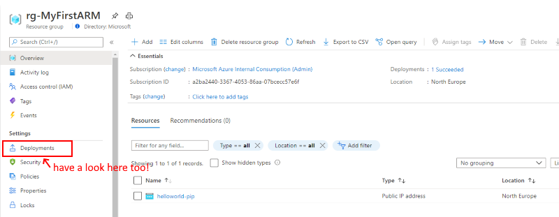

# Challenge 4: ARM - Azure Resource Manager (ARM) Templates

## Here is what you will learn 🎯

- get to know the Azure Resource Manager and Resource Providers
- learn about how ARM templates are structured and what you can do with them
- create a basic template and deploy them via the Azure Portal
- work with parameters and deploy using Azure CLI

## Just to be on the same page

Before we can get into Azure Resource Manager and the related templates, we need to clarify some terms:

- **Resource** – an element manageable via Azure. For example: a virtual machine, a database, a web app etc.
- **Resource Group** – a container for resources. A resource can not exist in Azure without a ResourceGroup (RG). Deployments of resources are always executed on an RG. Typically, resources with the same lifecycle are grouped into one resource group.
- **Resource Provider** – an Azure service for creating a resource through the Azure Resource Manager. For example, “Microsoft.Web” to create a web app, “Microsoft.Storage” to create a storage account etc.
- **Azure Resource Manager (ARM) Templates** – a JSON file that describes one or more resources that are deployed into a Resource Group. The template can be used to consistently and repeatedly provision the resources.

One great advantage when using ARM templates, is the _traceability_ of changes to your infrastructure. Templates can be stored together with the _source code_ of your application in the code repository (_Infratructure as Code_).

If you have established Continuous Integration / Deployment in your development process (which we will do on [Day 4](../day4/README.md)), you can execute the deployment of the infrastructure from Jenkins, TeamCity or Azure DevOps. No one has to worry about an update of the environment – web apps, databases, caches etc. will be created and configured automatically – no manual steps are necessary (which can be error-prone, as we all know).

## Table of Contents

- [Challenge 4: ARM - Azure Resource Manager (ARM) Templates](#challenge-4-arm---azure-resource-manager-arm-templates)
  - [Here is what you will learn 🎯](#here-is-what-you-will-learn-)
  - [Just to be on the same page](#just-to-be-on-the-same-page)
  - [Table of Contents](#table-of-contents)
  - [Azure Resource Manager and Resource Providers](#azure-resource-manager-and-resource-providers)
  - [ARM Templates](#arm-templates)
    - [A Basic Template](#a-basic-template)
    - [Let's deploy the template](#lets-deploy-the-template)
  - [ARM with Parameter File](#arm-with-parameter-file)
  - [Create your first ARM Template](#create-your-first-arm-template)
    - [1. Open Visual Studio Code](#1-open-visual-studio-code)
    - [2. Add a resource to it](#2-add-a-resource-to-it)
    - [3. Use an ARM function](#3-use-an-arm-function)
    - [4. Create a parameter](#4-create-a-parameter)
    - [5. Create a parameter file](#5-create-a-parameter-file)
  - [Cleanup](#cleanup)

## Azure Resource Manager and Resource Providers

The _Azure Resource Manager_ is the deployment and management service for Azure. It provides a management layer that enables you to create, update, and delete resources in your Azure subscription.

You can access the resource manager through several ways:

- Azure Portal
- Azure Powershell
- Azure CLI
- plain REST Calls
- SDKs


As you can see in the picture above, the Resource Manager is made of several _Resource Providers_ (RP) that are ultimately responsible for provisioning the requested service/resource. Resource providers can be independently enabled or disabled. To see, what RPs are active in your subscription, you can either check the Portal (Subscription --> Resource Providers) or use Azure CLI (e.g. in the [Cloud Shell](https://shell.azure.com/)) to query the resource manager:

```shell
$ az provider list -o table

Namespace                               RegistrationPolicy    RegistrationState
--------------------------------------  --------------------  -------------------
Microsoft.ChangeAnalysis                RegistrationRequired  Registered
Microsoft.EventGrid                     RegistrationRequired  Registered
Microsoft.Logic                         RegistrationRequired  Registered
Microsoft.Security                      RegistrationRequired  Registered
Microsoft.PolicyInsights                RegistrationRequired  Registered
Microsoft.AlertsManagement              RegistrationRequired  Registered
Microsoft.Advisor                       RegistrationRequired  Registered
Microsoft.Web                           RegistrationRequired  Registered
microsoft.insights                      RegistrationRequired  Registered
Microsoft.KeyVault                      RegistrationRequired  Registered
Microsoft.Storage                       RegistrationRequired  Registered
Microsoft.Portal                        RegistrationFree      Registered
Microsoft.DocumentDB                    RegistrationRequired  Registered
Microsoft.Search                        RegistrationRequired  Registered
Microsoft.Cdn                           RegistrationRequired  Registered
Microsoft.Cache                         RegistrationRequired  Registered
Microsoft.ResourceHealth                RegistrationRequired  Registered
Microsoft.Sql                           RegistrationRequired  Registered
...
...
...
```


:::tip  
📝 Resource providers talk REST (what a surprise ;-))  
Here is an example of a REST call that creates a storage account:

```http
PUT
https://management.azure.com/subscriptions/{subscriptionId}/resourceGroups/{resourceGroupName}/providers/Microsoft.Storage/storageAccounts/mystorageaccount?api-version=2016-01-01
REQUEST BODY
{
  "location": "westus",
  "sku": {
    "name": "Standard_LRS"
  },
  "kind": "Storage",
  "properties": {}
}
```

:::

As you can see, deployments in Azure will always be executed against a _resource group_, as mentioned before! In this sample, the template will be ultimately picked-up by the _Microsoft.Storage_ resource provider, which then will be responsible for creating a Storage Account for you.

But of course - nobody wants to construct native REST calls. Instead we focus on the json payload and let Azure CLI or powershell do the REST communication/transmission part.  
The json document we are about to create is an _ARM Template_

## ARM Templates

A full ARM template is more than just a REST json payload. It usually consists of several parts:

```json
{
  "$schema": "https://schema.management.azure.com/schemas/2015-01-01/deploymentTemplate.json#",
  "contentVersion": "1.0.0.0",
  "parameters": {},
  "variables": {},
  "resources": [],
  "outputs": {}
}
```

- **parameters** – Parameters (e.g. a virtual machine's name) that are passed from the outside to the template. Typically, from the command line or your deployment tool (e.g. Terraform, Azure DevOps, Jenkins...)
- **variables** – variables for internal use. Typically, parameters are “edited”, e.g. names are concatenated strings and stored in variables for later use.
- **resources** – the actual resources to be created
- **outputs** – Output parameters that are returned to the caller after the template has been successfully applied. With _outputs_ you can achieve multi-stage deployments by passing outputs to the next ARM template in your deployment chain.

### A Basic Template

Sticking to our sample from above (Storage Account), let's create a basic template that will create a Storage Account and makes use of a very helpful feature (_Template Functions_). Here it is:

```json
{
  "$schema": "https://schema.management.azure.com/schemas/2015-01-01/deploymentTemplate.json#",
  "contentVersion": "1.0.0.0",
  "parameters": {
    "storageAccountName": {
      "type": "string",
      "metadata": {
        "description": "The name of the storage account to be created."
      }
    },
    "storageAccountType": {
      "type": "string",
      "defaultValue": "Standard_LRS",
      "allowedValues": [
        "Standard_LRS",
        "Standard_GRS",
        "Standard_ZRS",
        "Premium_LRS"
      ],
      "metadata": {
        "description": "Storage Account type"
      }
    }
  },
  "variables": {},
  "resources": [
    {
      "name": "[parameters('storageAccountName')]",
      "type": "Microsoft.Storage/storageAccounts",
      "apiVersion": "2015-06-15",
      "location": "[resourceGroup().location]",
      "tags": {
        "displayName": "[parameters('storageAccountName')]"
      },
      "properties": {
        "accountType": "[parameters('storageAccountType')]"
      }
    }
  ],
  "outputs": {
    "storageAccountConnectionString": {
      "type": "string",
      "value": "[listKeys(resourceId('Microsoft.Storage/storageAccounts', parameters('storageAccountName')), providers('Microsoft.Storage', 'storageAccounts').apiVersions[0]).keys[0].value]"
    }
  }
}
```

:::tip
📝 As you can see, we are able to use functions to do dynamic stuff within a template, e.g. reading keys (`listKeys()`) or using parameter (`parameters()`). There are, of course, other functions e.g. for string manipulation (_concatenate_, _padLeft_, _split_...), numeric functions, comparison functions, conditionals etc. You can find all available template functions and their documentation here: [ARM template functions](https://docs.microsoft.com/azure/azure-resource-manager/templates/template-functions). Please make yourself familiar with the list!
:::

### Let's deploy the template

There are several ways to kick off an ARM template deployment:

- Azure cli
- PowerShell
- Azure Portal -> '+' -> 'Template Deployment'
- ...

We will try each of these to learn its haptic.

1. We use the Azure Portal. You may find it strange to use a web portal that offers wizards and use it to process our template. However, when testing/developing templates errors will occur. In this case the portal offers immediate feedback e.g. for validation errors. So do:

`[Azure Portal] -> '+' -> 'Template deployment' -> Create -> 'Build your own template in the editor'`

2. Copy and paste the above ARM template into the portal editor window


3. Hit save. This will bring you to the next page.

:::tip
📝 This page contains:

- fixed elements: The deployment scope - where should your resources be deployed (subscription & RG) - dynamic elements: The parameters - defined in the template will define the 'look' and hence what the user needs to provide.  
  :::


4. Enter a unique lowercase value for the storage account and kick off the deployment.

5. When finished take a look at the outputs section:


:::tip
📝 Think of it that way: You can define the outputs of a deployment in the template for later use e.g. if you want to upload something in the next step of your deployment and need the access key for this.  
 :::

## ARM with Parameter File

You have noticed that you have been asked to enter a value for the parameter `storageAccountName`. In a fully automated deployment, this is not really acceptable.  
Using e.g. the [Azure CLI](https://docs.microsoft.com/cli/azure/group/deployment?view=azure-cli-latest#az_group_deployment_create) you can specify an `answer` parameter file that goes along with the deployment file.

```shell
az deployment group create -g basicarm-rg -n firsttemplate --template-file=./azuredeploy.json --parameters=@azuredeploy.params.json
```

Doing so you can set up parameter files for different environments, e.g.:

- azuredeploy.params.**DEV**.json
- azuredeploy.params.**TEST**.json
- azuredeploy.params.**PROD**.json
- ...

:::tip

📝 One template + multiple parameter files. That's **how most people do** it.

:::

Example for our storage account parameter:

```json
{
    "$schema": "https://schema.management.azure.com/schemas/2015-01-01/deploymentTemplate.json#",
    "contentVersion": "1.0.0.0",
    "parameters": {
        "storageAccountName": {
            "type": "string",
            "metadata": {
                "description": "The name of the storage account to be created."
            }
        },
.
.
.
```

The corresponding parameter file would look like this.

```json
{
  "$schema": "https://schema.management.azure.com/schemas/2015-01-01/deploymentParameters.json#",
  "contentVersion": "1.0.0.0",
  "parameters": {
    "storageAccountName": {
      "value": "adcmyarmsa"
    }
  }
}
```

## Create your first ARM Template

Now I want you to create your first ARM Template. A speed course - based on the [Tutorial: Create and deploy your first ARM template](https://docs.microsoft.com/azure/azure-resource-manager/templates/template-tutorial-create-first-template?tabs=azure-powershell)

You will:

- Open Visual Studio Code and create an empty ARM template file.
- Add a resource to it.
- Use an ARM function
- Create a parameter
- Generate a parameter file
- Deploy it using Azure CLI

### 1. Open Visual Studio Code

and create an empty ARM template file (e.g. **_pip.json_**). Use the following
code snippet

```json
{
  "$schema": "https://schema.management.azure.com/schemas/2019-04-01/deploymentTemplate.json#",
  "contentVersion": "1.0.0.0",
  "resources": []
}
```

### 2. Add a resource to it

Put the json code snippet that defines a public IP address into the resources
section of the template

```json
{
  "name": "string",
  "type": "Microsoft.Network/publicIPAddresses",
  "apiVersion": "2020-06-01",
  "location": "string",
  "sku": {
    "name": "usefulstring"
  },
  "properties": {
    "publicIPAllocationMethod": "usefulstring",
    "publicIPAddressVersion": "usefulstring"
  }
}
```

::: tip

Try a **Shift-ALT-F to format the code after inserting**. (requires ARM
extension to be installed)

:::

You need to replace the _"usefulstring"_ with meaningful data. See the following links as reference:

- [Microsoft.Network publicIPAddresses](https://docs.microsoft.com/azure/templates/microsoft.network/publicipaddresses#template-format)
- All Azure resources are listed in the [ARM Templates Reference](https://docs.microsoft.com/azure/templates/). e.g. Public IP is in the network resource provider.

### 3. Use an ARM function

Concentrate on

```json
  "location": "string",
```

Azure resources go into a resource group. A resource group is located in an azure region. So you may want to use the same region for your public IP Address as it's hosting resource group.  
 Lucky us. There is a function available - that we can use. Replace _"string"_ with "`[resourceGroup().location]`"

### 4. Create a parameter

Create a parameter so that a user can enter the name of the IP Address artefact.  
Therefore add a parameter section to the template. Checkout [Make template reusable](https://docs.microsoft.com/en-us/azure/azure-resource-manager/templates/template-tutorial-add-parameters?tabs=azure-powershell#make-template-reusable) to see how it is done.

As example you can compare your ARM Template with the following code snippet:

```json
{
  "$schema": "https://schema.management.azure.com/schemas/2019-04-01/deploymentTemplate.json#",
  "contentVersion": "1.0.0.0",
  "parameters": {
    "IPName": {
      "type": "string",
      "metadata": {
        "description": "The name of the Azure IP adress artefact"
      }
    }
  },
  "resources": [
    {
      "name": "[parameters('IPName')]",
      "type": "Microsoft.Network/publicIPAddresses",
      "apiVersion": "2020-06-01",
      "location": "[resourceGroup().location]",
      "sku": {
        "name": "Basic"
      },
      "properties": {
        "publicIPAllocationMethod": "Static",
        "publicIPAddressVersion": "IPv4"
      }
    }
  ]
}
```

### 5. Create a parameter file

Use VS Code to generate a parameter file for you and enter a value:


As example you can compare your parameters file with the following code snippet:

```json
{
  "$schema": "https://schema.management.azure.com/schemas/2019-04-01/deploymentParameters.json#",
  "contentVersion": "1.0.0.0",
  "parameters": {
    "IPName": {
      "value": "my-PIP"
    }
  }
}
```

6. Kick off the deployment using Azure CLI. To Do this you can upload the template and parameter file to your Azure Cloud Shell:


Create a resource group first by executing e.g.:

```shell
az group create -l northeurope -n rg-MyFirstARM
```

Kick off the deployment by executing e.g.:

```json
az deployment group create -g rg-MyFirstARM --template-file pip.json --parameters '@pip.parameters.json'
```

Result:



::: tip

There exist two modes how to deploy an ARM template:

- **Complete** – resources that are not present in the template, but do exist in the resource group, are deleted.
- **Incremental** (default)– resources that are not present in the template, but exist in the resource group, remain unchanged.

:::

## Cleanup

Execute the following commands:

```PowerShell
az group delete -n basicarm-rg --no-wait --yes
az group delete -n rg-MyFirstARM
```

[◀ Previous challenge](../challenge-03/README.md) | [🔼 Day 1](../README.md) | [Next challenge ▶](../challenge-05/README.md)
