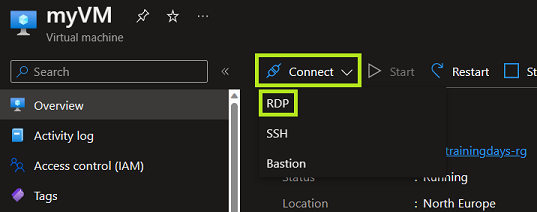
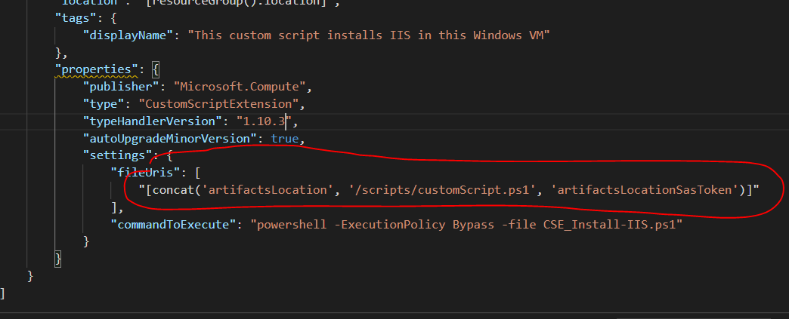

# Challenge 7 (optional): VM and Custom Script Extensions - Post deployment automation  or configure / setup / install something within an empty VM

## Here is what you will learn 🎯

- How to automate the further configuration / setup of an '_empty_' VM after it has been deployed.
- Use a Custom Script Extension for a Windows VM.
- Upload automation code into a storage account for anonymous download (so that the CSE agent can download)
- Modify an ARM Template to enable '_zero touch VM deployments_'

## Table Of Contents

1. [Do you need a VM?](#do-you-need-a-vm)
1. [Attach a simple HelloWorld Custom Script Extension (CSE) to a VM using the Portal](#attach-a-simple-helloworld-custom-script-extension-cse-to-a-vm-using-the-portal)
1. [See what has happened inside the VM](#see-what-has-happened-inside-the-vm)
1. [Attaching a CSE to a VM in an ARM Template (optional)](#attaching-a-cse-to-a-vm-in-an-arm-template-optional)
1. [Cleanup](#cleanup)

## Do you need a VM?

For this lab you need an Azure virtual machine that runs Windows Server and some storage accessible to hold your automation code.  
Just **click**  <a href="https://portal.azure.com/#create/Microsoft.Template/uri/https%3A%2F%2Fraw.githubusercontent.com%2Fazuredevcollege%2Ftrainingdays%2Fmaster%2Fday1%2Fchallenge-07%2Fchallengestart%2Fchallengestart.json"></a> to spin up a new VM for this lab.

| Name | Value |
|---|---|
| _Resource group_  |  e.g. rg-www-test-001 |
| _Location_  |  e.g. North Europe |
| _Admin user_  |  demoadmin |
| _Admin password_  | %complex enough% |
| _Vm Size_  |  e.g.  Standard_F2s_v2|
| _Disk Sku_  |  StandardSSD_LRS |  

## Attach a simple HelloWorld Custom Script Extension (CSE) to a VM using the Portal

- Take the following code and copy & paste it into a file named e.g. `HelloWorld.ps1`:

  ```PowerShell
  ##############################################
  #   HelloWorld Custom Script Extension (CSE)
  ##############################################

  $folderPath = Join-Path 'C:' 'temp'
  $filePath = Join-Path $folderPath 'CSEwasRunAt.txt'

  #create directory if it doesn't exist
  if (-not (Test-Path -Path $folderPath)) {
    New-Item -Path $folderPath -ItemType 'Directory'
  }

  #write current time to file.
  Get-Date | Out-File $filePath -Append

  #This is really simple but imagine what else you can do to customize a vm ...
  ```

- Upload this file to a storage account

  ```
  [Azure Portal] 
  -> Resource Group 
  -> rg-www-test... 
  -> sawww... (_your storage account_)  
  -> containers 
  -> 'csescripts' 
  -> Upload  
  ->File "HelloWorld.ps1" 
  -> Upload
  ```

  

- Make this file being executed by the Custom Script Extension within the the VM:

  ```
  [Azure Portal] 
  -> Home 
  -> Search 'virtual machines' 
  -> 'vmblue'  
  -> Extensions 
  -> Add 
  -> 'Custom Script Extension' 
  -> Create
  ```

  | Parameter  |  Action |
  |---|---|
  | _Script file (Required)_ |  Browse to your '_HelloWorld.ps1_' -> it is in your storage account 'sawww...' -> csescripts  |
  | _Arguments (Optional)_ |  none  |  
  
- Wait some seconds then do a refresh of your browser - it'll show the progress:

  
  
- Final result should show a success:

  

## See what has happened inside the VM

Now we RDP into the VM and see what has happened and where to find logs in case something breaks.

```
[Azure Portal] 
-> Resource Groups 
-> 'rg-www...' 
-> 'vmblue' 
-> Connect 
-> Download RDP file 
```

 

```
-> Open the downloaded RDP file on your device
-> If Windows tries to connect you via Windows Hello, select 'More choices' and 'Use a different account' as we have to use the credentials you set the VM up with
-> Provide the username & password you created the VM with and select 'OK'
-> You can disregard the warning that the remote computer's identity cannot be verified
```

| Parameter | Value |
|---|---|
|_User_ | demouser |
|_Password_ |%Your Password%|  
  
Within the VM:

1. Navigate to `C:\temp`. The result should look similar to this:

   

1. Navigate to `C:\Packages\Plugins\Microsoft.Compute.CustomScriptExtension\ _%version%_\Downloads`. The CSE is software that runs within the VM. The script that will be executed is downloaded first to this location. If you don't see your script file CSE might have trouble to download the resource.

     

1. Navigate to `C:\WindowsAzure\Logs\Plugins\Microsoft.Compute.CustomScriptExtension\ _%version%_` This is the place where the CSE logs its actions locally - a good place to start troubleshooting.

   

1. Remove the CSE from the VM
 
   ```
   [Azure Portal] 
   -> Home 
   -> Search 'virtual machines' 
   -> 'vmblue' 
   -> 'Custom Script Extension' 
   -> 'Uninstall'
   ```
 
   ::: tip
   📝You can only have one Custom Script Extension attached to a VM at  a time. If you want to process multiple CSE scripts you have  multiple options. 
   
   - The easiest would be to install & uninstall one CSE at a time:  `Install CSE ('Script1') -> deinstall CSE -> Install CSE  ('Script2') -> deinstall ->...`
 
   - A better, but more demanding solution would be to deploy the  extension using an ARM/Bicep template. The template enables you to  specify multiple files to download from a storage account, of which  one could be an orchestration file. The following section provides you with an introduction to this approach.

   :::

## Attaching a CSE to a VM in an ARM Template (optional)

The goal of this action is to learn how to avoid the portal, i.e. so that the CSE can be attached to a VM during deployment time e.g. using an ARM template. With the whole setup Azure + VM Settings can be done in a '_0 touch way_'.

1. In the next CSE we want to install Internet Information Services (IIS) in the VM. Take a look at the code file first ("[CSE_Install-IIS.ps1](https://raw.githubusercontent.com/azuredevcollege/trainingdays/master/day1/challenge-07/scripts/CSE_Install-IIS.ps1)"). The relevant parts starts at _#region install IIS features_.

1. When automating CSE e.g. through ARM deployment - the CSE needs a valid download location for the code file (`CSE_Install-IIS.ps1`). This could be e.g. a public GitHub repo or another https-reachable location. In this lab we use a storage account for this. Upload ("[CSE_Install-IIS.ps1](https://raw.githubusercontent.com/azuredevcollege/trainingdays/master/day1/challenge-07/scripts/CSE_Install-IIS.ps1)") file to a storage account.

   ```
   [Azure Portal] 
   -> Resource Group 
   -> rg-www 
   -> sawww... (%your storage account%)  
   -> containers 
   -> 'csescripts' 
   -> Upload
   -> File "CSE_Install-IIS.ps1" 
   -> Upload
   ```  
  
1. Edit the CSE ARM template to use the correct scripts location. Once uploaded you can copy the blobs URL from the Azure portal

   

   > ❔ **Question** Can you download the file in your browser using  the URL? If not have you set the correct access level at the  container?
 
   Edit this: [CSE ARM template](https://raw.githubusercontent.com/ azuredevcollege/trainingdays/master/day1/challenge-07/scripts/ ARMCSE.json) template to use the scripts location:
 
     
 
   with your value
 
   ```JSON
   ...
   "fileUris": [
     "https://sawww....blob.core.windows.net/cse/CSE_Install-IIS.ps1"
   ],
   ...
   ```
 
   Copy the template into the clipboard.

1. Deploy the ARM Template.

   ```
   [Azure Portal] 
   -> Resource Groups 
   -> 'rg-www' 
   -> '+' 
   -> Template deployment 
   -> "Build your own template in the editor" 
   -> Paste the clipboard
   ```
 
   Select the right resource group and VM and deploy:
   | Name | Value |
   |---|---|
   | _Resource group_  |  e.g. rg-www-test-001 |
   | _Region_  |  e.g. North Europe |
   | _VM name_  |  vmblue |
 
   Deployment will take some minutes: A role is installed and an IIS  feature is downloaded and installed.  

1. At the end the result should look like this:

     
 
   Now you have a web server in your VM - you should test by browsing  to the public IP address: 
    
     

## Cleanup

Cleanup by deleting the resource group.

```
[Azure Portal] 
-> Resource Groups 
-> 'rg-www' 
-> 'Delete resource group'
```

[◀ Previous challenge](../challenge-06/README.md) | [🔼 Day 1](../README.md) | [Next challenge ▶](../challenge-08/README.md)
