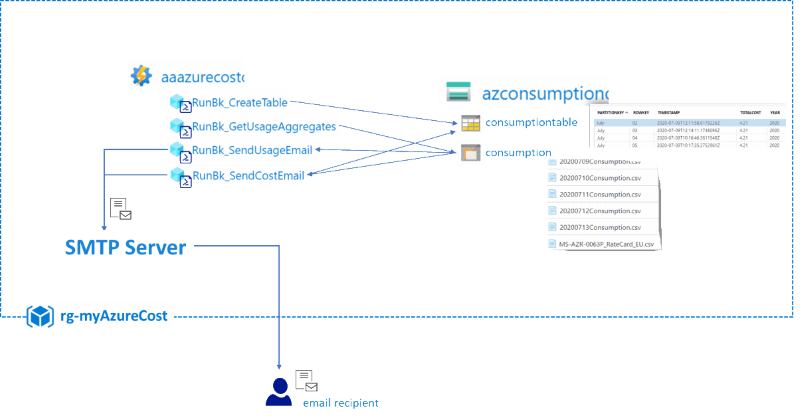
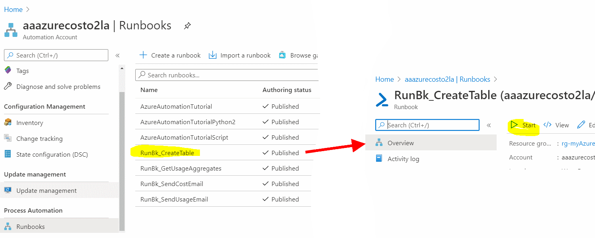

# Challenge 9: Azure Automation -  Send me yesterday's Azure cost

## Here is what you will learn 🎯

- How to use an Azure Automation account with PowerShell runbooks.
- Get insights in your Azure consumption for the day.  
  
> 🔍 This challenge was adapted from [MyAzure Cost](https://github.com/bfrankMS/myAzureCost). It will send you an email with your daily Azure cost report.  

Each day you will get a report of the usage and the costs in your inbox :

- A _daily cost email_

  
- _Cost report_ as .csv
  
  
  
It also contains e.g.:

- Historic data (using an Azure table)
  
  
- Cost Per Category
  
  

## A look behind the curtain

The overall architecture looks likes this:



It comprises:

- An ARM template for setup
- Azure automation for daily tasks
- .NET code to send email and analysis
- A storage account to hold the data  

## Table Of Contents

1. [Deploy the ARM Template](#deploy-the-arm-template)  
2. [Create an Azure Run As Account](#create-an-azure-run-as-account)  
3. [Create a Table and see AA Variables Section](#create-a-table-and-see-aa-variables-section)  
4. [Upload a Price Sheet](#upload-a-price-sheet)  
5. [Run a Report](#run-a-report)
6. [Cleanup](#cleanup)

## Deploy the ARM Template

**Click** on the <a href="https://portal.azure.com/#create/Microsoft.Template/uri/https%3A%2F%2Fraw.githubusercontent.com%2Fazuredevcollege%2Ftrainingdays%2Fmaster%2Fday1%2Fchallenge-09%2Fchallengestart%2Fchallengestart.json"></a> button.  

| Name | Values  |
|---|---|
| _Region_ | **West Europe** |
| _Resource group_ | rg-myAzureCost |
| _O_my Azure Cost Smtp Recipient_ | %the destination email address% |
| _O_my Azure Cost Smtp Sender_ | %the source email/sender address% |
| _O_my Azure Cost Smtp Sender Password_ | %the email sender's smtp pwd% |
| _O_my Azure Cost Smtp Server_ | %the senders smtp server% e.g. smtp.office365.com |
| _O_my Azure Cost Smtp Server SSL Port_ | e.g. 587 for smtp.office365.com |
| _O_base Time_ | **don't touch** |  

The deployment should take < 10mins.  
  
## Create an Azure Run As Account

For Azure Automation (AA) to perform tasks in the current subscription (e.g. gather usage information) needs an account a so called `Run As Account`. This account is a so called service principal (SP) which has permissions in the current subscription. To create this SP and connect it to AA please do the following:  

```
[Azure Portal] 
-> Resource Groups 
-> "rg-myAzureCost" 
-> 'aaazurecost...' (Your Automation Account) 
-> Account Settings 
-> Run as accounts
```  

Hit `Create`, wait and watch the account being created:

  

:::tip
📝 Note that this account has an _expiration date_.  
:::  

### See how the AA Run As account manifests itself throughout AAD and your subscription (optional)

- 'AA Run As' is an _Azure AD - Application Registration_

  ```
  `[Azure Portal] 
  -> Azure Active Directory 
  -> App registrations` 
  ```
  
  

- 'AA Run as' has contributor rights to your subscription
  ```
  [Azure Portal] 
  -> Subscriptions 
  -> Access Control (IAM) 
  -> View role assignments 
  -> 'View'`
  ```
  
  

## Create a Table and see AA Variables Section

Storing settings for Azure Automation (AA) e.g. account information, locale settings,... AA credentials and AA variables can be used.
In our myAzureCost sample we use:

- **AA Credentials** to store the sender's account details  
- **AA Variables** to hold settings needed  for the AA _Runbooks_ that do the usage and cost calculation
- One **Azure table** to store processed data e.g. daily cost history.

### Inspect the variables

```
[Azure Portal] 
-> Resource Groups 
-> "rg-AzureCost" 
-> 'aaazurecost...' (Your Automation Account) 
-> Variables
```

| Variable **Name** | **Description** |
|---|---|
| _myAzureCostAzureSubscriptionId_ | GUID of your subscription* to calculate the usage for |
| _myAzureCostCultureInfo_ | e.g. de-DE for reports (CSVs) to come with numbers, date formatted in German format|
| _myAzureCostPriceSheetURI_| a URI pointing to a CSV with pricing information about Azure resources - we'll take care of this soon |
| _myAzureCostSAContainer_ | where your daily reports are stored - pls don't change|
| _myAzureCostSATable_ | table name to hold your daily usage costs for 'history view' |
| _myAzureCostSmtpRecipient_ | email recipient of the report  |
| _myAzureCostStorageAccountName_ | where your daily reports are stored |


### Create the Azure table to hold your daily usage costs for 'history view'

There is a AA Runbook that will create an Azure table for us - we only need to start it:  

```
[Azure Portal] 
-> Resource Groups 
-> "rg-AzureCost" 
-> 'aaazurecost...' (Your Automation Account) 
-> "Process Automation" Runbooks 
-> RunBk_CreateTable -> Start
```  

  

:::tip
📝 A _runbook_ is a piece of code (here PowerShell) that is being executed in an Azure runtime environment. 
:::

This runbook will execute PowerShell code that creates an Azure table using the AA Run as Account. 

It'll login to your subscription as the Run as Account and perform tasks against your subscription. You can follow the execution by:  

   

Once completed you should have a new table in:  

```
[Azure Portal] 
-> Resource Groups 
-> "rg-AzureCost" 
-> 'azconsumption...' (Your Storage Account) 
-> Tables
```  

  

## Upload a price sheet

`myAzureCost` can gather your daily consumption data. Additionally it can also estimate the costs that your consumption will pose. 

To do this you need to upload a price sheet with your specific Azure rates. The price sheet needs to be formatted as CSV (en-us) and contain at least 2 columns: `MeterID` and  `MeterRates`.

:::tip
📝 Every Azure resource in each region has a MeterID (GUID) that uniquely identifies it. When you query the usage of an Azure resource the MeterID is delivered with it. The MeterID translates to a price -> MeterRates - e.g.:
| MeterId | MeterName | MeterRates | MeterRegion |
|--|--|--|--|
| 793843d0-d081-4934-9782-ee92505c56cb |D2 v3|0.1011..| EU West |  
:::  

:::tip
📝 Price information for Azure resources is accessible through the [RateCard API](https://docs.microsoft.com/azure/cost-management-billing/manage/usage-rate-card-overview#azure-resource-ratecard-api-preview). If you want to dig into some details go [here for a sample](https://github.com/bfrankMS/myAzureCost/tree/master/SetupChallenges/GenerateAPriceSheet)
:::

1. You find a sample price list in this directory:
  [day1\challenge-09\challengestart\Sample_PriceSheet_EN.csv](./challengestart/Sample_PriceSheet_EN.csv)

2. Upload this to your storage account:

  ```
  [Azure Portal] 
  -> Resource Groups 
  -> "rg-AzureCost" 
  -> 'azconsumption...' (Your Storage Account) 
  -> Containers 
  -> 'consumption'
  ```

    

3. Generate a URI with a Read only SAS token (e.g. expiry +2 years) for this fil. If you have done [challenge 3](../challenge-03/README.md) you know how to do this ;-)

4. Copy & paste the URI (with the SAS token) into the AA variable `myAzureCostPriceSheetURI` so that runbooks can download the pricesheet:

  ```
  [Azure Portal] 
  -> Resource Groups 
  -> "rg-AzureCost" 
  -> 'aaazurecost...' (Your Automation Account) 
  -> Variables
  ```  

    

## Run a report

Here you'll kick off the runbooks to test your myAzureCost implementation. You'll also might want to link the runbook to a schedule to receive a daily report.  

### Gather your daily usage Runbook

Start the AA Runbook that will gather the Azure usage for the previous day. It will save it as CSV (en-us) in the storage account. **Leave the `MYDATE` parameter empty.**:

```
[Azure Portal] 
-> Resource Groups 
-> "rg-AzureCost" 
-> 'aaazurecost...' (Your Automation Account) 
-> "Process Automation" Runbooks 
-> RunBk_GetUsageAggregates 
-> Start
```  

:::tip
📝The optional `MYDATE` parameter takes a short en-us formatted time string MM/dd/yyyy -> e.g. '07/13/2020'
:::

Once the runbook is completed you should find a result report in your storage account:  

```
[Azure Portal] 
-> Resource Groups 
-> "rg-AzureCost" 
-> 'azconsumption...' (Your Storage Account) 
-> Containers 
-> 'consumption'
```  

  

### Send cost report email

As the previous runbook has calculated the Azure consumption for a day and stored it on our storage account. We can now start the AA Runbook that will do a cost estimation and send it as email the recipient.
**Leave the `MYDATE` parameter empty.**:

```
[Azure Portal] 
-> Resource Groups 
-> "rg-AzureCost" 
-> 'aaazurecost...' (Your Automation Account) 
-> "Process Automation" Runbooks 
-> RunBk_SendCostEmail 
-> Start
```

:::tip
📝 The optional `MYDATE` parameter takes a short en-us formatted time string MM/dd/yyyy -> e.g. '07/13/2020'  
:::

Once the runbooks is completed you should receive an email with the costs & graphs calculated and some reports attached as CSV:

  

🥳 **Congratulations!** 🥳

**... and wait for tomorrows email :-)**

## Cleanup

Delete the resource group `rg-myAzureCost`

[◀ Previous challenge](../challenge-08/README.md) | [🔼 Day 1](../README.md)
