# Azure Pass Setup: Create a new Azure Active Directory and map an Azure (Trial) Pass subscription to its admin user.

[back](../../README.md)  

**Why this procedure? Because**,... 
- not all users have a subscription to work with (i.e. create resources in azure)
- not all users have the required permissions in AAD to create objects

## You need to ... ##

1. **Open your browser in private | incognito mode** -> _aad.portal.azure.com_ -> **logon and passwords are provided by instructor**
2. **Create a new Azure Active directory**
```
[Portal] -> Azure Active Directory -> Create a directory
```
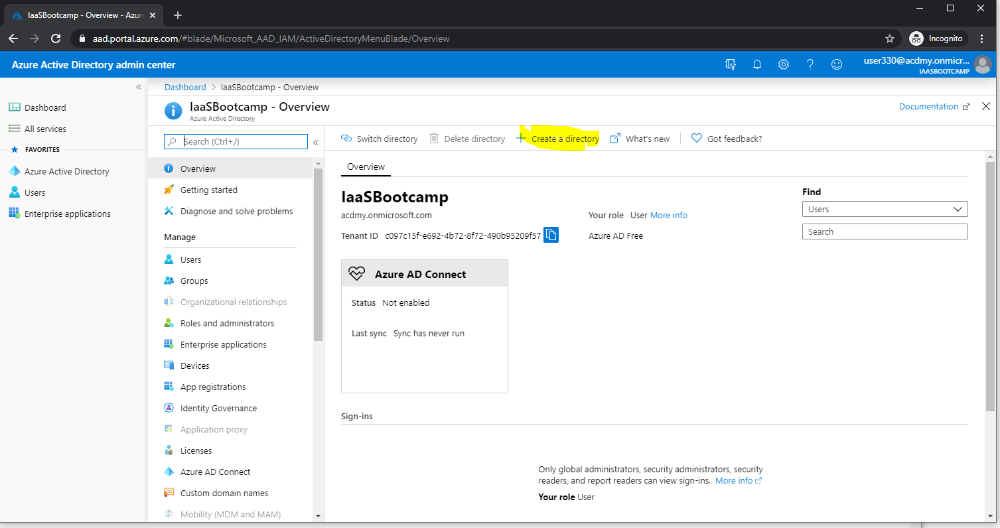  

| Parameter Name | Values  |
|---|---|
| Directory Type  |  **Azure Active Directory** |  
| Organization Name| e.g. **ADCollege Gruppe** _%Nr%_ |
| Initial Domain Name| e.g. **acd**_%Nr%_ |
| Country| Germany |  

e.g. like:  
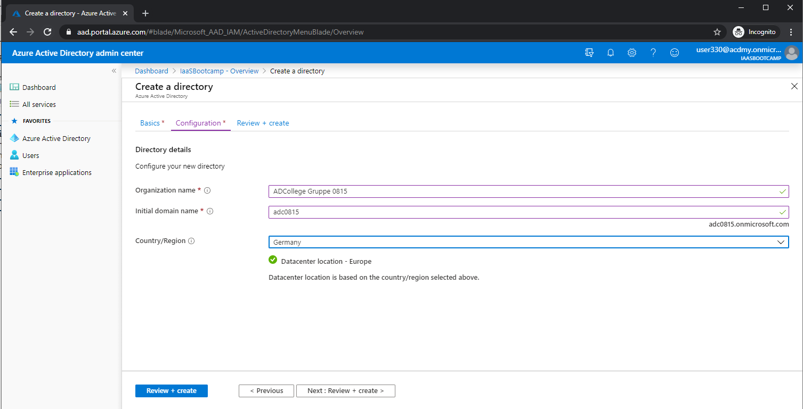  

->**Create**  
  ->When created **navigate to the new directory**  
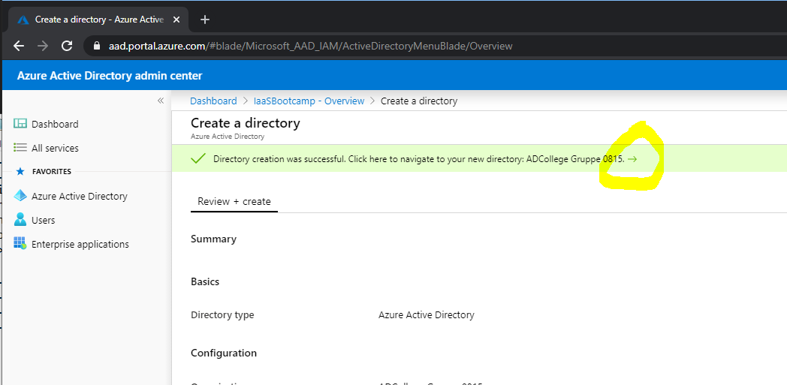  

**Make sure you are in the 'realm' of the new directory! -> Click 'Users'**  
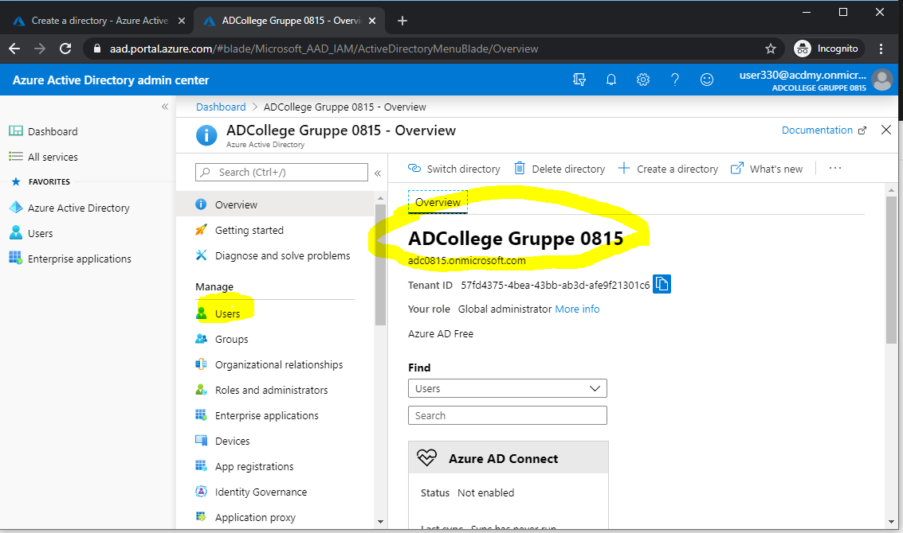

3. **Create a new admin user in this directory**
```
[Portal] -> Azure Active Directory -> 'Users' -> '+ New User'
```
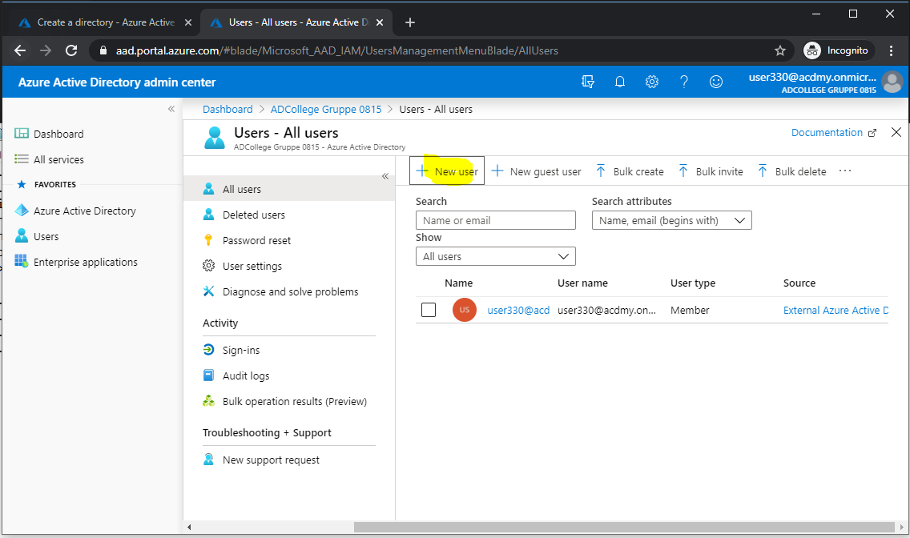  

| Parameter Name | Values  |
|---|---|
| User Name  |  **admin** |  
| Name| e.g. **Admin User** |
| Auto-generate password| **_selected_** |
| Show Password| **_checked_ and _copy initial password to clipboard_** |  
| Roles| **Global administrator** | 

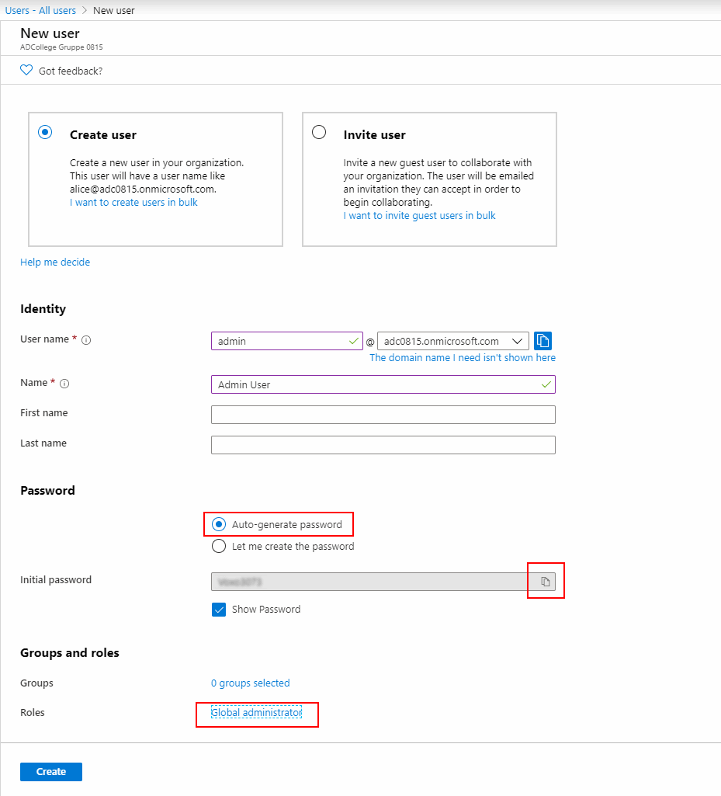  
The r**esult should look similar to**:  
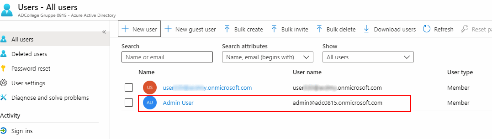  

**Have you copied the admins initial password? -> If Yes, logout from the azure AAD portal and close the browser.**

4. **Open a _new_ browser in private | incognito mode** -> and navigate to www.microsoftazurepass.com  
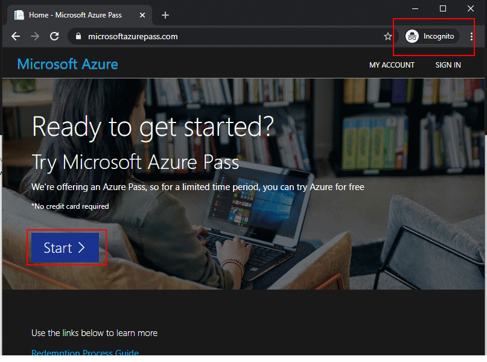  
Click **Start.**  

Login as the previously generated Admin user -> change the password. Make sure your are logged in correctly:  
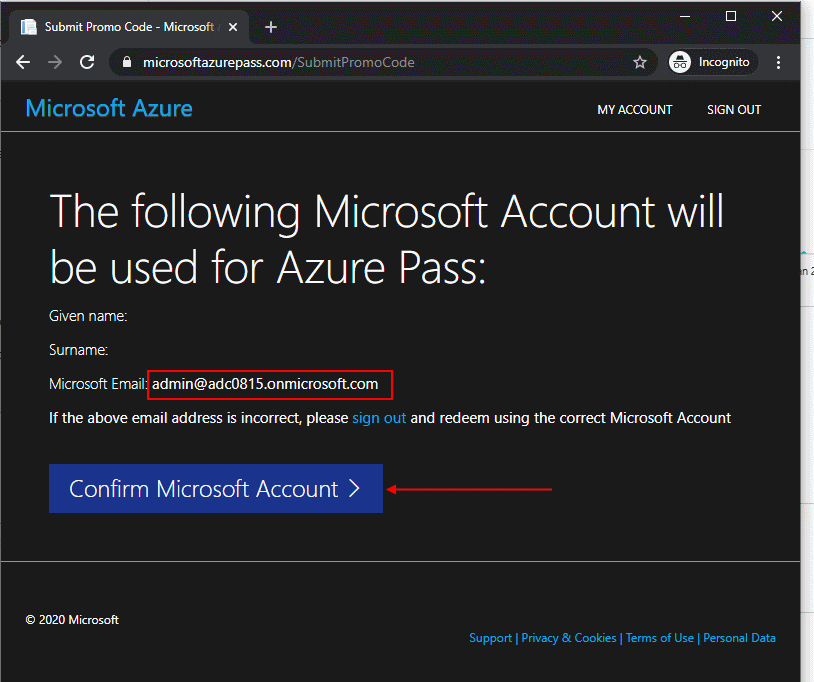  
**Confirm**  

5. **Enter the promo code you receive from your instructor**  
-> Validate  
Wait a while and then fill in some information about you:  
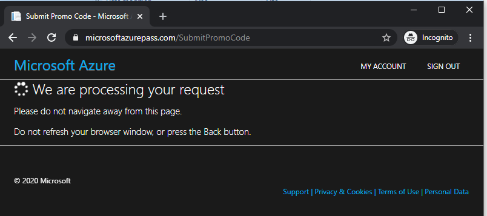
  
**Once successful** you will be redirected to the azure portal and **should see** a subscription: 
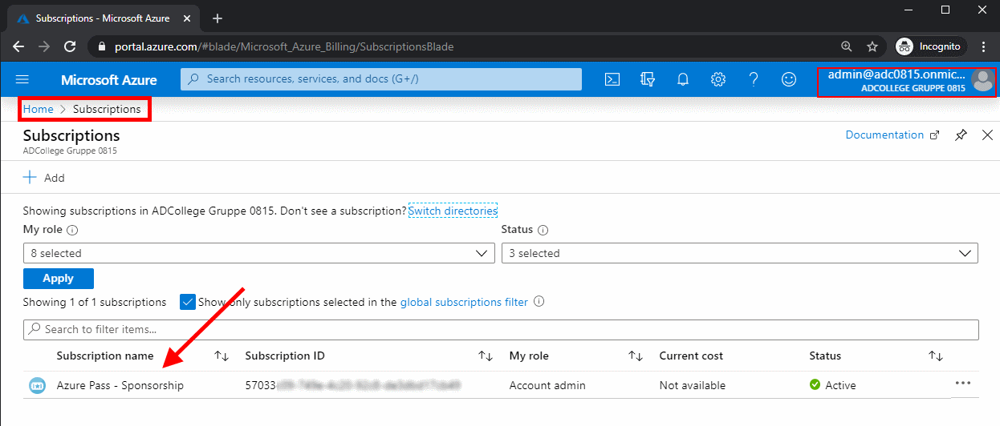


[back](../../README.md) 

