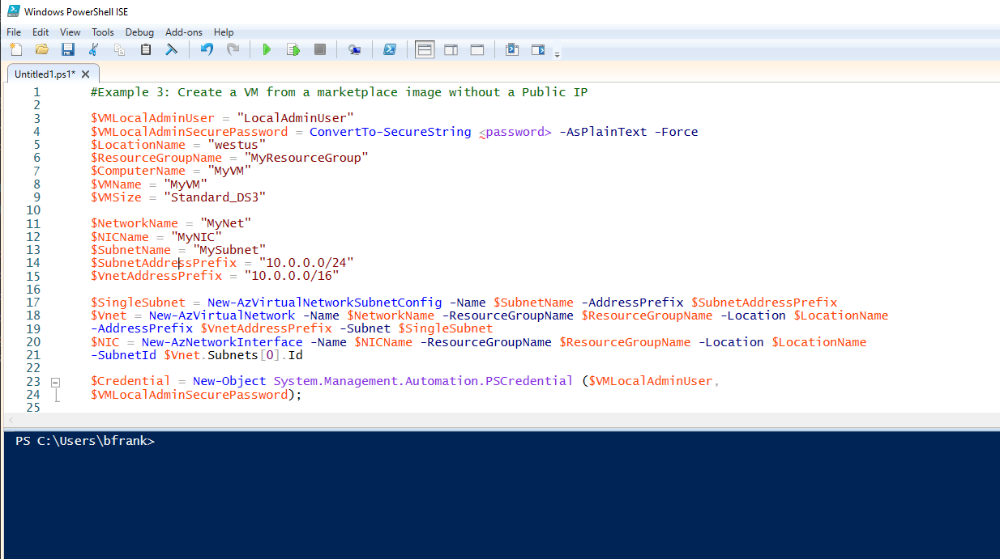

# Challenge 1: PowerShell: Configure PowerShell for Azure Administration & Create a VM Using PowerShell.

[back](../../README.md)

## Here is what you will learn ##

- Which PowerShell modules to download for Azure administration
- How to update the modules as version updates **will** happen.
- Use help with _-examples_ to speed your coding through code snippets
- Deploy your first Azure VM using code.

## Install PowerShell Az Modules for Azure ##
Open PowerShell **as administrator** and execute: 
```
Install-Module Az
```

Press 'Y' and allow the installation of the latest Nuget Package Provider:
```
NuGet provider is required to continue
PowerShellGet requires NuGet provider version '2.8.5.201' or newer to interact with NuGet-based repositories. The NuGet
 provider must be available in 'C:\Program Files\PackageManagement\ProviderAssemblies' or
'C:\Users\Administrator\AppData\Local\PackageManagement\ProviderAssemblies'. You can also install the NuGet provider by
 running 'Install-PackageProvider -Name NuGet -MinimumVersion 2.8.5.201 -Force'. Do you want PowerShellGet to install
and import the NuGet provider now?
[Y] Yes  [N] No  [S] Suspend  [?] Help (default is "Y"): y
```
Press 'A' to make the PowerShell Gallery a trusted code repository - this is the Code source for the Azure Az modules:
```
Untrusted repository
You are installing the modules from an untrusted repository. If you trust this repository, change its
InstallationPolicy value by running the Set-PSRepository cmdlet. Are you sure you want to install the modules from
'PSGallery'?
[Y] Yes  [A] Yes to All  [N] No  [L] No to All  [S] Suspend  [?] Help (default is "N"): a
```
The installation will take a while. After install you can query the modules and it's versions using:
```
get-module Az* -ListAvailable
```
Output will be something like:
```
Directory: C:\Program Files\WindowsPowerShell\Modules


ModuleType Version    Name                                ExportedCommands
---------- -------    ----                                ----------------
Script     1.4.0      Az.Accounts                         {Disable-AzDataCollection, Disable-AzContextAutosave, Enab...
Script     1.0.1      Az.Aks                              {Get-AzAks, New-AzAks, Remove-AzAks, Import-AzAksCredentia...
Script     1.0.2      Az.AnalysisServices                 {Resume-AzAnalysisServicesServer, Suspend-AzAnalysisServic...
Script     1.0.0      Az.ApiManagement                    {Add-AzApiManagementRegion, Get-AzApiManagementSsoToken, N...
Script     1.0.0      Az.ApplicationInsights              {Get-AzApplicationInsights, New-AzApplicationInsights, Rem...
Script     1.2.0      Az.Automation                       {Get-AzAutomationHybridWorkerGroup, Remove-AzAutomationHyb...
Script     1.0.0      Az.Batch                            {Remove-AzBatchAccount, Get-AzBatchAccount, Get-AzBatchAcc...
Script     1.0.0      Az.Billing                          {Get-AzBillingInvoice, Get-AzBillingPeriod, Get-AzEnrollme...
Script     1.1.0      Az.Cdn                              {Get-AzCdnProfile, Get-AzCdnProfileSsoUrl, New-AzCdnProfil...
Script     1.0.1      Az.CognitiveServices                {Get-AzCognitiveServicesAccount, Get-AzCognitiveServicesAc...
Script     1.6.0      Az.Compute                          {Remove-AzAvailabilitySet, Get-AzAvailabilitySet, New-AzAv...
Script     1.0.0      Az.ContainerInstance                {New-AzContainerGroup, Get-AzContainerGroup, Remove-AzCont...
Script     1.0.1      Az.ContainerRegistry                {New-AzContainerRegistry, Get-AzContainerRegistry, Update-...
.
.
.
```

## First Steps: Login to Azure and select your target subscription...
To Login open PowerShell and execute:
```
Login-AzAccount
```
List the available Azure subscriptions:
```
Get-AzSubscription
```
Output will be something like:

```
Name                     Id                                   TenantId                             State
----                     --                                   --------                             -----
Azure Pass - Sponsorship 79021c9b-147b-4dc0-ab8c-a3de94905f3f c097c15f-e692-4b72-8f72-490b95209f57 Enabled

```
To select a specific subscription as target for further deployments you might want to ask the user:
```
Get-AzSubscription | Out-GridView -PassThru | Set-AzContext
```
Now after the context has been set you can query subscription specific details e.g. the available VM sizes in a specific region:
```
Get-AzVMSize -Location 'west europe'
```
Output should be something like:
```
Name                   NumberOfCores MemoryInMB MaxDataDiskCount OSDiskSizeInMB ResourceDiskSizeInMB
----                   ------------- ---------- ---------------- -------------- --------------------
Standard_A0                        1        768                1        1047552                20480
Standard_A1                        1       1792                2        1047552                71680
Standard_A2                        2       3584                4        1047552               138240
Standard_A3                        4       7168                8        1047552               291840
.
.
.

```

**Note:** Azure resources (e.g. a virtual machine's hard disk) are provided through so called Azure Resource Providers. 
In order to create a specific resource (e.g. a VM) you have to talk to the correct resource provider (e.g. Microsoft.Compute). 
These resource providers implement the feature (e.g. a VM) in a specific region. You don't have to learn whom to talk to and where which resource providers are available - because the PowerShell Az modules you just installed do this for you.  
The Az modules are _sort of_ aligned to Azure Resource Providers, i.e. 
| What do you want to create |  Responsible Azure Resource Provider | PowerShell Module to use  |
|---|---|---|
| Create a VM |  Microsoft.Compute | Az.Compute  |
| Create a virtual network |  Microsoft.Network | Az.Network  |
| ... |  ... | ...  |

So the commands for creating a VM are _'hidden'_ in Az.Compute.
Execute:
```
Get-Command -Module Az.Compute
```
delivers e.g.:
```
CommandType     Name                                               Version    Source
-----------     ----                                               -------    ------
.
.
.
Cmdlet          Invoke-AzVMRunCommand                              3.0.0      Az.Compute
Cmdlet          Invoke-AzVmssVMRunCommand                          3.0.0      Az.Compute
Cmdlet          New-AzVM                                           3.0.0      Az.Compute
Cmdlet          New-AzVMConfig                                     3.0.0      Az.Compute
Cmdlet          New-AzVMDataDisk                                   3.0.0      Az.Compute
Cmdlet          New-AzVMSqlServerAutoBackupConfig                  3.0.0      Az.Compute
.
.
.
```
## Create a VM with PowerShell ...
Now **let's create a vm using PowerShell**. But we are lazy and want to be fast so we copy example code from PowerShell help:
```
help New-AzVM -Examples | clip
```
copies the example code to the clipboard. Open PowerShell ISE and do a **CTRL-V** to paste the code into a editor window. 
Please **choose example 3** and remove the rest: 


**Now it's your turn**: e.g. remove errors - (superflous line breaks), use variables, implement the resource group creation, add login-azaccount, subscription selection...  
  
**Does it run?** If yes, watch in the portal what happens.
**What is missing | outdated?**

After a successful run. **Cleanup** e.g. by deleting the resource group with the vm using the portal

[back](../../README.md)