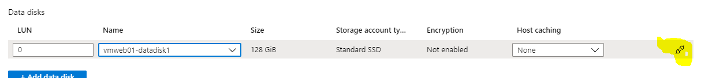

# Challenge 4: VM - Managed Disks: Attach a Data Disk to a VM - Extend and Retype it.
[back](../../README.md)  

## Here is what you will learn ##

## Create a data disk and attach it to a vm ##
```
[Azure Portal] -> Virtual machines -> e.g. 'vmweb01' -> Disks -> "+ Add data disk"
```  
| Name | Value |
|---|---|
| LUN (aka _logical unit number_)  |  e.g. 0 |
| Name  | **_create disk_** |
| Disk name  |  **vmweb01-datadisk1** |   
| Resource group  |  rg-contosomortgage-www |   
| Source type  |  None |   
| Size  | **_Change size_** |
| Account type | **Standard SSD** |
| Size  |  **128GiB (E10)** | 
| Host caching  |  **None** | 

**Don't forget to press the save button!**

## Logon to your windows vm and partition the disk ##
Once logged into the vm - execute **_diskmgmt.msc_** to open the **Disk Manager**. Your attached data disk will show up 'uninitialized'.  
**Initialize** it:  
  
  
**Partition and format** it:  


## Extend your disk ##
To **modify an existing disk it must be first 'detached' first** from the vm
```
[Azure Portal] -> Virtual machines -> e.g. 'vmweb01' -> Disks -> "Edit"  
```
  
  
**Detach !**  
  
  
And don't forget the **SAVE** button!

**Find your disk in the resource group and change it's configuration**
```
[Azure Portal] -> Resource Groups -> rg-contosomortgage-www -> vmweb01-datadisk1 -> Configuration
```


**Now resize to a disk type that**:
- **supports 99.9% availabilty**
- 256GiB disksize and **supports up to 1100 IOPS per disk**
**Checkout**: [What disk types are available in Azure?](https://docs.microsoft.com/en-us/azure/virtual-machines/windows/disks-types)
  

**Attach disk back to vm.** Once done it'll show up in the vm like:  


> **Questions**:  
> - How much is a E10 / month? (fix price, variable costs, region differences)
> - Can a disk be resized without losing its data? 
> - Can I easily downsize a disk? 

[back](../../README.md)  
