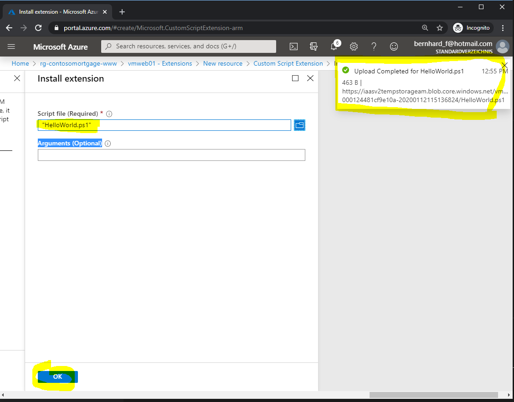
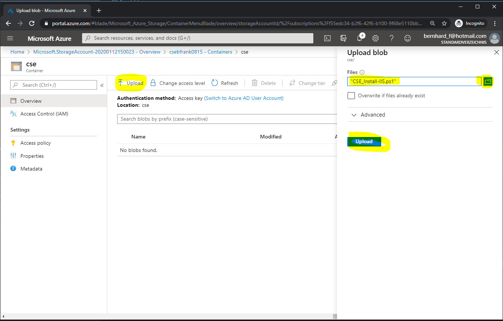
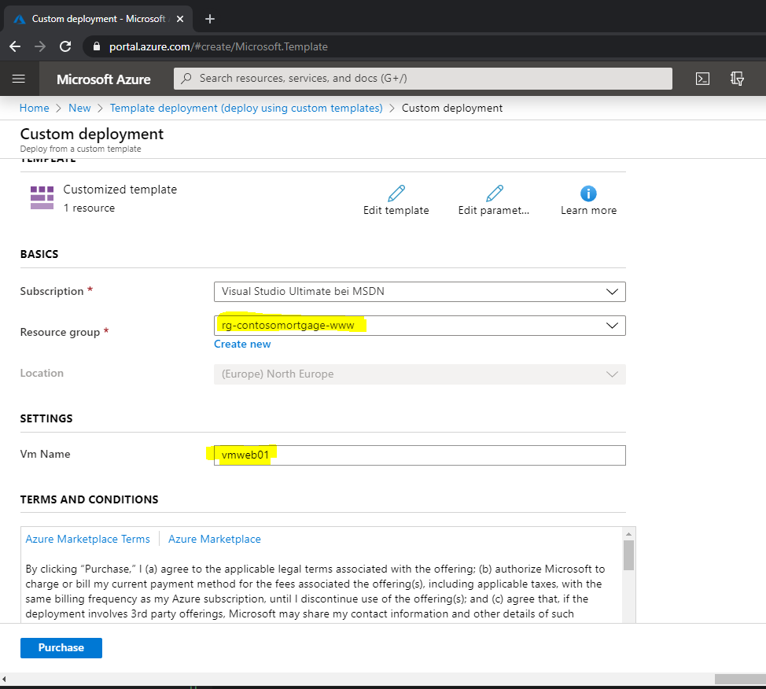
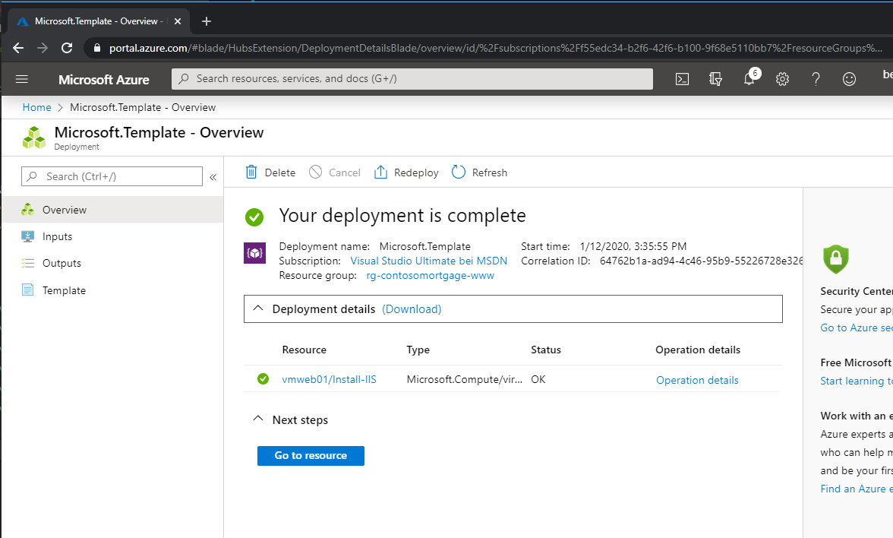

# Challenge 6: VM - Custom Script Extensions: Post deployment automation
## or - configure / setup / install something within an empty vm ##  

[back](../../README.md)  

## Here is what you will learn ##
- How to automate the further configuration / setup of an '_empty_' VM after it has been deployed.
- Use a Custom Script Extension for a Windows VM.
- Upload automation code into a storage account for anonymous download (so that the CSE agent can download)
- Modify an ARM Template to enable '_0 touch VM deployments_'

## Attach a simple HelloWorld Custom Script Extension (CSE) to a VM using the Portal ##
1. Take the following code and copy & paste it into a file named e.g. '_HelloWorld.ps1_':

```
##############################################
#   HelloWorld Custom Script Extension (CSE)
##############################################

$filePath = "c:\temp\CSEwasRunAt.txt"

#create dir if it doesn't exist
if (!(Test-Path -Path (Split-Path $filePath -Parent))) {mkdir (Split-Path $filePath -Parent)}

#write current time to file.
Get-Date | Out-File $filePath -Append

#This is really simple but imagine what else you can do to customize a vm ...

```

2. Make this file being executed by the Custom Script Extension within the the VM:
```
[Azure Portal] -> Resource Groups -> 'rg-contosomortgage-www' -> 'vmweb01'
  -> Extensions -> Add -> 'Custom Script Extension' -> Create
```
  
| Script file (Required) |  Browse to your '_HelloWorld.ps1_'  |
|---|---|
| Arguments (Optional) |  _none_  |  
  
**Wait until uploaded**  
  
**_then_ press OK**  


Do a **refresh** of your browser - it'll show the progress:  

  
Final result should show a success:  


## See what has happened inside the VM
Now we **RDP into the VM** and see what has happened **and where to find logs** in case something breaks.
```
[Azure Portal] -> Resource Groups -> 'rg-contosomortgage-www' -> 'vmweb01'
  -> Connect -> Download RDP file -> Open -> Connect
```
**User**: demouser  
**Password**: _%Your Password%_  
  
Within the VM:
1. **Navigate to c:\temp**  
The **result** should look similar to this:  


2. **Navigate to C:\Packages\Plugins\Microsoft.Compute.CustomScriptExtension\ _%version%_\Downloads**
The CSE is software that runs within the VM. The script that will be executed is **download**ed first to this **location**. If you don't see your script file CSE might have trouble to download the resource.  
  

3. **Navigate to C:\WindowsAzure\Logs\Plugins\Microsoft.Compute.CustomScriptExtension\ _%version%_**
This is the place where the **CSE logs its actions locally** - a good place to start troubleshooting.  


## [optional] Attaching a CSE to a VM in an ARM Template ##
The goal of this action is to learn how to avoid the portal, i.e. so that the CSE can be attached to a VM during deployment time e.g. using an ARM template. With the whole setup Azure + VM Settings can be done in a '_0 touch way_'.

1. In order to **run the next CSE** - you **need to unload the previous one**
```
[Azure Portal] -> Resource Groups -> 'rg-contosomortgage-www' -> 'vmweb01'
  -> Extensions -> CustomScriptExtension -> 'Uninstall'
```
(Note: See what happens to your C:\Packages folder in the VM)

2. In the next CSE **we want to install Internet Information Services (IIS) in the VM**.  
Take a look at the code file first ("[CSE_Install-IIS.ps1](CSE_Install-IIS.ps1)")  
The relevant parts starts at _#region install IIS features_

3. When automating CSE e.g. through **ARM deployment** - the CSE **needs a valid download location for the code file** (CSE_Install-IIS.ps1).  
This could be e.g. a public github repo or another https-reachable location.  
In this lab **we use a storage account for this**.
If you don't have a storage account yet (from a previous lab). Let's create one:  
```
[Azure Portal] -> Resource Groups -> 'rg-contosomortgage-www' -> '+' -> Storage Account 
```  
| Parameter Name | Value  |
|---|---|
| Resource Group  |  **rg-contosomortgage-www** |
| Storage account name  |  **_cse%SomeUniqueLowerCaseValue%_** |
| Location  |  **(Europe) North Europe** |
| Performance  |  Standard |
| Account kind  |  StorageV2 |
| Replication  |  **Locally-redundant storage (LRS)** |
| Access tier  | Hot |
  
Once the storage account has been created - navigate to it **and create a container**:  

| Parameter Name | Value  |
|---|---|
| Container Name  |  **cse** |
| Public access level  |  **Blob** |

And **upload the CSE_Install-IIS.ps1 script into the container**:
```
[Azure Portal] -> Resource Groups -> 'rg-contosomortgage-www' -> %Your Storage Account% -> Container -> 'cse' -> Upload
```

  
4. **Edit the CSE ARM template to use the correct scripts location**
Once uploaded you can copy the blobs URL from the azure portal  


**Can you download the file in your browser using the URL**? [Yes] If not have you set the correct access level at the container?

**Edit this** [CSE ARM template](ARMCSE.json) **template** to use the scripts location: 
  

**with your value**
```
...
"fileUris": [
    "https://cse.....blob.core.windows.net/cse/CSE_Install-IIS.ps1"
],
...
```
**Copy the template into the clipboard.**

5. Deploy the ARM Template.
```
[Azure Portal] -> Resource Groups -> 'rg-contosomortgage-www' -> '+' -> Template deployment -> "Build your own template in the editor" -> Paste the clipboard
```
Select the right resource group and VM and deploy:

  

Deployment will take some minutes: A role is installed and an IIS feature is downloaded and installed.  
At the end **the result should look like this**  
  
Now you have a web server in your VM.  

[back](../../README.md) 
