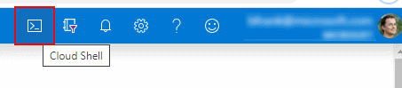
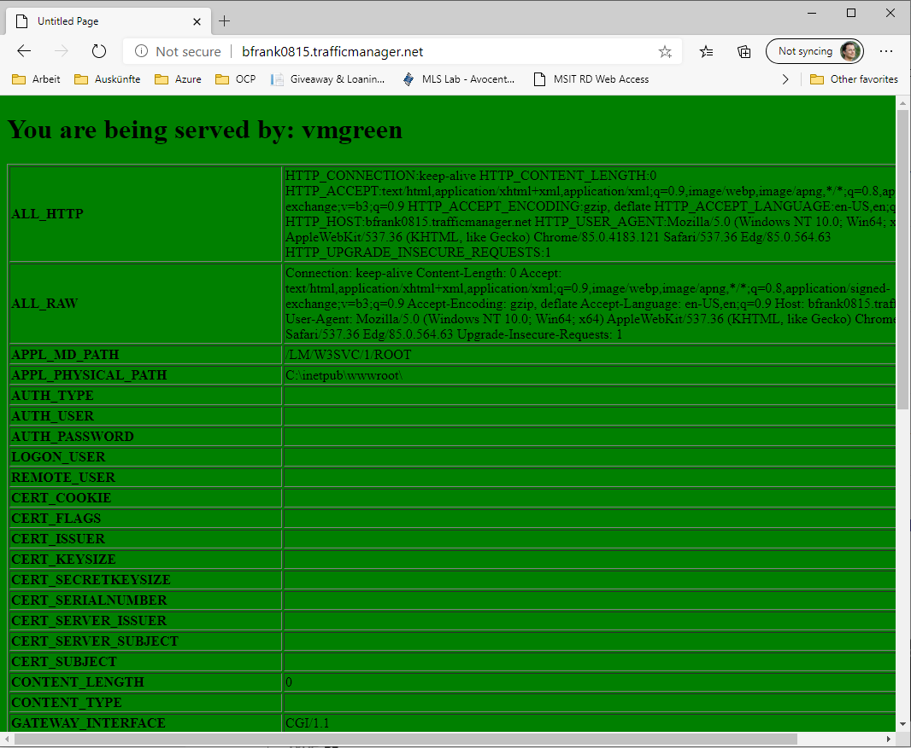
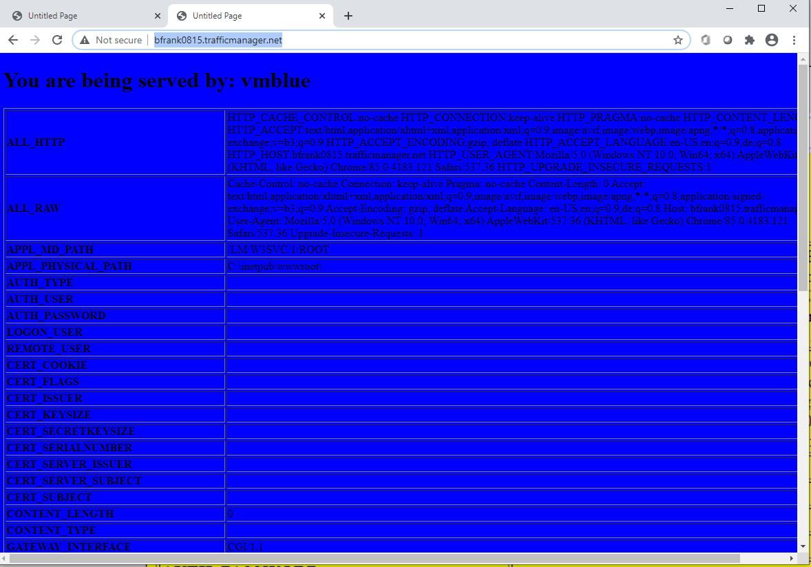
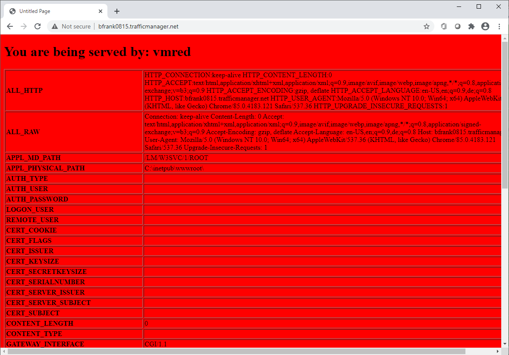

# Challenge 10: Networking: Distribute traffic accross global Azure regions for optimal latency and availability using Traffic Manager

[back](../../README.md)

**[Traffic Manager](https://docs.microsoft.com/en-us/azure/traffic-manager/traffic-manager-overview)** uses DNS to load balance traffic to endpoints accross Azure regions. It can help you to:
- **provide optimal latency** by serving clients from the **nearest location**.
- **increase availability** as it monitors its endpoints and **provides failover**.
- **redirect traffic** to online endpoints while others are in **maintenance**.
- ...

## Here is what you will learn ##
- How to setup Traffic Manager using the Azure portal.
- Setup 2 endpoints located in 2 Azure regions ('North Europe', 'West Europe')
- Configure loadbalancing based on clients origin geography. 

Our **final architecture** will look like this: 
  
  
> To speed things up you will execute a script that creates the VMs and Load balancers in the 2 regions automatically. Then you will setup the Traffic Manager using the portal.

## 1. Deploy the 'starting point' ##
Now let's **create some vms** using the 'Cloud Shell' in the Azure Portal.
```
[Azure Portal] -> Click the 'Cloud Shell' symbol close to your login details on the right upper corner.
```  
)  
The **'Cloud Shell' is an in-browser-accessible shell for managing Azure resources**. It already has the required SDKs and tools installed to interact with Azure. You can use either Bash or PowerShell.  
When being asked **choose PowerShell this time**.  
**The first time you use the 'Cloud Shell' you will be asked to setup a storage account** e.g. to store files you have uploaded persistently. [See](https://docs.microsoft.com/en-us/azure/cloud-shell/persisting-shell-storage)  

```
[Azure Portal] -> Click 'Show advanced settings'
```  
  

| Name | Value |
|---|---|
| Subscription  |  _your subscription_ |
| Cloud Shell Region  |  **North Europe** |   
| Resource Group  |  **rg-cloudshell** |   
| Storage Account  |  **_some unique value_** |   
| File Share  |  **cloudshell**|   

```
[Azure Portal] -> Create storage
```  
Once successful your shell should appear at the bottom of the page:  

  
To setup the starting point **copy & paste the following code into the Cloud Shell**:  
```PowerShell
#Creates some resource groups in different azure regions
New-AzResourceGroup -Name 'rg-wwwlb-NE' -Location 'North Europe'
New-AzResourceGroup -Name 'rg-wwwlb-WE' -Location 'West Europe'
New-AzResourceGroup -Name 'rg-wwwlb' -Location 'North Europe'

$TemplateParameters = @{
    "adminUser" = [string]'demouser';
    "adminPassword" = [System.Security.SecureString](Read-Host -Prompt "adminUser password please" -AsSecureString);
    "vmNames" = [array]@('vmblue','vmred');
    "vmSize" = [string]'Standard_F2s_v2' # or 'Standard_B2s'
    "DiskSku" = [string]'StandardSSD_LRS'
}

```
**Enter the password as asked.**  Then execute the deployment by adding 2 lines

```PowerShell
#will create some vms in different azure regions in parallel
New-AzResourceGroupDeployment -Name 'NE' -TemplateUri "https://raw.githubusercontent.com/CSA-OCP-GER/azure-developer-college/master/day1/challenges/Challenge10/Challenge10Start.json" -ResourceGroupName 'rg-wwwlb-NE' -TemplateParameterObject $TemplateParameters -AsJob

$TemplateParameters.vmNames = @('vmyellow','vmgreen')
New-AzResourceGroupDeployment -Name 'WE' -TemplateUri "https://raw.githubusercontent.com/CSA-OCP-GER/azure-developer-college/master/day1/challenges/Challenge10/Challenge10Start.json" -ResourceGroupName 'rg-wwwlb-WE' -TemplateParameterObject $TemplateParameters -AsJob  

#wait until both deployments are done
get-job -State Running | wait-job  

```


## 2. Deploy a Traffic Manager instance ##
[Add Traffic Manager Profile](https://docs.microsoft.com/en-us/azure/traffic-manager/quickstart-create-traffic-manager-profile#add-traffic-manager-endpoints) in resource group **rg-wwwlb** with a routing method based on e.g. **performance**  
  
Add 2 endpoints to the traffic manager.
| Name | Value |
|---|---|
| Type  |  **Azure endpoint** |
| Name  |  **Dublin** |
| Target resource type  |  **Public IP address** |
| Public IP address  |  **pip-wwwlb-NE** |

| Name | Value |
|---|---|
| Type  |  **Azure endpoint** |
| Name  |  **Amsterdam** |
| Target resource type  |  **Public IP address** |
| Public IP address  |  **pip-wwwlb-WE** |

Now test by opening the traffic managers DNS name in your browser (you might need to open multiple different browsers to see some change):  

|    |    |   |   |
|---|---|---|---|
| vmyellow (Amsterdam)   | vmgreen (Amsterdam) |  vmblue (Dublin) | vmred (Dublin) |
  
## Cleanup ##
**Delete the resource groups _rg-wwwlb...._** or execute this in the Cloud Shell:  
```PowerShell
Remove-AzResourceGroup -Name 'rg-wwwlb-NE' -Force -AsJob
Remove-AzResourceGroup -Name 'rg-wwwlb-WE' -Force -AsJob
Remove-AzResourceGroup -Name 'rg-wwwlb'    -Force -AsJob

Get-Job -State Running | Wait-Job

```


[back](../../README.md)