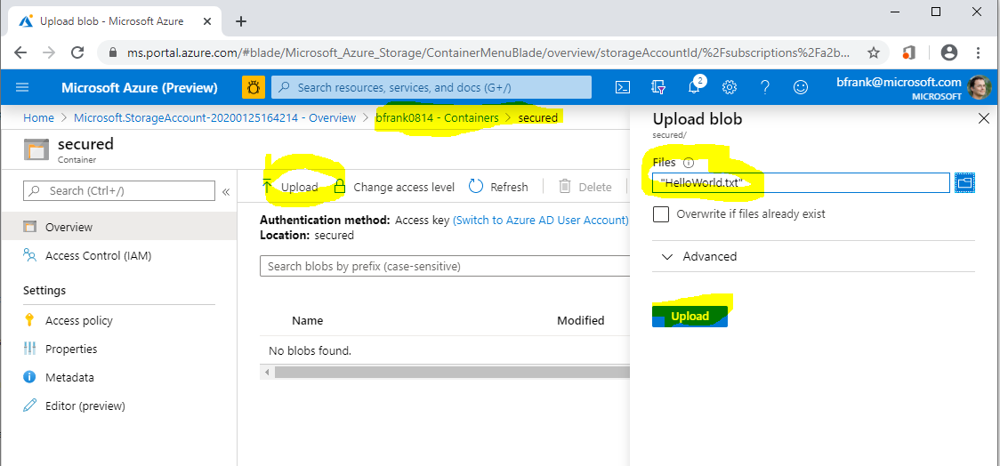
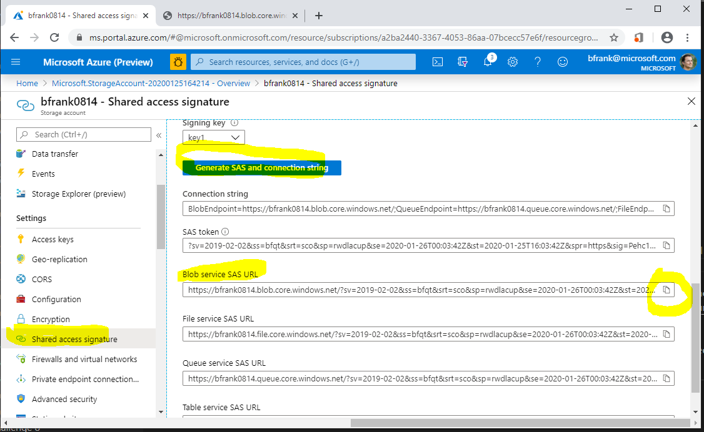

# Challenge 5: Storage Account: Creating a Data Storage for VMs and Applications
[back](../../README.md)  

## Here is what you will learn ##
- how to create an azure storage account using the portal
- enable access to the storagage account data (e.g. blobs) using Shared Access Signatures
- create a SAS policy to enable permission modification after SAS tokens have been issued.
- use AAD credentials as 'better' way for storage account authorization
- create a file share and attach it to your azure virtual machine

## Create a storage account and a container using the azure portal

1. Login to your azure subscription **and search the marketplace for 'Storage Account'**  
  
**Create a storage account** with the following values:

| Name | Value |
|---|---|
| Resource Group  |  **(new)** rg-sachallenge |
| Storage account name  |  _%unique lowercase value%_ |
| Location | **North Europe** |
| Account kind  |  StorageV2 |
| Performance  |  Standard |
| Replication  |  **Locally-redundand storage (LRS)** |
| Access tier  |  Hot |

See some use cases for SAS / [SAS use cases](https://docs.microsoft.com/en-us/azure/storage/common/storage-sas-overview#when-to-use-a-shared-access-signature)

2. Once the sa is created - **generate a new "container"** within the storage account:  
```
[Azure Portal] -> %Your Storage Account% -> Containers -> "+ Container"
```
| Name | Value |
|---|---|
| Name  |  **secured** |
| Public access level  |  Private (no anonymous access) |

Now **upload a small file**.  
  

**Can you download the file** using its URI in another browser session?  
  
Answer: No. Because anonymous access is not allowed and this URI does not 'carry' any auth token.
  

3. **Create a Shared Access Signature** [via the portal] to enable blob access. 
```
[Azure Portal] -> %Your Storage Account% -> Shared access signature -> "Generate SAS and connection string"
```
**Copy the Blob Service SAS URL to the clipboard**
  

**Edit the SAS URL**: You need to add the path to uploaded file - it should look similar to:  

> https://**%Your Storage Account Name%**.blob.core.windows.net/**secured/HelloWorld.txt**?sv=2019-02-02&ss=bfqt&srt=sco&sp=rwdlacup&se=2020-01-26T00:03:42Z&st=2020-01-25T16:03:42Z&spr=https&sig=Pehc....  

**Can you now download the file** in the browser [Yes]

> **Note**: If a SAS,...  
> - ... is leaked, it can be used by anyone who obtains it, which can potentially compromise your storage account.
> - ... provided to a client application expires and the application is unable to retrieve a new SAS from your service, then the application's functionality may be hindered.

4. [optional] **Revoke the storage account's access key1**.
```
[Azure Portal] -> %Your Storage Account% -> Access keys -> key1 -> 'regenerate'
```
Can you still download the file in the browser using aboves URL [No]  
Why? Because the SAS key was generated using the previous key1 -> which is no longer valid.

## Create a stored access policy to control permissions after SAS token is issued. ##

1. Define a stored access policy on the container "securedap" (write)  
```
[Azure Portal] -> %Your Storage Account% -> Containers -> 'secured' -> Access policy -> 'Storage access policy' -> '+' Add policy
```
| Name | Value |
|---|---|
| Identifier  |  **securedap** |
| Permissions  |  **Write** |  

**Note** Don't forget to use the **save** button!  


2. **Create a SAS URL that is using this access policy** using Azure Storage Explorer  
**Open** [Microsoft Azure Storage Explorer](https://azure.microsoft.com/en-us/features/storage-explorer/) and  [See Also Day 2: Challenge 0 - Setup your System](/day2/challenges/challenge-0.md)
**Navigate to your storage account** and container.  
**Right click** and do 'Get Shared Access Signature' based on our policy.  
  
**Copy the URI** to the clipboard.  
**Edit the SAS URI** -> add the path to uploaded file -> can you now download the file in the browser [No]  
**Edit the stored access policy 'securedap' to allow READ access**  
```
[Azure Portal] -> %Your Storage Account% -> Containers -> 'secured' -> Access policy -> Under 'Storage access policy' -> 'securedap' -> '...' -> Edit -> Permissions -> Add READ -> OK -> Save
```
  
**Can you now download the file in the browser** [Yes]

> **Note**:  
> When you now distribute this SAS URI to users or Apps you can later modify it's behaviour by modifying the access policy.  
> So stored access policies can help to modify permissions to a container after the SAS has been issued to users / apps.

## [optional] Authorize access to blobs using AAD ##  
**You can** also **authorize access to storage accounts using Azure Active Directory (AAD) credentials**. [See](https://docs.microsoft.com/en-us/azure/storage/common/storage-auth-aad?toc=%2fazure%2fstorage%2fblobs%2ftoc.json)  
And in fact this **is the recommended way**.  
Apps however might want to use 'service accounts' aka Service Principals in Azure.  
The following PowerShell code creates a Service Principal in AAD. You can give this 'user' permissions to your storage account -> container

```PowerShell
#Login to your azure subscription
Login-AzAccount 
#Right subscription selected?
Get-AzSubscription | Out-GridView -Title "Select working context" -OutputMode Single | Set-AzContext
#Get your AAD ID
$tenantID = $((Get-AzContext).Tenant.Id)  #e.g. '72f988bf-8.....'

#create service principal with null rights in AAD
$servicePrincipalName = "mySaSP...."   #must be unique within AAD tenant
$sp = New-AzADServicePrincipal -DisplayName $servicePrincipalName -Role $null
#save password for later logon (see below).
$BSTR = [System.Runtime.InteropServices.Marshal]::SecureStringToBSTR($sp.Secret)
$UnsecureSecret = [System.Runtime.InteropServices.Marshal]::PtrToStringAuto($BSTR)

<#now assign this service principal storage account contributor rights in the Portal.
[Azure Portal] -> %Your Storage Account% -> Containers -> 'secured' ->  Access Control (IAM) -> Add a role assignment...
    Role: e.g. "Storage Blob Data Owner"
    Select: "mySaSP..."
#>

#Now sign in as this service principal
$passwd = ConvertTo-SecureString $UnsecureSecret -AsPlainText -Force
$pscredential = New-Object System.Management.Automation.PSCredential($sp.ServicePrincipalNames[0], $passwd)
Connect-AzAccount -ServicePrincipal -Credential $pscredential -Tenant $tenantID

$ctx = $null
$ctx = New-AzStorageContext -StorageAccountName "%Your Storage account name%" -UseConnectedAccount
$container = Get-AzStorageContainer -Context $ctx -Name 'secured'
Get-AzStorageBlob -Container $($container.Name) -Context $ctx
#in case of error - do you have the correct role permissions? (e.g. Storage Blob Data Contributor)
#Get-AzRoleAssignment -ServicePrincipalName $sp.ServicePrincipalNames[0]
Get-AzStorageBlob -Container $($container.Name) -Context $ctx | out-gridview -Title 'Select blob to download to c:\temp' -OutputMode Single | Get-AzStorageBlobContent -Destination 'c:\temp'

Logout-AzAccount -Username $sp.ServicePrincipalNames[0]


#cleanup
Read-Host -Prompt "Ready to cleanup? (key)"
#Login to your azure subscription
Login-AzAccount 
#Right subscription selected?
Get-AzSubscription | Out-GridView -Title "Select working context" -OutputMode Single | Set-AzContext
Remove-AzADServicePrincipal -DisplayName $servicePrincipalName -Force
Remove-AzADApplication -DisplayName $servicePrincipalName -Force
```

## Add an azure file share to a server. ##
1. **Add the file share** via the portal:  
```
[Azure Portal] -> Storage Account -> File Shares -> "+" File Share
```
| Name | Value |
|---|---|
| Name  |  **myfiles** |
| Quota  |  _empty_ |   
  
2. **In your Azure VM mount the share** as drive by executing the command taken from:  
```
[Azure Portal] -> Storage Account -> File Shares -> 'myfiles' -> Connect -> copy the code into the clipboard
```  
)  
  
In your VM paste the code into a PowerShell window and execute it. Once successful your 'drive' has been mounted.  


> Questions:
> - What is the default quota of an azure file share? 
> - Which user account is used for establishing the connection? 
> - Is the 'drive' available to other users that logon to the VM? [No]
> - Is the 'drive' mounted 'automatically' after a reboot? [Yes]  

[back](../../README.md)  