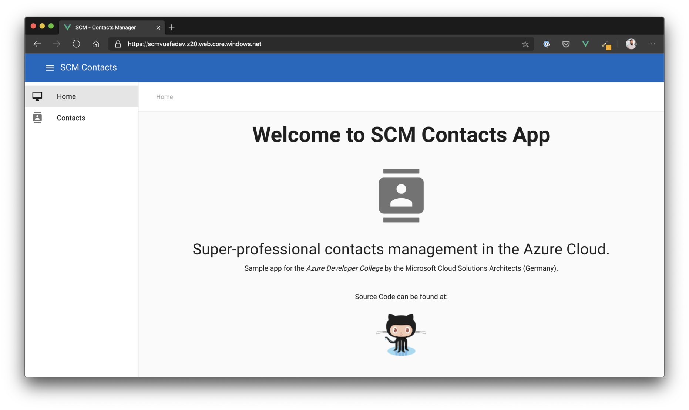
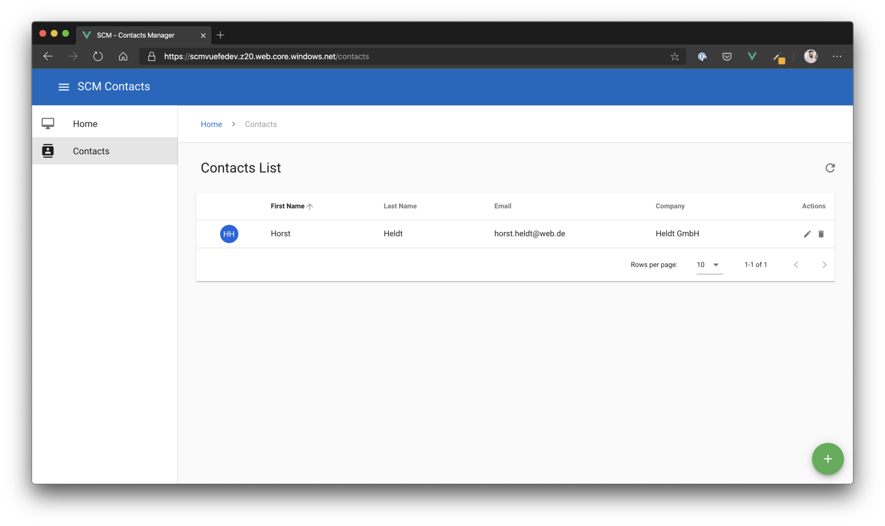

# Day 2 Azure Development

- [Challenge 0 - Setup your system](challenges/challenge-0.md)
- [Challenge 1 - Azure Web Applications](challenges/challenge-1.md)
- :small_orange_diamond: *[Breakout! - Deploy the Azure Dev College sample application to Azure](challenges/challenge-bo-1.md)* :small_orange_diamond:
- [Challenge 2 - Serverless](challenges/challenge-2.md)
- [Challenge 3 - Messaging](challenges/challenge-3.md)
- :small_orange_diamond: *[Breakout! - Add a serverless microservice to our sample app and include messaging](challenges/challenge-bo-2.md)* :small_orange_diamond:
- [Challenge 4 - Azure Resource Manager (ARM) Templates](challenges/challenge-4.md)
- :small_orange_diamond: *[Breakout! - Create an Azure Web App and Storage Account with ARM templates](challenges/challenge-bo-3.md)* :small_orange_diamond:

# Day 2 - Goal #

To give you a little bit more context on what we will be building, here's the description of our sample application and the resulting architecture for *Day 2*.

## Application ##

The sample application we will be using to get to know all the Azure services throughout the workshop, will be a **Simple Contacts Management** (SCM) application. You can - surprisingly - create, read, update and delete contacts with it. Currently, we will be storing the contacts in an in-memory database. On *Day 3* we will learn about the various database services of Azure and add proper persistance to our services. 

Later that day, we will also add a second service to be able to add contact images - which will be stored in an *Azure Storage Account* (Blob). An *Azure Function* which will automatically be trigger through an *Azure Storage Queue* will be responsible to create thumbnails of the images in background.

The frontend for the application is a small, responsive Single Page Application written in *VueJS* (which is one of the popular frameworks at the moment). We will be using the cheapest option to host a static website like that: Azure Blob storage.

## Architecture ##

At the end of the day, we will have the following architecture up and running in your own Azure subscription.

