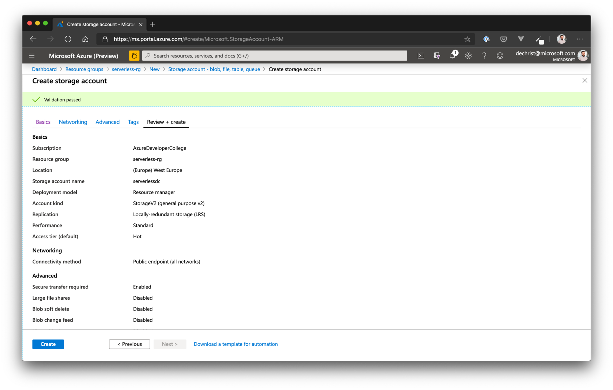
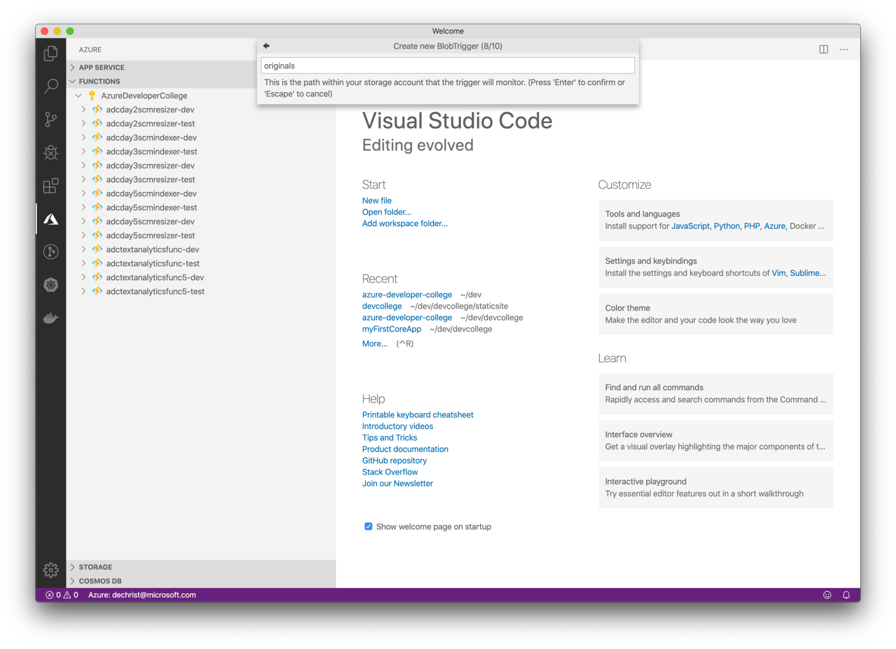

# Serverless #

## Here is what you will learn ##

- Create an Azure Function on your local machine
- Learn how to debug Azure Functions
- Learn how to use Function Triggers to react to events in Azure
- Deploy Azure Functions

## Create a local Azure Function ##

To get familiar with Azure Functions on your local machine, we will be creating a sample that listens for files on an Azure Storage Account (Blob). Each time a new file will be added to a predefined container, our function will be called by Azure, giving us the opportunity to manipulate the file and save it to another location (just a small sample).

So, first of all, we need  to create a Storage Account to being able to upload/process files.

### Add a Storage Account ###

Go to the Azure Portal and click on **"Create a resource"**, in the next view choose/search for **"Storage Account"** and afterwards click *create*.

Follow the wizard:

- put the Storage Account in a new resource group called *serverless-rg*
- give your account a global unique name
- For Location, choose "West Europe"
- Performance Tier: Standard
- Account Kind: Storage V2 (General Purpose)
- Replication: Locally-redundant storage (LRS)
- Access Tier: Hot

Leave all other options to their defaults. In the summary view, it should look like that:



Proceed and create the Storage Account.

When the deployment has finished, go to the storage account and open "Containers" (under "Blob service") and create a container called **originals** and another one called **processed** (leave the proposed settings for **Public Access Level** - *Private*).

The infrastructure to store files is now ready. Let's create the local Azure Function.

### Create the local Function App ###

Open a new Visual Studio Code window and switch to the Azure Tools Exentsion. In the section for "Functions", click on "Create New Project":


The Wizard will guide you through the local setup process.

Choose the following options:
- Language: C#

- Template: BlobTrigger

- Function Name: BlobTriggerCSharp

- Namespace: AzDevCollege.Function

- Settings: Create new local app setting

- Storage Account: select the storage account you created previously

- Trigger Path (the container name we want to listen to for new files): originals

- Debug: select the same storage account as above

When everything is setup in VS Code, let's test the function.

Open *BlobTriggerCSharp.cs* file and set a breakpoint in the "*Run*" method.

Start the Azure Function by hitting **F5**.

The debug console should print logs like that:

```
> Executing task: func host start <


                  %%%%%%
                 %%%%%%
            @   %%%%%%    @
          @@   %%%%%%      @@
       @@@    %%%%%%%%%%%    @@@
     @@      %%%%%%%%%%        @@
       @@         %%%%       @@
         @@      %%%       @@
           @@    %%      @@
                %%
                %

Azure Functions Core Tools (2.7.1948 Commit hash: 29a0626ded3ae99c4111f66763f27bb9fb564103)
Function Runtime Version: 2.0.12888.0
```

Now, open the Azure Storage Explorer, find your storage account and select the *originals* container (alternatively: go to the Portal and open the "Storage Explorer" in the Storage Account). 


Drag'n Drop a file to the container or upload one via the menu. After a few seconds, the breakpoint in VS Code will be hit. Examine the properties of the **myBlob** variable.

### Adjusting the Sample ###

So, great, we can now receive events when a file is added to blob storage. Let's add a more meaningful sample. We want to receive images that we will be resizing/manipulating in our function and write the result to the **processed** container. 

Therefore, we need to add a dependency to our project that enables us to do image manipulation in dotnet core. We will use **SixLabors.ImageSharp** <https://github.com/SixLabors/ImageSharp>. Open a terminal and go to your projects folder. Add the library:

```shell
$ dotnet add <NAME_OF_FUNC>.csproj package SixLabors.ImageSharp -v 1.0.0-beta0007
```

Now, back in Visual Studio Code, replace the contents of the file **BlobTriggerCSharp.cs** with:

```csharp
using System;
using System.IO;
using Microsoft.Azure.WebJobs;
using Microsoft.Azure.WebJobs.Host;
using Microsoft.Extensions.Logging;
using SixLabors.ImageSharp;
using SixLabors.ImageSharp.Processing;

namespace AzDevCollege.Function
{
    public static class BlobTriggerCSharp
    {
        [FunctionName("BlobTriggerCSharp")]
        public static void Run(
            [BlobTrigger("originals/{name}", Connection = "<REPLACE_WITH_NAME_OF_STORAGE_ACCOUNT>_STORAGE")]Stream myBlob, string name,
            [Blob("processed/proc_{name}", FileAccess.Write)] Stream outStream, ILogger log)
        {
            using (Image image = Image.Load(myBlob))
            {
                // Resize and rotate the image!
                image.Mutate(x => x.Resize(image.Width / 2, image.Height / 2));
                image.Mutate(x => x.Rotate(90));

                image.SaveAsJpeg(outStream);
            }
            log.LogInformation($"C# Blob trigger function Processed blob\n Name:{name} \n Size: {myBlob.Length} Bytes");
        }
    }
}
```

What has been added to the **Run** method:

- **[Blob("processed/proc_{name}", FileAccess.Write)] Stream outStream** parameter to automatically write the results of the image manipulation to a blob in the container *processed* having the same file name, prefixed with "proc". This is called an **Output Binding**. You simply write data to these kind of annotated variables and Azure takes care of storing to the configured "data store". For more information on that, see <https://docs.microsoft.com/en-us/azure/azure-functions/functions-bindings-storage-blob?tabs=csharp#output>
- Code to manipulate the input image in the *using* statement

Now restart the local Azure Function and when the function is ready to accept calls, again go to the Storage Explorer and drag an **image** (! - please use an image!) to the folder **orginals**. A few seconds later, you will see that the Azure Function has been triggered. 

Now check the *processed* container. You will find a new **proc_** image with the results of our manipulation.

If everything works as expected on your local machine, let's deploy to Azure.

## Deploy an Azure Function App to Azure ##

Go to the Azure Tools Extension and click on the "Deploy to Azure..." button in the "Functions" section. A wizard will guide you through the creation process (- you are now already familiar with that). 

> **Important**: choose **Advanced** mode.


Choose the following options, when asked:

- OS: Windows
- Hosting Plan: Consumption
- Runtime: .NET
- You can skip the creation of an Application Insights instance
- resource groupe: **serverless-rg**
- when asked, select the same storage account used in the local sample

We still have to configure our Functions App, to be able to listen to blob changes in the Storage Account (BlobTrigger information). Therefore, got to the Portal and open the Functions App you previously created.
Open the Application settings under **Configuration** and add a new application setting (**you can check your *local.settings.json* file for the correct values!**):

| Name | Value |
| --- | --- |
| \<storageaccountname>_STORAGE | enter the connection string to the storage account (you can copy that from your *local.settings.json* file) |
<hr>
<br>

**Make sure to click on _Save_ afterwards.**

Afterwards, it should like that:


Now, test again (upload images) and check, if the Function App is running correctly in Azure (_it might be necessary to restart your function app_).

## House Keeping ##

Remove the sample resource group.

```shell
$ az group delete -n serverless-rg
```
