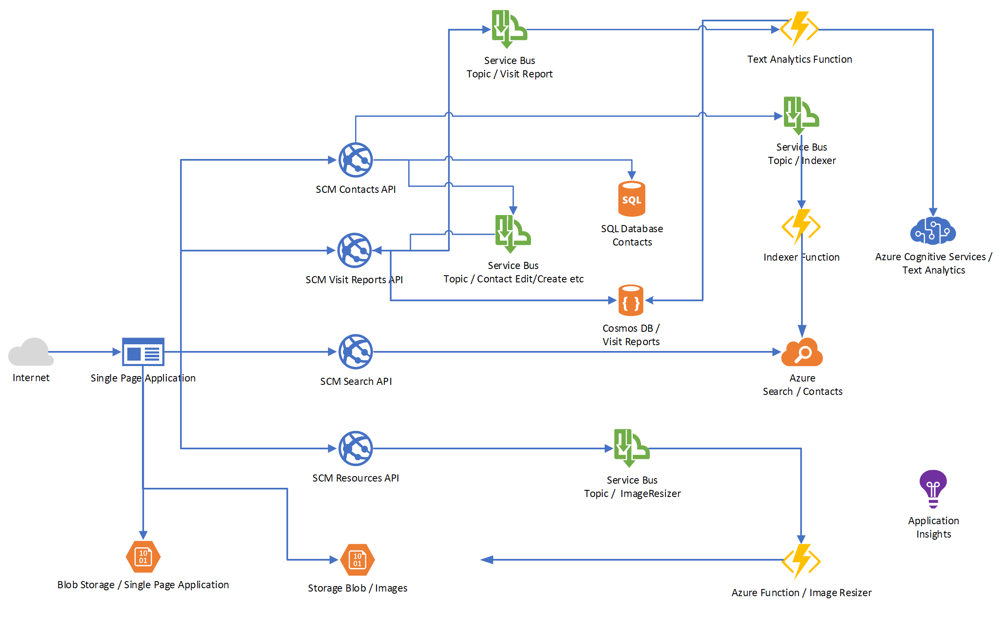

# Day 3 Data and AI

- [Challenge 0 - ](challenges/challenge-0.md)
- [Challenge 1 - Azure Cosmos DB](challenges/challenge-1.md)
- [Challenge 2 - Azure SQL DB](challenges/challenge-2.md)
- [Challenge 3 - Azure Search](challenges/challenge-3.md)
- :small_orange_diamond: *[Breakout! - Add data storage and search services to our sample application](challenges/challenge-bo-1.md)* :small_orange_diamond:
- [Challenge 4 - Cognitive Services](challenges/challenge-4.md)
- :small_orange_diamond: *[Breakout! - Enhance our application with Azure Cognitive Services](challenges/challenge-bo-2.md)* :small_orange_diamond:

# Day 3 - Goal #

Yesterday, we built a basic application that talks to services running as Azure Web Apps in the cloud. Today, we will enhance the application by introducing modern **Data Storage** services (SQL and NoSQL) and adding features of a modern User Experience, like full-text search. We will also add further services and make sure, that they can loosely communicate with each other, so that the application itself remains easily extendable.

## Architecture ##

At the end of the day, we will have the following architecture up and running in Azure.

