# Azure Cognitive Search

⏲️ _Est. time to complete: 30 min._ ⏲️

## Here is what you will learn 🎯

In this challenge you will learn how to:

- Create an Azure Cognitive Search Service in the Portal
- Add Cognitive Skills to Azure Cognitive Search
- Integrate Azure Cognitive Search in an Node.js application

## Table Of Contents

1. [What is Azure Cognitive Search?](#what-is-azure-cognitive-search)
2. [What are the Features of Azure Cognitive Search?](#what-are-the-features-of-azure-cognitive-search)
3. [Create an Azure Search Service in the Portal](#create-an-azure-search-service-in-the-portal)
4. [Querying Content](#querying-content)
5. [Create a Demo App](#create-a-demo-app)
6. [Index Unstructured Data: Add Cognitive Skills to Azure Search](#index-unstructured-data-add-cognitive-skills-to-azure-search)
7. [Azure Samples](#azure-samples)
8. [Cleanup](#cleanup)

## What is Azure Cognitive Search?

Azure Cognitive Search is a search-as-a-service cloud solution that gives developers APIs and tools for adding a rich search experience over private, heterogeneous content in web, mobile and enterprise applications. Your code or a tool invokes data ingestion (indexing) to create and load an index. Optionally, you can add cognitive skills to apply Artificial Intelligence processes during indexing. Doing so, you can add new information and structures useful for search and other scenarios.

Regarding your application, your code issues query requests and handles responses from Azure Cognitive Search. The search experience is defined in your client using functionality from Azure Cognitive Search, with query execution over a persisted index that you create, own, and store in your service.


## What are the Features of Azure Cognitive Search?

| Core Search           | Features                                                                                                                                                                                                                                                                                                                                                                                                                                                                                                                                                                                                                                                                                       |
| --------------------- | ---------------------------------------------------------------------------------------------------------------------------------------------------------------------------------------------------------------------------------------------------------------------------------------------------------------------------------------------------------------------------------------------------------------------------------------------------------------------------------------------------------------------------------------------------------------------------------------------------------------------------------------------------------------------------------------------- |
| Free-form text search | [**Full-text search**](https://docs.microsoft.com/azure/search/search-lucene-query-architecture) is a primary use case for most search-based apps. Queries can be formulated using a supported syntax. <br/><br/>[**Simple query syntax**](https://docs.microsoft.com/rest/api/searchservice/simple-query-syntax-in-azure-search) provides logical operators, phrase search operators, suffix operators, precedence operators.<br/><br/>[**Lucene query syntax**](https://docs.microsoft.com/rest/api/searchservice/lucene-query-syntax-in-azure-search) includes all operations in simple syntax, with extensions for fuzzy search, proximity search, term boosting, and regular expressions. |
| Filters and facets    | [**Faceted navigation**](https://docs.microsoft.com/azure/search/search-faceted-navigation) is enabled through a single query parameter. Azure Cognitive Search returns a faceted navigation structure you can use as the code behind a categories list, for self-directed filtering (for example, to filter catalog items by price-range or brand). <br/><br/> [**Filters**](https://docs.microsoft.com/azure/search/search-filters-facets) can be used to incorporate faceted navigation into your application's UI, enhance query formulation, and filter based on user- or developer-specified criteria. Create filters using the OData syntax.                                            |

:::tip
📝You can find more details here: [Search-Filters-Facets](https://docs.microsoft.com/azure/search/search-filters-facets)
:::

In the SCM Application, we are using the _Lucene_ query syntax ([Lucene Query Syntax Examples](https://docs.microsoft.com/azure/search/search-query-lucene-examples)).

:::tip
📝 View the full Azure Cognitive Search Feature list here: [Azure Cognitive Search Feature list](https://docs.microsoft.com/azure/search/search-features-list)
:::

## Create an Azure Search Service in the Portal

In this first demonstration, we are going to create a new Azure Cognitive Search instance and index the data on the "product" container that we have created during the Cosmos DB challenge.

1. Let's use the same resource group that we have created for Cosmos DB challenge **rg-cosmos-challenge** and add a service of type **Azure Cognitive Search**


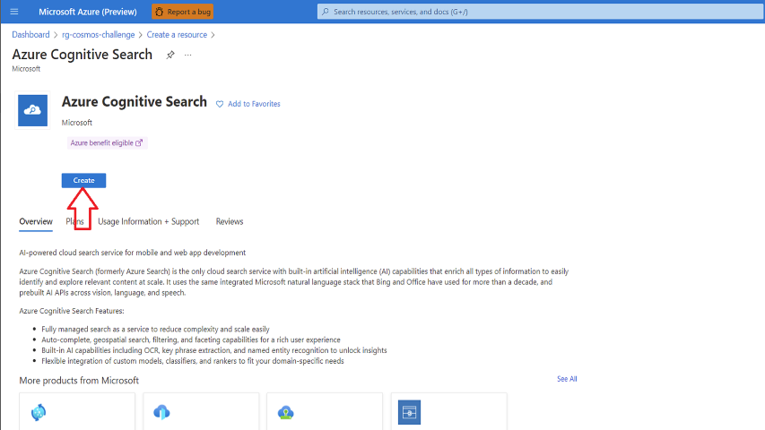

2. Type **azdc-cgsearch-<YOUR_SUFFIX>** as "Service name" and select **West Europe** as "Location". For our purposes, the `Free Tier` would be sufficient.

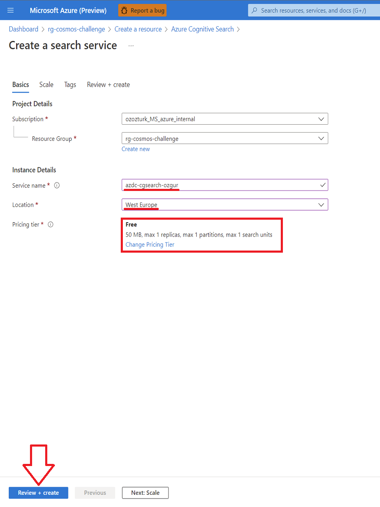

::: tip
📝 However, the `Free Tier` does not support additional replicas, scaling and is only able to index documents with up to 32000 characters/document. If we want to index larger documents, we need to go to a bigger tier (64000 for `Basic`, 4m for `Standard` and above).
:::

Click **Create** and in a few minutes your "Azure Cognitive Service" will be ready.

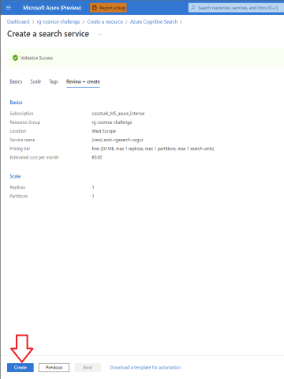

Once provisioned, our service will be reachable via `https://xxxxxxx.search.windows.net`

Azure Search [can index](https://docs.microsoft.com/azure/search/search-indexer-overview) data from a variety of sources:

- Azure SQL Database or SQL Server on an Azure virtual machine
- Azure Cosmos DB
- Azure Blob Storage
- Azure Table Storage
- Indexing CSV blobs using the Azure Search Blob indexer
- Indexing JSON blobs with Azure Search Blob indexer

In general, you can upload your data to one of the sources and let Azure Search index it from there. You can do this completely through the Azure Portal, use [Storage Explorer](https://azure.microsoft.com/features/storage-explorer/) or use the API/CLI.

In our case, we'll use the **product** data in our Cosmos DB instance.

1. Open your Azure Cognitive Search instance and go to `Import Data`


2. Next, we need to define the `Data Source` and choose **Azure Cosmos DB** as a our data source.

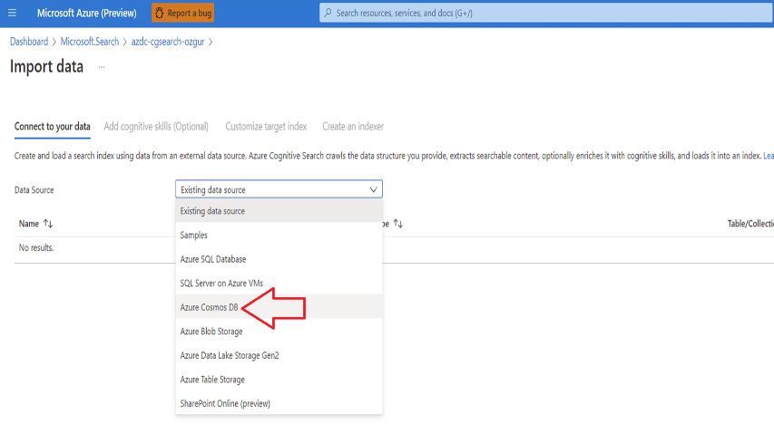

3. On the wizard, please choose/enter the following parameters:

| Option Name         | Value                                                                                      |
| ------------------- | ------------------------------------------------------------------------------------------ |
| _Data source name_  | Type **cosmosdb-connection**                                                               |
| _Connection string_ | Click **Choose an existing connection** and select **azdc-cosmos-challenge-<YOUR_SUFFIX>** |
| Database            | **AzDcdb**                                                                                 |
| _Collection_        | **product**                                                                                |

keep the rest as is and click **Next: Add cognitive skills (Optional)**


4. We'll skip `Cognitive Search` for this example.

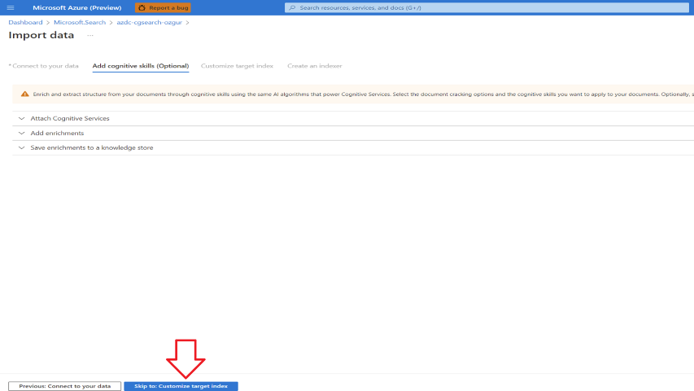

5. Now let's proceed to creating an index. Minimally, an index requires a name and a fields collection; one of the fields should be marked as the **document key** to uniquely identify each document. Additionally, you can specify language analyzers or suggesters ([typeahead/type-as-you-go services](https://docs.microsoft.com/azure/search/index-add-suggesters)), if you want autocomplete or suggested queries.


Fields have data types and attributes. The check boxes above are **index attributes**, controlling how the field is used.

- **Retrievable** means that it shows up in search results list. You can mark individual fields as off limits for search results by clearing this checkbox, for example for fields used only in filter expressions or **security-related** fields.
- **Key** is the unique document identifier. It's always a string, and it is required.
- **Filterable**, **Sortable**, and **Facetable** determine whether fields are used in a filter, sort, or faceted navigation structure.
- **Searchable** means that a field is included in full text search. Strings are searchable. Numeric fields and Boolean fields are often marked as not searchable.

:::tip
📝 Storage requirements do not vary as a result of your selection. For example, if you set the **Retrievable** attribute on multiple fields, storage requirements do not rise.
:::

By default, the wizard scans the data source for unique identifiers as the basis for the key field. _Strings_ are attributed as **Retrievable** and **Searchable**. _Integers_ are attributed as **Retrievable**, **Filterable**, **Sortable**, and **Facetable**.

Select the fields as shown above and click **Next: Create an indexer**

1. Click **Submit** to create and simultaneously run the indexer. This object defines an executable process. You could put it on recurring schedule, but for now use the default option to run the indexer once, immediately.


7. After a minute or two, our Indexer will have indexed the Cosmos DB dataset and we should be able to query the data.


## Querying Content

Open the Search Explorer in the Azure Portal, copy the queries (see below) and get familiar with the results of the queries.

When using the index in the portal for the first time (by pushing the search button), a warning with the following message will appear: `
To search in the portal, please allow the portal origin in your index CORS settings.`

In order to use the index in the portal, hit the `Allow portal` button. Now let's start exploring our data.

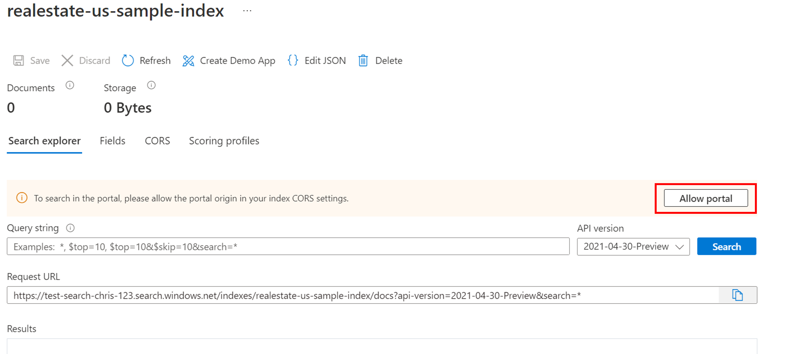
### Simple query with top N results

#### String Query: `search=blue`

- The **search** parameter is used to input a keyword search for full text search, in this case, returning product data for those containing _blue_ in any searchable field in the document.

- **Search explorer** returns results. You see that results are returned in **OData** notation making them easily readable by any language/other service.

- Documents are composed of all fields marked as "retrievable" in the index. To view index attributes in the portal, click _Fields_ in this index view.

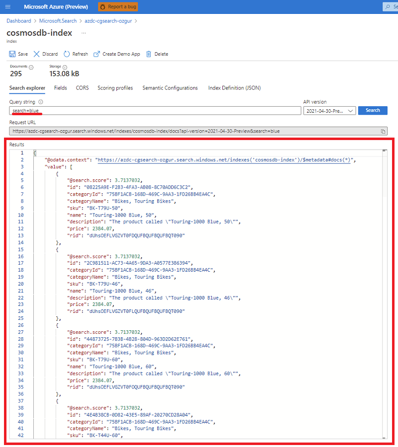

#### Parameterized Query: `search=blue&$count=true&$top=3`

- The **&** symbol is used to append search parameters, which can be specified in any order.

- The **$count=true** parameter returns the total count of all documents **available/found** in the Azure Search index - not **returned**. You can verify filter queries by monitoring changes reported by **$count=true**. Smaller counts indicate your filter is working.

- The **$top=3** returns the highest ranked 3 documents out of the total (**$count**). By default, Azure Cognitive Search returns the first 50 best matches. You can increase or decrease the amount via **$top** parameter.

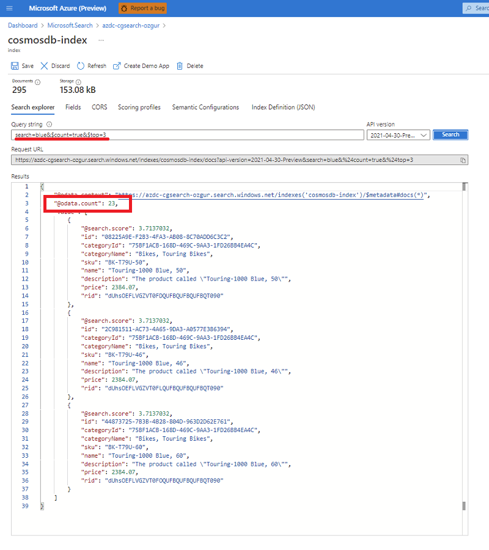

### Filter the query

Filters are included in search requests when you append the **$filter** parameter.

#### Filtered Query: `search=blue&$filter=price lt 1000&$orderby=price desc&$top=10`

- The **$filter** parameter returns results matching the criteria you provided. In this case: _price less than 1000_.

- Filter syntax is an OData expression.
  :::tip
  📝For more information, see [Filter OData syntax](https://docs.microsoft.com/rest/api/searchservice/odata-expression-syntax-for-azure-search).
  :::


#### Linguistic Analysis Query: `search=blue&highlight=description`

- Full text search recognizes basic variations in word forms. In this case, search results contain highlighted text for "blue", for products that have that word in their searchable fields, in response to a keyword search on "blue". Different forms of the same word can appear in results because of linguistic analysis.

  :::tip
  📝 Highlighting works by inserting HTML tags ```<em></em>´´´. You have to add the corresponding CSS (or functionality), to handle the highlighting in your application.
  :::

- Azure Cognitive Search supports 56 analyzers from both Lucene and Microsoft (including the same that are used in Office 365). The default used by Azure Cognitive Search is the standard Lucene analyzer.

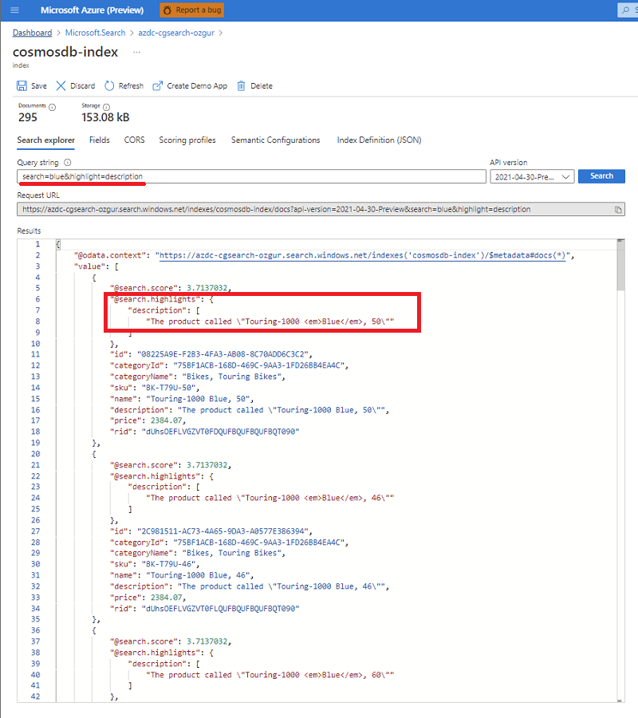

### Try fuzzy search

By default, misspelled query terms, like _bleu_ for "blue", fail to return matches in a typical search. The following example returns no results.

#### Example (misspelled term, unhandled): `search=bleu`

To handle misspellings, you can use fuzzy search. Fuzzy search is enabled when you use the full Lucene query syntax, which occurs when you do two things: set **queryType=full** on the query, and append the **~** to the search string.

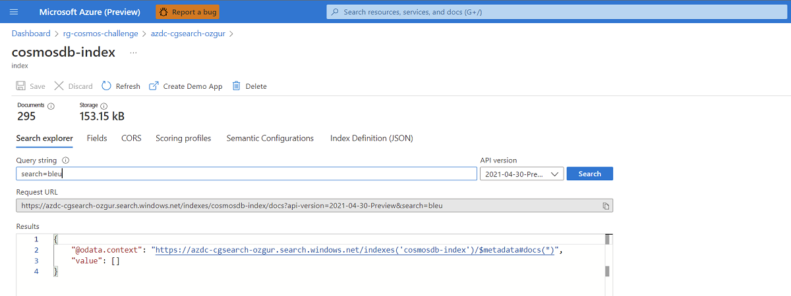

#### Example (misspelled term, handled): `search=bleu~&queryType=full`

This example now returns documents that include matches on "**blue**".

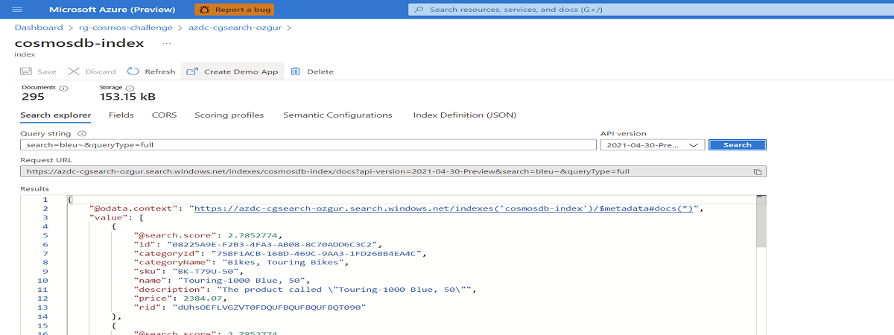

When **queryType** is unspecified, the default **simple query parser** is used. The **simple query parser** is faster, but if you require fuzzy search, regular expressions, proximity search or other advanced query types, you will need the full syntax.

:::tip
📝 Here you find more information about the query syntax:

- [Simple Query Syntax](https://docs.microsoft.com/rest/api/searchservice/simple-query-syntax-in-azure-search)
- [Lucene Query Syntax](https://docs.microsoft.com/rest/api/searchservice/lucene-query-syntax-in-azure-search)

:::

## Create a Demo App

[Azure Cognitive Search](https://docs.microsoft.com/azure/search/cognitive-search-concept-intro) allows us to create a demo application, "localhost"-style web app that runs in a browser. Depending on its configuration, the generated app is operational on first use, with a live read-only connection to a remote index. A default app can include a search bar, results area, sidebar filters, and typeahead support. The demo app can help you visualize how an index will function in a client app, but it is not intended for production scenarios.

1. Open your Azure Cognitive Search instance and go to Indexes. Find the index that you have created a few minutes ago and open.
   

2. Click **Create demo app**
   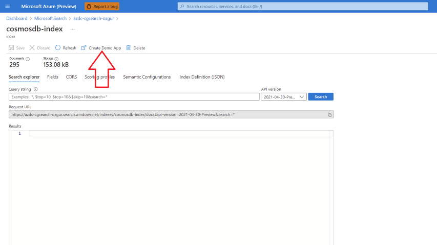
3. Tick **Enable Cors (\*)** tickbox and click **Create Demo App**
   
4. Select **name** as Title and **description** as Description. Leave rest as is and click **Create Demo App**
   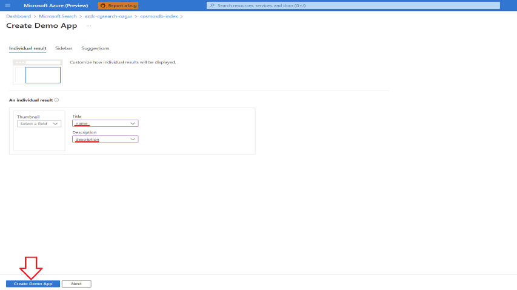
5. Click **Download** and your static web app will be downloaded.
   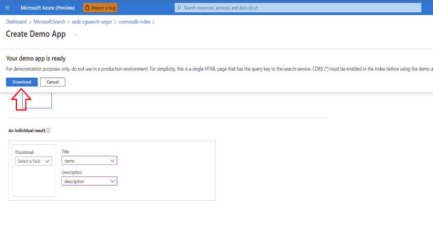
6. Click **Open File** and open downloaded html file.
   
7. Your static web app is configured and ready to use.
   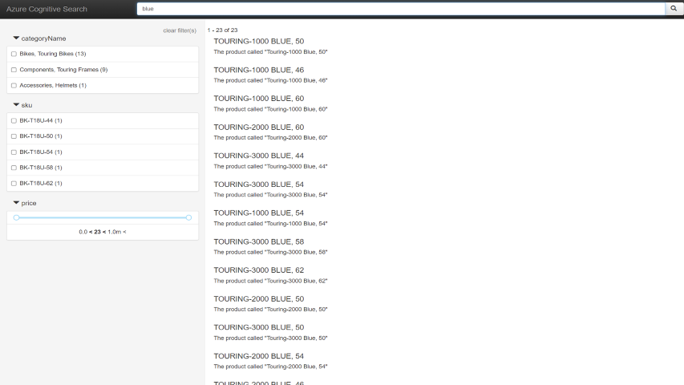

:::tip
📝You can find more details here: [Create-Demo-App](https://docs.microsoft.com/azure/search/search-create-app-portal)
:::

## Index unstructured data: Add Cognitive Skills to Azure Search

[Azure Cognitive Search](https://docs.microsoft.com/azure/search/cognitive-search-concept-intro) allows us to also index unstructured data (like images, audio etc.). More precisely, it adds capabilities for _data extraction_, _natural language processing_ (NLP), and _image processing_ to Azure Search indexing pipeline (for more see [here](https://docs.microsoft.com/azure/search/cognitive-search-concept-intro#key-features-and-concepts)). In Azure Cognitive Search, a skill set is responsible for the pipeline of the data and consists of multiple skills. Some skills have been pre-included, but it is also possible for us to write our own skills.

Let's see it in action. This time we're going to use Sample data provided by Azure Cognitive Services team.

1. Go to the Azure Search Service an click on **Import Data**.


2. Once we're done, we'll repeat the steps from before, **Import Dataset**, walk through the wizard, but this time, we'll configure the **Cognitive Search** part in the second tab.

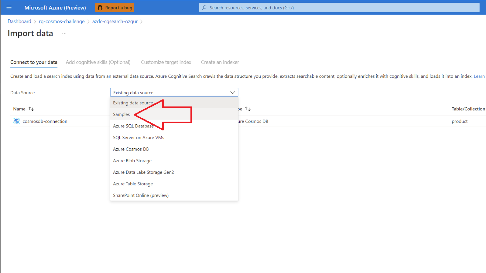

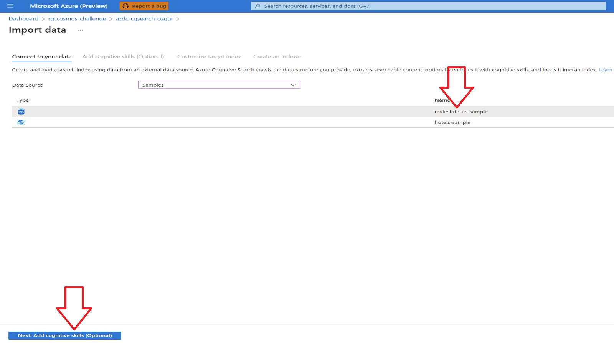

3. So, we need to define the skillset. In our case, we'll enable all features under **Add enrichments**.

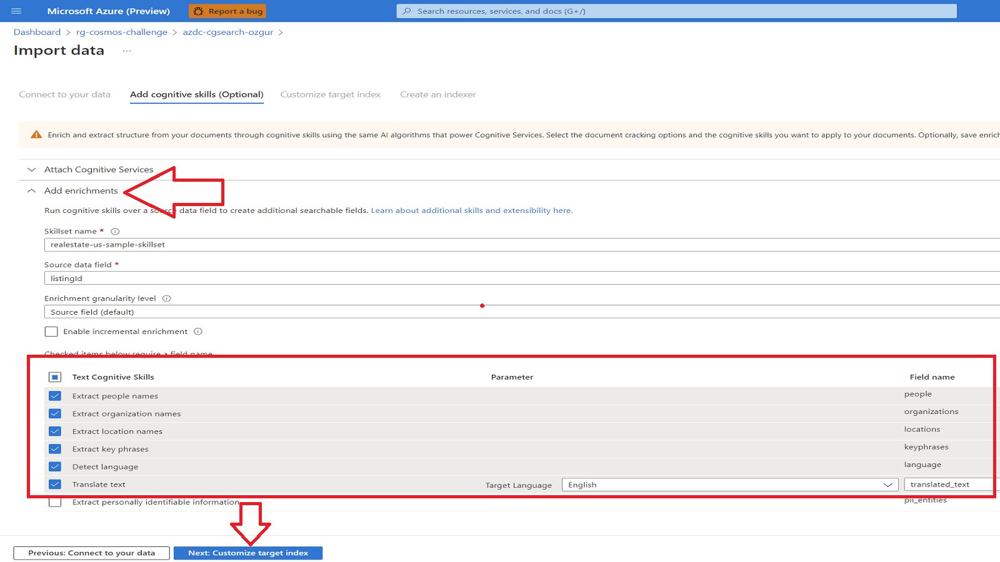

4. Accept the _defaults_ of the index. Once we have finished the next two tabs (Hit **Submit** to run the indexer), Azure Cognitive Search will start indexing our data (this will take a bit longer, as it needs to run image recognition, OCR, etc. on the files).


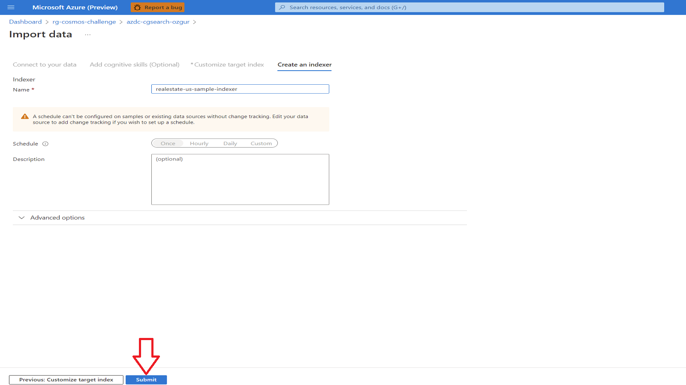

5. When you select the _Indexes Tab_ on the _Overview Page_ in the Azure Portal and select the _Realestate_ Index, you can use the default query and will see (as shown in the following JSON) that the cognitive skills are enabled and that the _Translate Skill_ has a result:


---

:::tip
📝 We've been lazy and did everything through the portal - obviously this is not the way we want to work in the real world. Especially data ingestion and search should (and most likely needs) to be performed through the API. Here are couple of examples for basic api tasks.

- [Create an index](https://docs.microsoft.com/azure/search/search-create-index-rest-api)
- [Import Data](https://docs.microsoft.com/azure/search/search-import-data-rest-api)
- [Search](https://docs.microsoft.com/azure/search/search-query-rest-api)

:::

## Azure Samples

Azure Cognitive Search code samples:

- <https://docs.microsoft.com/samples/browse/?expanded=azure&products=azure-cognitive-search>

## Cleanup

Remove the resource group:

```shell
az group delete -n rg-cosmos-challenge
```

[◀ Previous challenge](./02-challenge-sql.md) | [🔼 Day 3](../README.md) | [Next challenge ▶](./04-challenge-bo-1.md)
