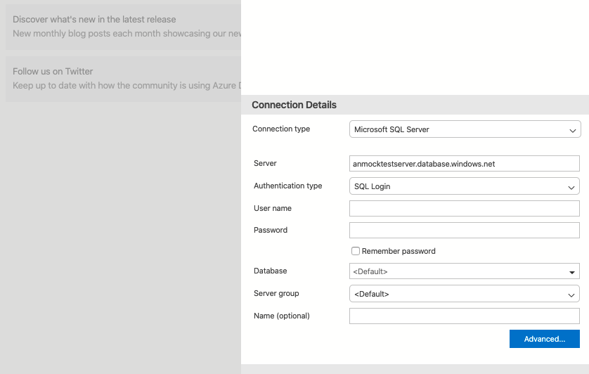
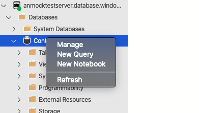
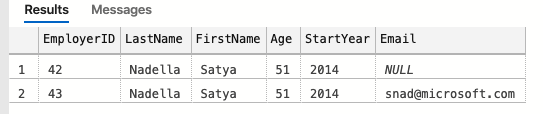

# Azure SQL DB #


## Here is what you will learn ##

- Create an Azure SQL DB (Single Database)
- Add Data to the Azure SQL DB
- Setup Dynamic Data Masking

Azure SQL Database is a general-purpose relational database, provided as a managed service. It's based on the latest stable version of [Microsoft SQL Server database engine](https://docs.microsoft.com/sql/sql-server/sql-server-technical-documentation?toc=/azure/sql-database/toc.json). In fact, the newest capabilities of SQL Server are released first to SQL Database, and then to SQL Server itself. You get the newest SQL Server capabilities with no overhead for patching or upgrading, tested across millions of databases.

To get startet with SQL Database the documentation [here](https://docs.microsoft.com/en-us/azure/sql-database/sql-database-technical-overview) is a good starting point.

## Deployment models

Let us have a look at the different deployment models of SQL Database first:


- Single database represents a fully managed, isolated database. You might use this option if you have modern cloud applications and microservices that need a single reliable data source. A single database is similar to a contained database in Microsoft SQL Server Database Engine.
- Managed instance is a fully managed instance of the Microsoft SQL Server Database Engine. It contains a set of databases that can be used together. Use this option for easy migration of on-premises SQL Server databases to the Azure cloud, and for applications that need to use the database features that SQL Server Database Engine provides.
- Elastic pool is a collection of single databases with a shared set of resources, such as CPU or memory. Single databases can be moved into and out of an elastic pool.

## Purchasing models

SQL Database offers the following purchasing models:

- The vCore-based purchasing model lets you choose the number of vCores, the amount of memory, and the amount and speed of storage.
- The DTU-based purchasing model offers a blend of compute, memory, and I/O resources in three service tiers, to support light to heavy database workloads. Compute sizes within each tier provide a different mix of these resources, to which you can add additional storage resources
- The serverless model automatically scales compute based on workload demand, and bills for the amount of compute used per second. The serverless compute tier also automatically pauses databases during inactive periods when only storage is billed, and automatically resumes databases when activity returns.

You see that each purchasing model refers to compute, memory and I/O resources, because this are the most important and crtical resources a databse uses.


## Create a single SQL Database

The single database deployment option creates a database in Azure SQL Database with its own set of resources and is managed via a SQL Database server. With a single database, each database is isolated from each other and portbale, each with its own service tier within the DTU-based purchasing model or vCore-based purchasing model and a guaranteed compute size. 

Open a shell, we use Azure CLI to create the nneded Azure resources:

1. Create a resource group:
   ```Shell
   az group create --name <your rg name> --location <your Azure region>
   ```
2. Create the server instance and note down the __fullyQualifiedDomainName__ of your server from the output
   ```Shell
   az sql server create --name <name of the server> --resource-group <your rg name> --location <your Azure region> --admin-user <name of your admin> --admin-password <pwd>
   ```
3. Per default the access is not permitted via the Azure SQL Server. Configure the server's firewall to allow your IP
   ```Shell
   az sql server firewall-rule create --server <name of your server> --resource-group <your rg name> --name AllowYourIp --start-ip-address <your public ip> --end-ip-address <your public Ip> 
   ```
4. Create the SQL Database with vCore-based purchasing Gen4, 1 vCore and max 32GB in size. [Here](https://docs.microsoft.com/en-us/azure/sql-database/sql-database-service-tiers-vcore) you will find a good overview of the vCore model.
   ```Shell
   az sql db create --name MSFTEmployees --resource-group <your rg name> --server <name of your server> --edition GeneralPurpose --family Gen4 --capacity 1 --max-size 32GB --zone-redundant false
   ```

## Add Data to SQL DB ##

Now that your SQL Database is up and running it's time to add some data. First we will use the Azure CLI to do so

Get to know your environment

   ```Shell
   az sql server list --resource-group <your rg name>
   ```
   ```Shell
   az sql db list --resource-group <your rg name> --server <name of your server>
   ```
  
   If you run the command like this you are getting a lot of information to make sense of. You can restrict this by using a query:
   
   ```Shell
   az sql db list --resource-group <your rg name> --server <name of your server> --query '[].{Name:name}'
   ```
  
   ```Shell
   az sql db show --resource-group <your rg name> --server <name of your server> --name MSFTEmployees --query '{name: name, maxSizeBytes: maxSizeBytes, status: status}'
   ```
  
Connect to your SQL DB

   ```Shell
   az sql db show-connection-string --name MSFTEmployees --server <name of your server> --client sqlcmd
   ```

   For the next part to work you either have the sqlcmd extension or just use the Azure Shell. Copy the sqlcmd command and enter your admin name and password. The command should look something like this:
  
   ```Shell
   sqlcmd -S tcp:[Name of your Server].database.windows.net,1433 -d MSFTEmployees -U <name of your admin> -P <pwd> -N -l 30
   ```
  
   After running this you should see a ```1>```. Now you can run SQL Queries. If you are unfamiliar with their Syntax feel free to take some time getting used to it.

Add a table.

   ```Sql
   CREATE TABLE CEOs (EmployerID int, LastName varchar(255), FirstName varchar(255), Age int, StartYear int);
   GO
   ```

Add Data to your table

   ```Sql
   INSERT INTO CEOs (EmployerID, LastName, FirstName, Age, StartYear) VALUES (42, 'Nadella', 'Satya', 51, 2014);
   GO
   ```

Update the Age of Satya Nadella in the Table

   ```Sql
   UPDATE CEOs SET Age=52 WHERE EmployerID=42;
   GO
   ```
  
Query the data

   ```Sql
   SELECT * FROM CEOs
   GO
   ```

  
Add the other CEOs Microsoft has had to the list as well (the ID is fictional). To exit the sqlcmd utility program enter ```exit```.

## Add Data to SQL DB using the Azure Data Studio ##

Another, more simple approach is using the Azure Data Studio. Azure Data Studio is a cross-platform database tool for data professionals using the Microsoft family of on-premises and cloud data platforms on Windows, MacOS, and Linux.

Azure Data Studio offers a modern editor experience with IntelliSense, code snippets, source control integration, and an integrated terminal. It's engineered with the data platform user in mind, with built-in charting of query result sets and customizable dashboards.

Open the `Azure Data Studio` and connect to your server:



After you have connected to your server `Azure Data Studio` wants you to add your Azure account. Follow the instructions and add your account.
Next we want to create our first table in the ContactsDb. Navigate to the ContactDb, open the context menu and select `New Query`.



Add and run the following query, creating a new Table:

   ```Sql
   CREATE TABLE PrtnrEmployees (EmployerID int, LastName varchar(255), FirstName varchar(255), PartnerCompany varchar(255), StartYear int)
   ```

Create a new query and insert a row:

   ```Sql
   INSERT INTO PrtnrEmployees (EmployerID, LastName, FirstName, PartnerCompany, StartYear) VALUES ( ... ), ( ... ), ( ... )
   ```

View the data returned by a query

   ```Sql
   SELECT * FROM PrtnrEmployees;
   ```   
   ```Sql
   SELECT * FROM CEOs;
   ```


## Setup Dynamic Data Masking

Dynamic data masking (DDM) limits sensitive data exposure by masking it to non-privileged users. It can be used to greatly simplify the design and coding of security in your application. Take a look at the documentation [here](https://docs.microsoft.com/en-us/sql/relational-databases/security/dynamic-data-masking?view=sql-server-ver15) to get more information about Dynamic Data Masking


To see Dynamic Data Masking in action we first add a column to the Contacts table with a Data Masking Rule.
Back in Azure Data Studio create a new query and run a command as follows:

   ```Sql
   ALTER TABLE [dbo].[CEOs]
   ADD Email varchar(256) MASKED WITH (FUNCTION = 'EMAIL()');
   ```
Run another query to add another row:

   ```Sql
   INSERT INTO CEOs (EmployerID, LastName, FirstName, Age, StartYear, Email) VALUES (43, 'Nadella', 'Satya', 52, 2014, 'snad@microsoft.com')
   ```
When we select the top 1000 rows of the Contacts table we still see the email's actual value.



The reason behind this is that the account we have used has elevated privileges. To show you how Dynamic Data Masking works we create a user and grant select on Contacts. Create a new query in the Azure Data Studio and run the commands as follows:

   ```Sql
   CREATE USER TestUser WITHOUT LOGIN;  
   GRANT SELECT ON CEOs TO TestUser;  
     
   EXECUTE AS USER = 'TestUser';  
   SELECT * FROM CEOs; 
   ```

## Access Management for Azure SQL DB ##

Under Access Management we are taking a look at authentication and authorization. Authentication is the process of proving the user is who they claim to be. Authorization refers to the permissions assigned to a user within an Azure SQL Database, and determines what the user is allowed to do.

Azure SQL Database supports two types of authentication: SQL authentication, as we have used before in creating the TestUser. And Azure Active Directory authentication.

Let's have a look at the SQL authentication. As server admin you can create additional SQL users - which enables other users to connect to the SQL Database. Create a new query.

   ```Sql
   CREATE USER Marvin WITH PASSWORD = '42_as_ANSWER!'
   ```

Now you can sign up as this user.

Before we did grant the ```TestUser``` select access to the Table CEOs. Similarly you can create a custom role. There is also a set of fixed roles. They can be assigned as followes:

   ```Sql
   ALTER ROLE  db_backupoperator ADD MEMBER Marvin;
   ```

 

## Clean up ##

Delete Resource Group

```az group delete -name <your rg name>```

## OPTIONAL: SQL Databace backup and retention policies ##

You make the choice between configuring your server for either locally redundant backups or geographically redundant backups at server creation.
After a server is created, the kind of redundancy it has, geographically redundant vs locally redundant, can't be switched.
While creating a server via the ```az sql server create``` command, the ```--geo-redundant-backup``` parameter decides your Backup Redundancy Option. If ```Enabled```, geo redundant backups are taken. Or if ```Disabled``` locally redundant backups are taken.
In our current database geo redundant backups therefore are not possible.

Go to the Azure portal and navigate to your SQL server. Under Manage Backups you will find the retention policies. Change the retention policy for MicrosoftEmployees to Monthly Backups that should be kept for 8 weeks.
   On the Available backups tab, you will find backups from which you can restore a specific database.
   
   As a declarative abstraction on top of the existing active geo-replication feature, Auto-failover groups are a SQL Database feature that allows you to manage replication and failover of a group of databases on a SQL Database server or all databases in a managed instance to another region.
   They are designed to simplify deployment and management of geo-replicated databases at scale.

   When you are using auto-failover groups with automatic failover policy, any outage that impacts one or several of the databases in the group results in automatic failover. Typically these are incidents that cannot be self-mitigated by the built-in automatic high availability operations. The examples of failover triggers include an incident caused by a SQL tenant ring or control ring being down due to an OS kernel memory leak on several compute nodes, or an incident caused by one or more tenant rings being down because a wrong network cable was cut during routine hardware decommissioning. For more information, see SQL Database High Availability.

Create another Azure SQL Server

   ```Shell
   az sql server create --name <name of your second server> --resource-group <your rg name> --location northeurope --admin-user <name of your admin> --admin-password <pwd>
   ```
   
Create a failover group between the servers and add the database

   ```Shell
   az sql failover-group create --name <name of your fg> --partner-server <name of your second server> --resource-group <your rg name> --server <name of your server> --add-db MSFTEmployees --failover-policy Automatic
   ```
   
Verify which server is secondary 

   ```Shell
   az sql failover-group list --server <name of your server> --resource-group <your rg name>
   ```
   
Failover to the secondary server

   ```Shell
   az sql failover-group set-primary --name <name of your fg> --resource-group <your rg name> --name <name of your second server>
   ```

Revert failover group back to the primary server

   ```Shell
   az sql failover-group set-primary --name <name of your fg> --resource-group <your rg name> --name <name of your server>
   ```
  
## OPTIONAL: Connect the Azure SQL DB to a Web Application ##

This tutorial shows how to create a .NET Core app and connect it to a SQL Database. When you're done, you'll have a .NET Core MVC app running in App Service.

Clone the sample application

   ```Shell
   git clone https://github.com/azure-samples/dotnetcore-sqldb-tutorial
   ```
   ```Shell
   cd dotnetcore-sqldb-tutorial
   ```

Install the required packages, run database migrations, and start the application.

   ```Shell
      dotnet tool install --global dotnet-ef 
      dotnet restore
      dotnet ef database update
      dotnet run
   ```
      
  Navigate to ```http://localhost:5000``` in a browser. Select the Create New link and create a couple to-do items.

   To stop .NET Core at any time, press ```Ctrl+C``` in the terminal.

Create a new database in the previously created SQL Server.

   ```Shell
   az sql db create --resource-group <your rg name> --server <name of your server> --name coreDB
   ```
   
Create the connection string

   ```Shell
   az sql db show-connection-string --name coreDB --server <name of your server> --client sqlcmd
   ```
   
   The result should look something like this:
   
   ```Shell
   Server=tcp:<name of your server>.database.windows.net,1433;Database=coreDB;User ID=<name of your admin>;Password=<pwd>;Encrypt=true;Connection Timeout=30;
   ```
   
Configure a local git deployment. FTP and local Git can deploy to an Azure web app by using a deployment user. Once you configure your deployment user, you can use it for all your Azure deployments.

   ```Shell
   az webapp deployment user set --user-name <name of your app user> --password <pwd>
   ```

Create an App Service plan. An App Service plan defines a set of compute resources for a web app to run. These compute resources are analogous to the server farm in conventional web hosting. One or more apps can be configured to run on the same computing resources (or in the same App Service plan).

   ```Shell
   az appservice plan create --name <name of your asp> --resource-group <your rg name> --sku FREE
   ```

Create a web app in the recently created App Service plan.
   
   ```Shell
   az webapp create --resource-group <your rg name> --plan <name of your asp> --name <your app name> --deployment-local-git
   ```
   
Configure the connection string. To set connection strings for your Azure app, use the az webapp config appsettings set command in the Cloud Shell. In the following command replace the [Your Connection String] parameter with the connection string you created earlier.

   ```Shell
   az webapp config connection-string set --resource-group <your rg name> --name <name of your app> --settings MyDbConnection="<Your Connection String>" --connection-string-type SQLServer
   ```
   
   In ASP.NET Core, you can use this named connection string (```MyDbConnection```) using the standard pattern, like any connection string specified in appsettings.json. In this case, ```MyDbConnection``` is also defined in your appsettings.json. When running in App Service, the connection string defined in App Service takes precedence over the connection string defined in your appsettings.json. The code uses the appsettings.json value during local development, and the same code uses the App Service value when deployed.

Configure environment variable. Next, set ASPNETCORE_ENVIRONMENT app setting to Production. This setting lets you know whether you're running in Azure, because you use SQLite for your local development environment and SQL Database for your Azure environment.

   ```Shell
   az webapp config appsettings set --name <name of your app> --resource-group <your rg name> --settings ASPNETCORE_ENVIRONMENT="Production"
   ```

Connect to SQL Database in production by opening the Startup.cs and finding the following code in your local repository:

   ```C#
   services.AddDbContext<MyDatabaseContext>(options =>
        options.UseSqlite("Data Source=localdatabase.db"));
   ```

   Replace it with the following code, which uses the environment variables that you configured earlier.
   
   ```C#
   // Use SQL Database if in Azure, otherwise, use SQLite
      if(Environment.GetEnvironmentVariable("ASPNETCORE_ENVIRONMENT") == "Production")
        services.AddDbContext<MyDatabaseContext>(options =>
            options.UseSqlServer(Configuration.GetConnectionString("MyDbConnection")));
      else
        services.AddDbContext<MyDatabaseContext>(options =>
            options.UseSqlite("Data Source=localdatabase.db"));

      // Automatically perform database migration
      services.BuildServiceProvider().GetService<MyDatabaseContext>().Database.Migrate(); 
   ```

   If this code detects that it's running in production (which indicates the Azure environment), then it uses the connection string you configured to connect to the SQL Database.

   The Database.Migrate() call helps you when it's run in Azure, because it automatically creates the databases that your .NET Core app needs, based on its migration configuration.  

   Save your changes, then commit it into your Git repository.
   
   ```Shell
   git add .
   ```
   ```Shell
   git commit -m "connect to SQL DB in Azure"
   ```
   
Push to Azure from Git. Add an Azure remote to your local Git repository. Replace [Local Git URL] with the URL of the Git remote from step 7, when ypu did create the web app.

   ```Shell
   git remote add azure <Local Git URL>
   ```

   Push to the Azure remote to deploy your app with the following command. When Git Credential Manager prompts you for credentials, make sure you enter the credentials you created in Configure a deployment user, not the credentials you use to sign in to the Azure portal. This might take some time.
   
   ```Shell
   git push azure master
   ```
   
Browse to the deployed app using your web browser.

   ```Shell
   http://<name of your app>.azurewebsites.net
   ```
