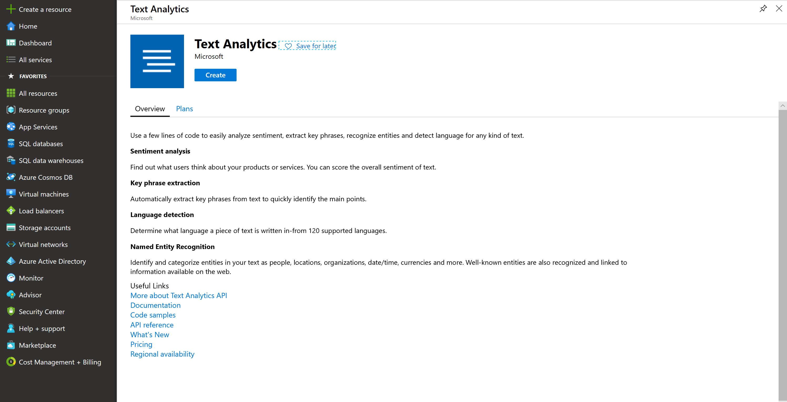

# Cognitive Services #

## Here is what you will learn ##

- Create and use the Text Analysis Cognitive Service
- Create and use the Translate Cognitive Service
- Create and use the  Computer Vision Service and integrate it into an Node.js App
- Create and use the Face Cognitive Service

# What are Azure Cognitive Services?

Azure Cognitive Services: 
- are APIs, SDKs and services available to help developers build intelligent applications without having direct Artificial Intelligence (AI), data science skills or knowledge. 
- enable developers to easily add cognitive features into their applications. 
- The goal of Azure Cognitive Services is to help developers create applications that can see, hear, speak, understand and even begin to reason. 
- The catalog of services within Azure Cognitive Services can be categorized into five main pillars - *Vision*, *Speech*, *Language*, *Web Search*, and *Decision*.

In this challenge we will focus on the following Cognitive Services:

|Service Name|Service Description|
|:-----------|:------------------|
|[Text Analytics](https://docs.microsoft.com/azure/cognitive-services/text-analytics/ "Text Analytics")|Text Analytics provides natural language processing over raw text for sentiment analysis, key phrase extraction and language detection.|
|[Translator Text](https://docs.microsoft.com/azure/cognitive-services/translator/ "Translator Text")|Translator text provides for machine-based text translation in near real-time.|
[Computer Vision](https://docs.microsoft.com/azure/cognitive-services/computer-vision/ "Computer Vision")|The Computer Vision service provides you with access to advanced algorithms for processing images and returning information.|
|[Face](https://docs.microsoft.com/azure/cognitive-services/face/ "Face")| The Face service provides access to advanced face algorithms, enabling face attribute detection and recognition.|

# Create and use a Text Analysis Cognitive Service 

You can solve these tasks in a programming language of your choice. For the sake of convenience, we are providing hints in `Node.js`. SDK support for `C#` or `.NET Core` is also available. 

|Azure Cognitive Services|Information|
|---|---|
|[Text Analytics API](https://azure.microsoft.com/en-us/services/cognitive-services/text-analytics/)|https://docs.microsoft.com/en-us/azure/cognitive-services/text-analytics/quickstarts/nodejs |


:triangular_flag_on_post: **Goal:** Leverage Text Analytics API for extracting language, sentiment, key phrases, and entities from text. Please use a new resource group, e.g. **adc-cognitive-rg**. As a **Pricing Tier**, select the smallest possible in the chosen region.

1. Go to the Azure Portal, create a Text Analytics Service (in the `West Europe` region):




## Extract sentiment, key phrases and entities from unstructured text ##

### Detect language ###

The Language Detection API detects the language of a text document, using the [Detect Language method](https://westcentralus.dev.cognitive.microsoft.com/docs/services/TextAnalytics-v2-1/operations/56f30ceeeda5650db055a3c7).

So, let's create a sample application:

- Create a new folder **adc-cognitive** on you machine and start a new Node.JS project.
  - run ```npm init``` on the command line and accept all options the wizard proposes
- open Visual Studio Code by typing ```code .```
- Add the code provided below to a new `detect.js` file.

```javascript
'use strict';

let https = require ('https');
let subscription_key = "<paste-your-text-analytics-key-here>";
let endpoint = "<paste-your-text-analytics-endpoint-here>";

let path = '/text/analytics/v2.1/languages';

let response_handler = function (response) {
    let body = '';
    response.on('data', function (d) {
        body += d;
    });
    response.on('end', function () {
        let body_ = JSON.parse(body);
        let body__ = JSON.stringify(body_, null, '  ');
        console.log(body__);
    });
    response.on('error', function (e) {
        console.log('Error: ' + e.message);
    });
};

let get_language = function (documents) {
    let body = JSON.stringify(documents);

    let request_params = {
        method: 'POST',
        hostname: (new URL(endpoint)).hostname,
        path: path,
        headers: {
            'Ocp-Apim-Subscription-Key': subscription_key,
        }
    };

    let req = https.request(request_params, response_handler);
    req.write(body);
    req.end();
}

let documents = {
    'documents': [
        { 'id': '1', 'text': 'This is a document written in English.' },
        { 'id': '2', 'text': 'Este es un document escrito en Español.' },
        { 'id': '3', 'text': '这是一个用中文写的文件' }
    ]
};

get_language(documents);
```

- Copy your Azure Cognitive Services Account **key and endpoint** into the code. You can find both on the *Overview* or *Quickstart* view in the Cognitive Services Account

You are all set. Now run the program from a terminal, change into the directory where the code is and run `node detect.js`.

After a few seconds, a successful response is returned in JSON, as shown in the following example: 

```json
{
   "documents": [
      {
         "id": "1",
         "detectedLanguages": [
            {
               "name": "English",
               "iso6391Name": "en",
               "score": 1.0
            }
         ]
      },
      {
         "id": "2",
         "detectedLanguages": [
            {
               "name": "Spanish",
               "iso6391Name": "es",
               "score": 1.0
            }
         ]
      },
      {
         "id": "3",
         "detectedLanguages": [
            {
               "name": "Chinese_Simplified",
               "iso6391Name": "zh_chs",
               "score": 1.0
            }
         ]
      }
   ],
   "errors": [

   ]
}
```

## Analyze sentiment ##

The Sentiment Analysis API detects the sentiment of a set of text records, using the [Sentiment method](https://westcentralus.dev.cognitive.microsoft.com/docs/services/TextAnalytics-v2-1/operations/56f30ceeeda5650db055a3c9). Sentiment analysis can be used to find out what customers think of your brand or topic by analyzing raw text for clues about positive or negative sentiment. The following example provides scores for two documents, one in English and another one in Spanish.

- Go back to Visual Studio Code.
- Add the code provided below to a new `sentiment.js` file.

```javascript
'use strict';

let https = require ('https');

let subscription_key = "<paste-your-text-analytics-key-here>";
let endpoint = "<paste-your-text-analytics-endpoint-here>";

let path = '/text/analytics/v2.1/sentiment';

let response_handler = function (response) {
    let body = '';
    response.on('data', function (d) {
        body += d;
    });
    response.on('end', function () {
        let body_ = JSON.parse(body);
        let body__ = JSON.stringify(body_, null, '  ');
        console.log(body__);
    });
    response.on('error', function (e) {
        console.log('Error: ' + e.message);
    });
};

let get_sentiments = function (documents) {
    let body = JSON.stringify(documents);

    let request_params = {
        method: 'POST',
        hostname: (new URL(endpoint)).hostname,
        path: path,
        headers: {
            'Ocp-Apim-Subscription-Key': subscription_key,
        }
    };

    let req = https.request(request_params, response_handler);
    req.write(body);
    req.end();
}

let documents = {
    'documents': [
        { 'id': '1', 'language': 'en', 'text': 'I really enjoy the new XBox One S. It has a clean look, it has 4K/HDR resolution and it is affordable.' },
        { 'id': '2', 'language': 'es', 'text': 'Este ha sido un dia terrible, llegué tarde al trabajo debido a un accidente automobilistico.' },
    ]
};

get_sentiments(documents);
```

- Copy your Cognitive Services Account key and endpoint into the code - as done before. 

You are all set. Now run the program from a terminal, change into the directory where the code is and run `node sentiment.js`.

The result is measured as positive if it's scored closer to 1.0 and negative if it's scored closer to 0.0.
A successful response is returned in JSON, as shown in the following example:

```json
{
   "documents": [
      {
         "score": 0.99984133243560791,
         "id": "1"
      },
      {
         "score": 0.024017512798309326,
         "id": "2"
      },
   ],
   "errors": [   ]
}
```

## Identify linked entities ##

The[ Entities API](https://docs.microsoft.com/azure/cognitive-services/text-analytics/how-tos/text-analytics-how-to-entity-linking) identifies well-known entities in a text document, using the [Entities method](https://westus.dev.cognitive.microsoft.com/docs/services/TextAnalytics-V2-1/operations/5ac4251d5b4ccd1554da7634). It extracts words from text, like "United States", then give you the type and/or Wikipedia link for this word(s). The type for "United States" would be `location`, while the link to Wikipedia is `https://en.wikipedia.org/wiki/United_States`. The following example identifies entities for English documents.

- Go back to Visual Studio Code.
- Add the code provided below to a new `entities.js` file.

```javascript
'use strict';

let https = require ('https');

let subscription_key = "<paste-your-text-analytics-key-here>";
let endpoint = "<paste-your-text-analytics-endpoint-here>";

let path = '/text/analytics/v2.1/entities';

let response_handler = function (response) {
    let body = '';
    response.on('data', function (d) {
        body += d;
    });
    response.on('end', function () {
        let body_ = JSON.parse(body);
        let body__ = JSON.stringify(body_, null, '  ');
        console.log(body__);
    });
    response.on('error', function (e) {
        console.log('Error: ' + e.message);
    });
};

let get_entities = function (documents) {
    let body = JSON.stringify(documents);

    let request_params = {
        method: 'POST',
        hostname: (new URL(endpoint)).hostname,
        path: path,
        headers: {
            'Ocp-Apim-Subscription-Key': subscription_key,
        }
    };

    let req = https.request(request_params, response_handler);
    req.write(body);
    req.end();
}

let documents = {
    'documents': [
        { 'id': '1', 'language': 'en', 'text': 'Microsoft is an It company.' }
    ]
};

get_entities(documents);
```

- Copy your Cognitive Services Account key and endpoint into the code - as done before. 

You are all set. Now run the program from a terminal, change into the directory where the code is and run `node entities.js`.

A successful response is returned in JSON, as shown in the following example:

```json
{  
   "documents":[  
      {  
         "id":"1",
         "entities":[  
            {  
               "name":"Microsoft",
               "matches":[  
                  {  
                     "wikipediaScore":0.20872054383103444,
                     "entityTypeScore":0.99996185302734375,
                     "text":"Microsoft",
                     "offset":0,
                     "length":9
                  }
               ],
               "wikipediaLanguage":"en",
               "wikipediaId":"Microsoft",
               "wikipediaUrl":"https://en.wikipedia.org/wiki/Microsoft",
               "bingId":"a093e9b9-90f5-a3d5-c4b8-5855e1b01f85",
               "type":"Organization"
            },
            {  
               "name":"Technology company",
               "matches":[  
                  {  
                     "wikipediaScore":0.82123868042800585,
                     "text":"It company",
                     "offset":16,
                     "length":10
                  }
               ],
               "wikipediaLanguage":"en",
               "wikipediaId":"Technology company",
               "wikipediaUrl":"https://en.wikipedia.org/wiki/Technology_company",
               "bingId":"bc30426e-22ae-7a35-f24b-454722a47d8f"
            }
         ]
      }
   ],
    "errors":[]
}
```

## Create and use the Translate Cognitive Service ##

There is also a Congitive Service that let's you translate text "on-the-fly" with just a simple request - same as for the Text Analysis service used before.

To use the Translation Service, you need to create a "Translator Text" resource in Azure. please go back to the Portal, click on "Create a resource" and search for "Text Translator". Create such a service, giving it a globally unique name and choosing the lowest "Pricing Tier" available.


Now, back in Visual Studio Code, add a new JavaScript file called ```translate-text.js```.

Add the code provided below:

```javascript
'use strict';

let https = require('https');

let subscription_key = "<paste-your-text-translator-key-here>";
let endpoint = "https://api.cognitive.microsofttranslator.com";
let path = '/translate?api-version=3.0&to=es&to=it';

let response_handler = function (response) {
    let body = '';
    response.on('data', function (d) {
        body += d;
    });
    response.on('end', function () {
        let body_ = JSON.parse(body);
        let body__ = JSON.stringify(body_, null, '  ');
        console.log(body__);
    });
    response.on('error', function (e) {
        console.log('Error: ' + e.message);
    });
};

let translate_text = function (documents) {
    let body = JSON.stringify(documents);

    let request_params = {
        method: 'POST',
        hostname: (new URL(endpoint)).hostname,
        path: path,
        headers: {
            'Ocp-Apim-Subscription-Key': subscription_key,
            'Content-type': 'application/json'
        }
    };

    let req = https.request(request_params, response_handler);
    req.write(body);
    req.end();
}

let documents = [{
    'text': 'Hello World! We hope you enjoy your day here at the Microsoft office in Munich!'
}];

translate_text(documents);
```

Copy your Text Translator Account **key** into the code - as done before. *Endpoint is already predefined. ***No*** need to change it.*

You are all set. Now run the program from a terminal, change into the directory where the code is and run `node translate-text.js`.

A successful response is returned in JSON, as shown in the following example:

```json
[
  {
    "detectedLanguage": {
      "language": "en",
      "score": 1
    },
    "translations": [
      {
        "text": "¡Hola mundo! ¡Esperamos que disfrute de su día aquí en la oficina de Microsoft en Múnich!",
        "to": "es"
      },
      {
        "text": "Salve, mondo! Speriamo che vi piaccia la vostra giornata qui presso l'ufficio Microsoft a Monaco di Baviera!",
        "to": "it"
      }
    ]
  }
]
```

## Create and use the Computer Vision Service using Node.js App ##

There is also a Cognitive Service that let's you analyze images with just a simple request to an API - same as for the Text Translator service used previously.

To use that service, you need to create a "Computer Vision" resource in Azure. Please go back to the Portal, click on "Create a resource" and search for "Computer Vision". Create such a service in the ```West Europe``` region, giving it a globally unique name and by choosing the lowest "Pricing Tier" available.


Now, back in Visual Studio Code, add a new JavaScript file called ```analyze-image.js```.

Add the code provided below:

```javascript
'use strict';

let https = require('https');

let subscription_key = "<paste-your-computer-vision-key-here>";
let endpoint = "<paste-your-computer-vision-endpoint-here>";
let path = '/vision/v2.1/analyze';

let response_handler = function (response) {
    let body = '';
    response.on('data', function (d) {
        body += d;
    });
    response.on('end', function () {
        let body_ = JSON.parse(body);
        let body__ = JSON.stringify(body_, null, '  ');
        console.log(body__);
    });
    response.on('error', function (e) {
        console.log('Error: ' + e.message);
    });
};

let analyze_image = function (image) {
    let body = JSON.stringify(image);
    let request_params = {
        method: 'POST',
        hostname: (new URL(endpoint)).hostname,
        path: path,
        headers: {
            'Ocp-Apim-Subscription-Key': subscription_key,
            'Content-type': 'application/json'
        }
    };

    let req = https.request(request_params, response_handler);
    req.write(body);
    req.end();
}

let imageUrl =
    'https://upload.wikimedia.org/wikipedia/commons/3/3c/Shaki_waterfall.jpg';

let image = {
    'url': imageUrl
};

analyze_image(image);
```

Copy your Computer Vision Account key and the endpoint into the code - as done before. 

You are all set. Now run the program from a terminal, change into the directory where the code is and run `node analyze-image.js`.

A successful response is returned in JSON, as shown in the following example:

```json
{
  "categories": [
    {
      "name": "outdoor_water",
      "score": 0.9921875
    }
  ],
  "requestId": "34502128-82eb-40c4-8149-9af1c16a650e",
  "metadata": {
    "width": 1280,
    "height": 959,
    "format": "Jpeg"
  }
}
```

## Create and run the Face Cognitive Services using Node.js ##

There is also a Cognitive Service that let's you detect and analyze face with just a simple request to an API - same as for the Computer Vision service used previously.

To use that service, you need to create a "Face" service in Azure. Please go back to the Portal, click on "Create a resource" and search for "Face". Create such a service in the ```West Europe``` region, giving it a globally unique name and by choosing the lowest "Pricing Tier" available.


Now, back in Visual Studio Code, add a new JavaScript file called ```detect-face.js```.

Add the code provided below:

```javascript
'use strict';

let https = require('https');

let subscription_key = "<paste-your-face-key-here>";
let endpoint = "<paste-your-face-endpoint-here>";
// please see the query params!
let path = '/face/v1.0/detect?returnFaceId=true&returnFaceLandmarks=false&returnFaceAttributes=age,gender,headPose,smile,facialHair,glasses,emotion,hair,makeup,occlusion,accessories,blur,exposure,noise';

let response_handler = function (response) {
    let body = '';
    response.on('data', function (d) {
        body += d;
    });
    response.on('end', function () {
        let body_ = JSON.parse(body);
        let body__ = JSON.stringify(body_, null, '  ');
        console.log(body__);
    });
    response.on('error', function (e) {
        console.log('Error: ' + e.message);
    });
};

let detect_face = function (image) {
    let body = JSON.stringify(image);
    let request_params = {
        method: 'POST',
        hostname: (new URL(endpoint)).hostname,
        path: path,
        headers: {
            'Ocp-Apim-Subscription-Key': subscription_key,
            'Content-type': 'application/json'
        }
    };

    let req = https.request(request_params, response_handler);
    req.write(body);
    req.end();
}

let imageUrl =
    'https://upload.wikimedia.org/wikipedia/commons/3/37/Dagestani_man_and_woman.jpg';

let image = {
    'url': imageUrl
};

detect_face(image);
```

Copy your Face Account key and the endpoint into the code - as done before. 

You are all set. Now run the program from a terminal, change into the directory where the code is and run `node detect-face.js`.

A successful response is returned in JSON, as shown in the following example:

```json
[
  {
    "faceId": "e2dd7bbf-8a78-4dde-b48c-4f2d9f5a12cc",
    "faceRectangle": {
      "top": 621,
      "left": 616,
      "width": 195,
      "height": 195
    },
    "faceAttributes": {
      "smile": 0,
      "headPose": {
        "pitch": -11.4,
        "roll": 7.7,
        "yaw": 5.3
      },
      "gender": "male",
      "age": 29,
      "facialHair": {
        "moustache": 0.4,
        "beard": 0.4,
        "sideburns": 0.1
      },
      "glasses": "NoGlasses",
      "emotion": {
        "anger": 0,
        "contempt": 0,
        "disgust": 0,
        "fear": 0,
        "happiness": 0,
        "neutral": 0.999,
        "sadness": 0.001,
        "surprise": 0
      },
      "blur": {
        "blurLevel": "high",
        "value": 0.89
      },
      "exposure": {
        "exposureLevel": "goodExposure",
        "value": 0.51
      },
      "noise": {
        "noiseLevel": "medium",
        "value": 0.59
      },
      "makeup": {
        "eyeMakeup": true,
        "lipMakeup": false
      },
      "accessories": [],
      "occlusion": {
        "foreheadOccluded": false,
        "eyeOccluded": false,
        "mouthOccluded": false
      },
      "hair": {
        "bald": 0.04,
        "invisible": false,
        "hairColor": [
          {
            "color": "black",
            "confidence": 0.98
          },
          {
            "color": "brown",
            "confidence": 0.87
          },
          {
            "color": "gray",
            "confidence": 0.85
          },
          {
            "color": "other",
            "confidence": 0.25
          },
          {
            "color": "blond",
            "confidence": 0.07
          },
          {
            "color": "red",
            "confidence": 0.02
          }
        ]
      }
    }
  },
  {
    "faceId": "2e6844aa-7f2f-4e96-a5f1-5c0063e8b069",
    "faceRectangle": {
      "top": 693,
      "left": 1503,
      "width": 180,
      "height": 180
    },
    "faceAttributes": {
      "smile": 0.003,
      "headPose": {
        "pitch": -9,
        "roll": -0.5,
        "yaw": -1.5
      },
      "gender": "female",
      "age": 58,
      "facialHair": {
        "moustache": 0,
        "beard": 0,
        "sideburns": 0
      },
      "glasses": "NoGlasses",
      "emotion": {
        "anger": 0,
        "contempt": 0.001,
        "disgust": 0,
        "fear": 0,
        "happiness": 0.003,
        "neutral": 0.984,
        "sadness": 0.011,
        "surprise": 0
      },
      "blur": {
        "blurLevel": "high",
        "value": 0.83
      },
      "exposure": {
        "exposureLevel": "goodExposure",
        "value": 0.41
      },
      "noise": {
        "noiseLevel": "high",
        "value": 0.76
      },
      "makeup": {
        "eyeMakeup": false,
        "lipMakeup": false
      },
      "accessories": [],
      "occlusion": {
        "foreheadOccluded": false,
        "eyeOccluded": false,
        "mouthOccluded": false
      },
      "hair": {
        "bald": 0.06,
        "invisible": false,
        "hairColor": [
          {
            "color": "black",
            "confidence": 0.99
          },
          {
            "color": "gray",
            "confidence": 0.89
          },
          {
            "color": "other",
            "confidence": 0.64
          },
          {
            "color": "brown",
            "confidence": 0.34
          },
          {
            "color": "blond",
            "confidence": 0.07
          },
          {
            "color": "red",
            "confidence": 0.03
          }
        ]
      }
    }
  }
]
```

# House Keeping: Lab Cleanup #
Remove the sample resource group.

```shell
$ az group delete -n adc-cognitive-rg
```
