# Break Out #1: Add data storage services to our sample application #

Now that we have made experience with Azure SQL DB, Azure CosmosDB and Azure (Cognitive) Search, it is time to add these services to our sample application. At the end of the day, the architecture will have progressed to this:


As you can see, we will introduce a new microservice (with its own data store - Cosmos DB) called "Visit Reports", that allows us to add visit reports to existing contacts. We will have a *1-to-many* relation between *Contacts* and *Visit Reports*. And, to have the Visit Reports service being able to work on its own, it will also store some data coming from the *Contacts* service. So there will be some kind of duplication of data, which - in a microservice approach - is not an unusual thing.

The services interact via the Azure Service Bus (Producer/Consumer pattern) and exchange data, when events occurs in e.g. the *Contacts* service.

The advantage is, that the services aren't tied together via REST calls and can work and be scaled independently. If we would introduce another service in the future that needs information from a contact, we would simply introduce another consumer for the *Contacts* topic.

In addition, we will also be migrating the Storage Queue services (for image resizing) to Azure Service Bus Queues so that we only have one messaging component in our architecture.

The frontend will also change, as we introduce a new service:

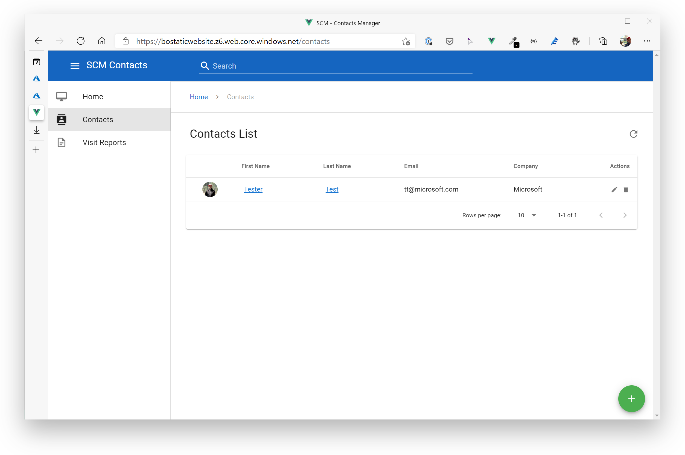
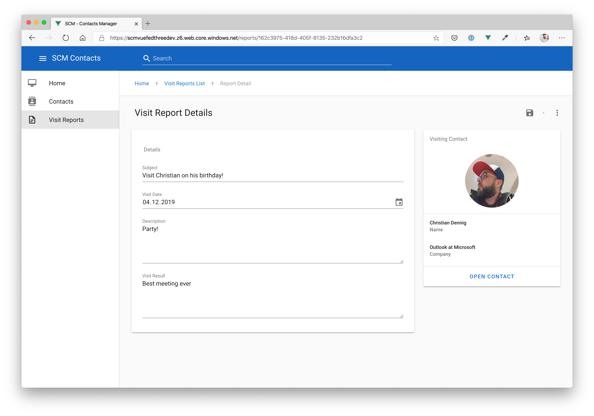
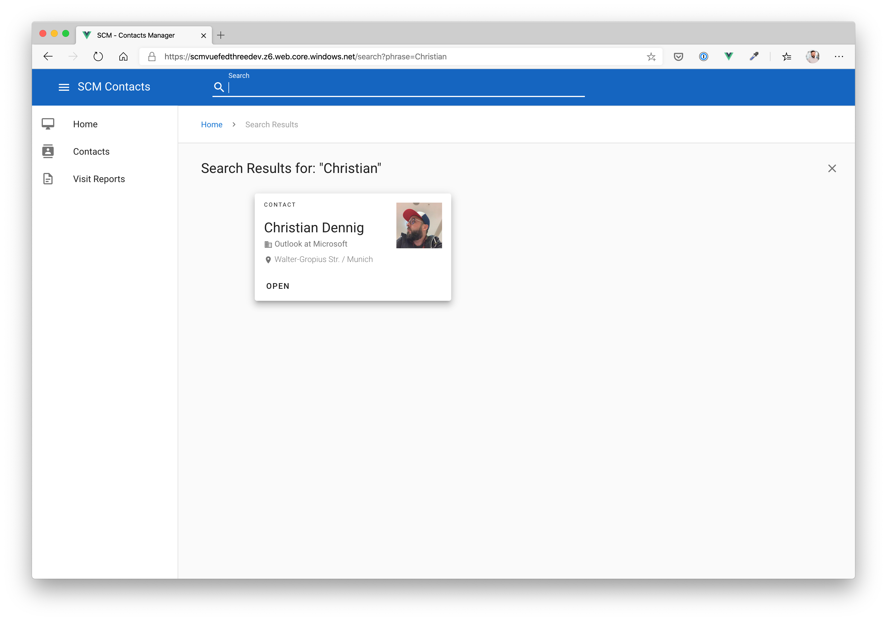

## Setup Data Storage Services ##

First of all, we now add an Azure SQL DB, Cosmos DB and an Azure Search service for the application.

### SQL DB ###

Create a new Azure SQL DB either via the Azure Portal or Azure CLI.

Database Properties:

- use your existing resource group: **scm-breakout-rg**
- SKU: Basic
- Location: *West Europe*
- Create a new server in *West Europe*
- Networking Tab: make sure **Allow Azure services and resources to access this server** is set to **true**.

Leave all other settings as proposed by Azure.

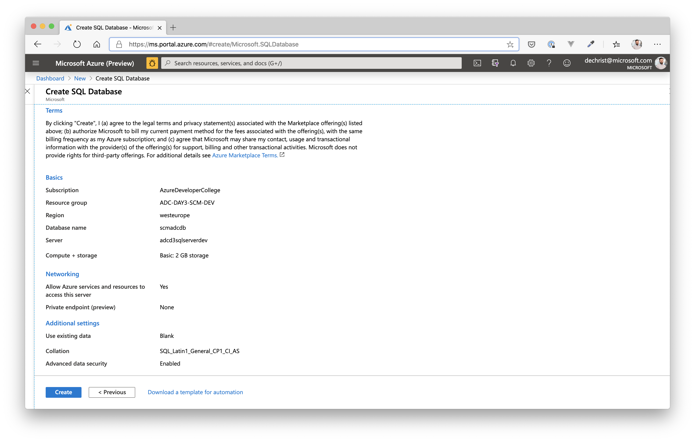

### Cosmos DB / SQL API ###

Create a new Azure Cosmos Account either via the Azure Portal or Azure CLI. BTW: You can do this while Azure SQL DB is created.

Account Properties:

- use your existing resource group: **scm-breakout-rg**
- Location: *West Europe*
- API: *Core SQL*

Leave all other settings as proposed by Azure.

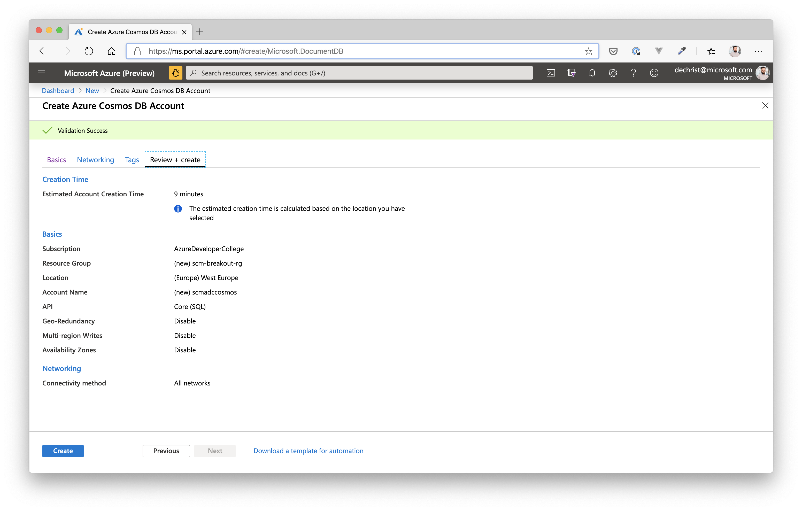

When the deployment has finished, create a new *Database* and *Container* for the Visis Reports microservice.

Database Properties:

- Database ID: *scmvisitreports*
- Provision Database Throughput: *true*
- RU/s: *Manual / 400*

Container Properties:

- Database ID: *scmvisitreports*
- Container ID: *visitreports*
- Partition: */type*

### Azure Search ###

Create a new Azure Search Account either via the Azure Portal or Azure CLI.

Account Properties:

- use your existing resource group: **scm-breakout-rg**
- Location: *West Europe*
- Pricing Tier: *Free* (for development purposes)

Leave all other settings as proposed by Azure.

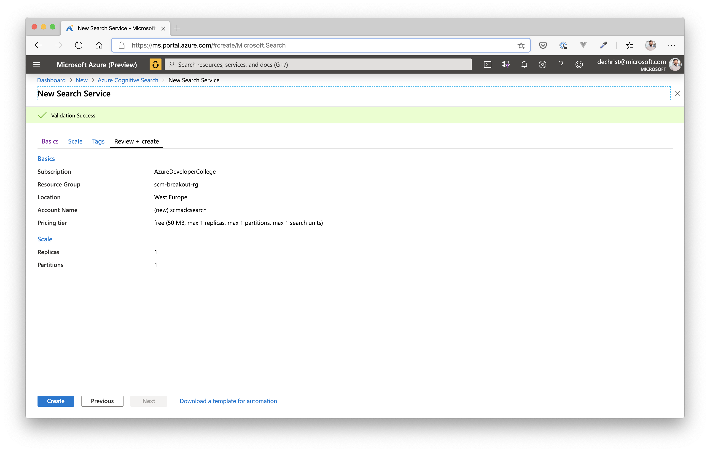

## Setup Messaging Services ##

Create a new Azure Service Bus either via the Azure Portal or Azure CLI.

Service Bus Properties:

- use your existing resource group: **scm-breakout-rg**
- Pricing Tier: *Standard*
- Location: *West Europe*

Leave all other settings as proposed by Azure.

### Service Bus Queue ###

When the deployment of the new Service Bus has finished, we need to add a Service Bus **Queue**. The queue will replace the Storage Account Queue we used to notify an Azure Function that creates thumbnails of contact images.

Service Bus Queue Properties:

- Name: *thumbnails*

When successfully added, go to **Shared Access Policies** of the **Service Bus Queue (!)** and add two policies:

- Name: *thumbnailslisten* (enable checkbox **Listen**)
  - will be used by clients that only need to listen to the Service Bus Queue
- Name: *thumbnailssend* (enable checkbox **Send**)
  - will be used by clients that also need to be able to send messages to the Service Bus Queue

Our produucers/consumers will use these Access Policies to be able to send and listen to/on that specific queue.

### Service Bus Topic for Contacts ###

We also nee a topic for handling *Contacts* changes (create, update etc.) with corresponding subscriptions. Go back to the Service Bus Namespace in the Portal and add a new topic.

Contacts Topic Properties:

- Name: *scmtopic*

Leave all other settings as is and click **Create**. When finished, open the topic and add two subscriptions.

Subscription for Search Service / indexing of contacts:

- Name: *scmcontactsearch*
- **Enable Sessions**: *true* (in this sample, we will be using Service Bus sessions!)

Subscription for Visit Reports Service

- Name: *scmcontactvisitreport*

When you have successfully added the two subscriptions, go back to **Shared Access Policies** of the Service Bus Topic **scmtopic** and add two policies:

- Name: *scmtopiclisten* (enable checkbox **Listen**)
  - will be used by clients that only need to listen to the Service Bus Topic
- Name: *scmtopicsend* (enable checkbox **Send**)
  - will be used by clients that also need to be able to send messages to the Service Bus Topic

### Service Bus Topic for Visit Reports ###

We also need a topic for handling *Visit Report* changes (create, update etc.). Go back to the Service Bus Namespace in the Portal and add a new topic.

Visit Reports Topic Properties:

- Name: *scmvrtopic*

Leave all other settings as is and click **Create**. 

When successfully added, go back to **Shared Access Policies** of the Service Bus Topic **scmvrtopic** and add two policies:

- Name: *scmvrtopiclisten* (enable checkbox **Listen**)
  - will be used by clients that only need to listen to the Service Bus Topic
- Name: *scmvrtopicsend* (enable checkbox **Send**)
  - will be used by clients that also need to be able to send messages to the Service Bus Topic

We don't add a subscription for the *visit report* topic at the moment. It will be reused later when we integrate further services like Azure Congitive Services.

## Quality Check ##

You should have created the following Azure Services by now:

- Azure SQL DB
- Azure Cosmos DB (database + container)
- Azure Search
- Azure Service Bus
  - Queue for thumbnail generation
    - Shared Access Policies for *listen* and *send*
  - Topic for Contacts
    - Shared Access Policies for *listen* and *send*
    - subscription for visit reports
    - subscription for search service
  - Topic for Visit Reports
    - Shared Access Policies for *listen* and *send*

If you missed to create one of these services, please go back to the corresponding section.

## Deploy new Contacts/Resources Service and Image Resizer Function ##

Because we refactored the Contacts and Resources APIs to use Azure Service Bus for inter-service communication, we need to deploy new versions of these services and change some of the App Settings we added yesterday.

### Alter App Settings ###

We will **reuse the Web Apps for Contacts and Resource**s as well as the Azure Function for image manipulation we created yesterday. So, first we will adjust the App Configuration for each of the services.

> Use a second window to be able to switch back and forth.

Azure Web App for **Contacts Service**:

Application Settings:

| Name | Value / Hint |
| --- | --- |
| EventServiceOptions__ServiceBusConnectionString | use the Connection String from the Shared Access Policy (**Topic scmtopic**) for sending messages - **scmtopicsend** |
<hr>
<br>

Connection Strings:

| Name | Value / Hint | Type |
| --- | --- | --- |
| DefaultConnectionString | go to the Azure SQL DB you created and use the ADO.NET connection string (under "**Settings**" / "**Connection strings**"). Don't forget to add your password to the connection string! | *SqlAzure*
<hr>
<br>

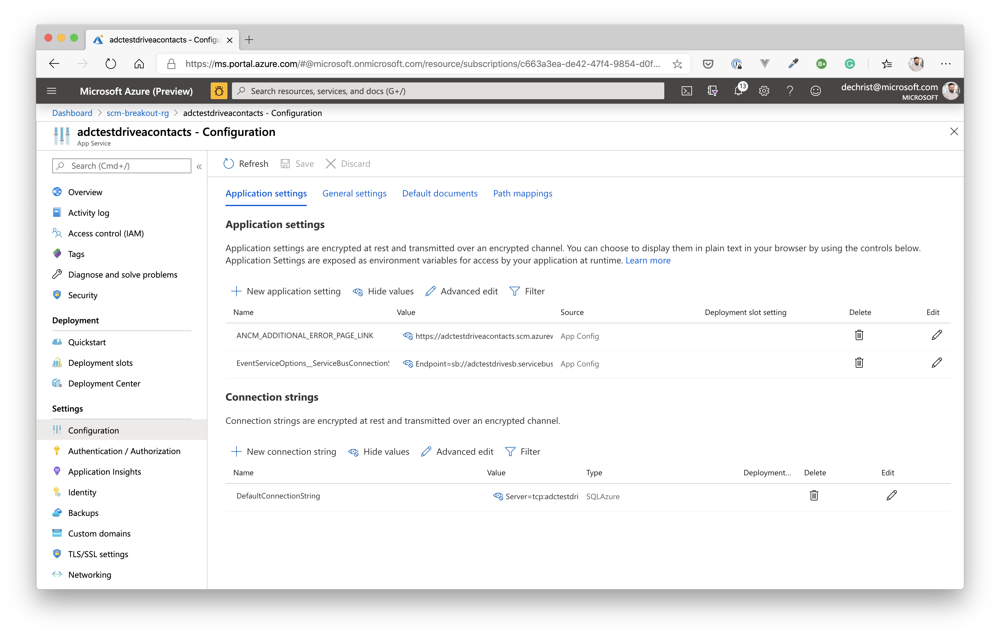

Azure Web App for **Resources Service**:

Application Settings:

| Name | Value / Hint |
| --- | --- |
| ImageStoreOptions__ThumbnailContainer | *thumbnails* |
| ImageStoreOptions__ImageContainer | *rawimages* |
| ImageStoreOptions__StorageAccountConnectionString | use the **Connection String** from your Storage Account created in the Break Out session yesterday (should be the same) |
| ServiceBusQueueOptions__ImageContainer | *rawimages* |
| ServiceBusQueueOptions__ThumbnailContainer | *thumbnails* |
| ServiceBusQueueOptions__ThumbnailQueueConnectionString | use the Connection String from the Shared Access Policy (**Queue**) for sending messages - **thumbnailssend** |

> You can delete all **StorageQueueOptions__** app settings!
<hr>
<br>

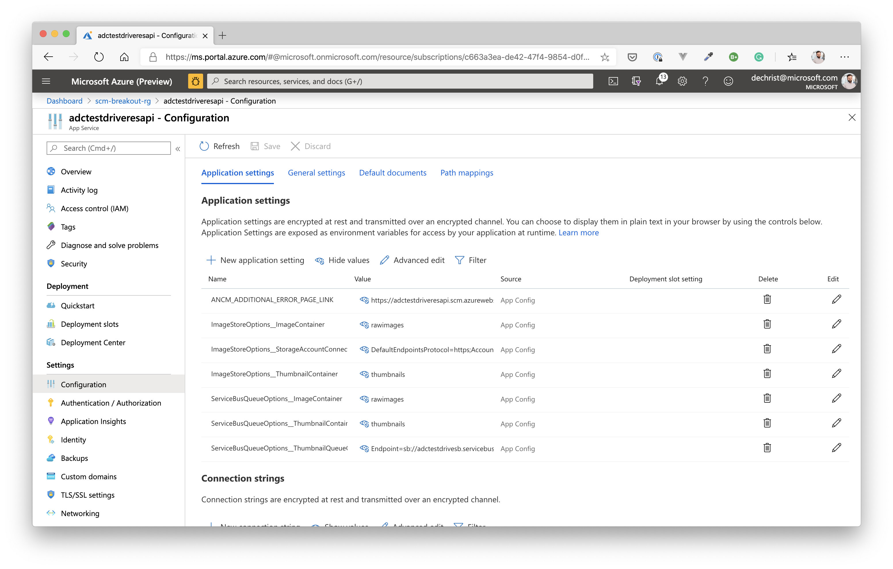

Azure Function for **Image Manipulation / Resizer Service**:

Configuration / Application Settings:

| Name | Value / Hint |
| --- | --- |
| ServiceBusConnectionString | use the Connection String from the Shared Access Policy (**Queue**) for listening for messages - **thumbnailslisten** |
| ImageProcessorOptions__ImageWidth | *100* |
| ImageProcessorOptions__StorageAccountConnectionString | use the **Connection String** from your Storage Account created in the Break Out session yesterday (should be the same) |

> You can delete the **QueueName** app settings!

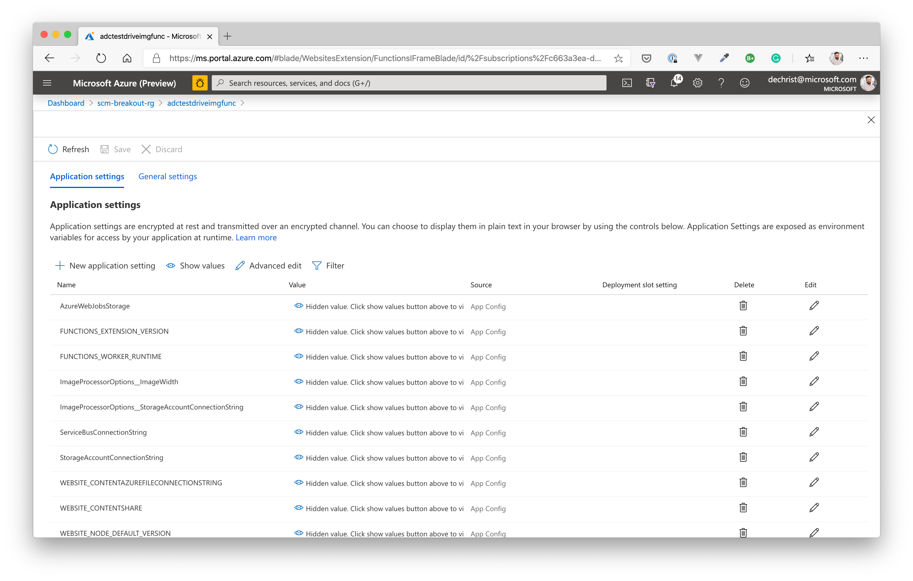

<hr>
<br>

### Redeploy your services for Contacts, Resources and Image Manipulation ###

First of all: as seen in the Break Out session yesterday, everything is pre-created for you...this time in the folder ***day3/apps***.

You have deployed web apps and functions several times yesterday, so you should be familiar, how to update the forementioned services. 

So please redeploy the Web Apps from folder *day3/apps/dotnetcore/Scm/Adc.Scm.Api* and *day3/apps/dotnetcore/Scm.Resources/Adc.Scm.Resources.Api*. (Tasks to publish the applications to a local folder are available. **F1 --> Tasks: Run Task --> day3publish***).

Do the same with the Image Manipulation Function in folder *day3/apps/dotnetcore/Scm.Resources/Adc.Scm.Resources.ImageResizer* (**Reminder**: open the functions app source folder as a separate Window when deploying from VS Code!)

### Deploy the Contacts Search Service ###

To be able to run the Contacts Search service (where we leverage the core functionality of Azure Search), we first need an Azure Web App to host it. So, please go to the Portal (or use Azure CLI) and create a basic Azure Web App (with a new Azure AppService Plan on Windows, Runtime **.NET Core 3.0**) - use SKU / Size **B1**. 

When finished, apply these settings to the Web App Configuration settings:

| Name | Value / Hint |
| --- | --- |
| ContactSearchOptions__AdminApiKey | use the Primary Admin Key from Azure Search (under **Settings / Keys**) |
| ContactSearchOptions__IndexName | *scmcontacts* |
| ContactSearchOptions__ServiceName | the name of your previously created Azure Search (just the subdomain! So from <https://adcd3search-dev.search.windows.net>, only **adcd3search-dev**) |
<hr>
<br>

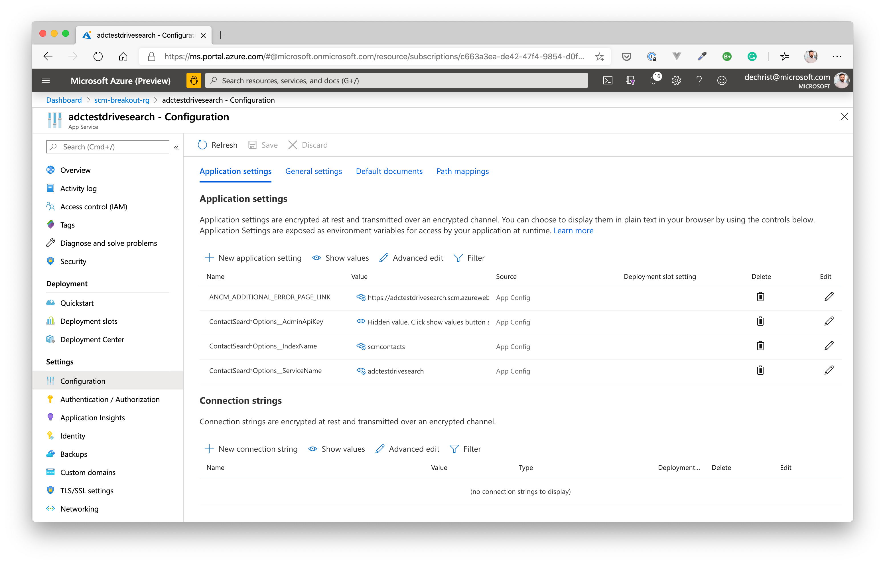

Time to deploy the Contacts Search (folder *day3/apps/dotnetcore/Scm.Search/Adc.Scm.Search.Api*) service from VS Code the the newly created Web App. Again, there is a predefined task to publish to a local folder (**day3publishScmSearch**).

### Create and deploy the Contacts Search Indexer Function ###

Now we have deployed an Azure Search Service and an API that is able to query the search index. But how will contacts be pushed to the Azure Search index? Therefore, we will be using another Azure Function that listens to created and changed contacts via an Azure Service Bus Topic (**scmtopic**, you already created it - as well as the corresponding subscription **scmcontactsearch**)!

Create the Azure function in the **scm-breakout-rg** resource group with the follwing parameters:

| Name | Value / Hint |
| --- | --- |
| Region | *West Europe* |
| Publish | *Code* |
| Runtime | *.NET Core* |
| OS | *Windows* |
| Storage Account | Use the storage account you created in the breakout resource group |
| Plan Type | *Consumption* |

When finished, apply these settings to the App Configuration settings:

| Name | Value / Hint |
| --- | --- |
| ContactIndexerOptions__AdminApiKey | use the Primary Admin Key from Azure Search (under **Settings / Keys**) |
| ContactIndexerOptions__IndexName | *scmcontacts* |
| ContactIndexerOptions__ServiceName | the name of your previously created Azure Search (just the subdomain! So from <https://adcd3search-dev.search.windows.net>, only **adcd3search-dev**) |
| ServiceBusConnectionString | use the Service Bus Connection String from the Shared Access Policy (**Topics** / **scmtopic**) for listening for messages - **scmtopiclisten**. <br><br>**Important**: Please remove the entitypath variable (incl. the value) at the end of the connection string! |
| FUNCTIONS_EXTENSION_VERSION | ~2 |
<hr>
<br>

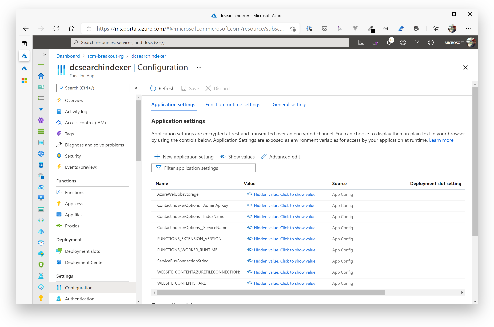

**Last but not least**, deploy the Contacts Search indexer function (folder *day3/apps/dotnetcore/Scm.Search/Adc.Scm.Search.Indexer*) service from VS Code the the newly created Function App. 

## Let's press "Pause" for a moment - What have we done so far? ##

The was a lot of manual typing so far, so let's hold on for a moment. We have just migrated our initial services (Contacts and Resources, Image Manipulation) to Azure Service Bus Queues and Topics. We redeployed new versions of these services to make use of Azure Service Bus. We also added Storage Services to our application. The Contacts Service now uses Azure SQL DB.

In addition, we added an Azure Search service (incl. indexer function) plus an API that is able to talk to Azure Search and query for contacts. The contacts will be added / updated in the search index "on-the-fly" whenever a Contact is changed - notification is done via Service Bus Topics.

Regarding our architecture, we are at this stage:


Now, let's add the Visit Report API. Trust us, we're on the home stretch :)

## Deploy new Visit Reports Service ##

To deploy the Visist Reports API, we - as usual - need another Web App. As this service runs on NodeJS and we want to leverage Azure Web Apps on Linux this time, let's create one that is backed by a Linux OS.

> **Important**: Currently, you can't mix Windows and Linux Web Apps in the same resource group, so we create another resource group to host the NodeJS Linux WebApp.

**Azure WebApp Properties**

Create the Linux Web App in West Europe with the following parameters.

| Name | Value / Hint |
| --- | --- |
| Resource Group | Create a new resource group, e.g. **scm-breakout-tux-rg** |
| Publish | *Code* |
| Runtime Stack | *Node 12 LTS* |
| App Service Plan | Create a new one: OS - *Linux*, SKU - *B1*  |

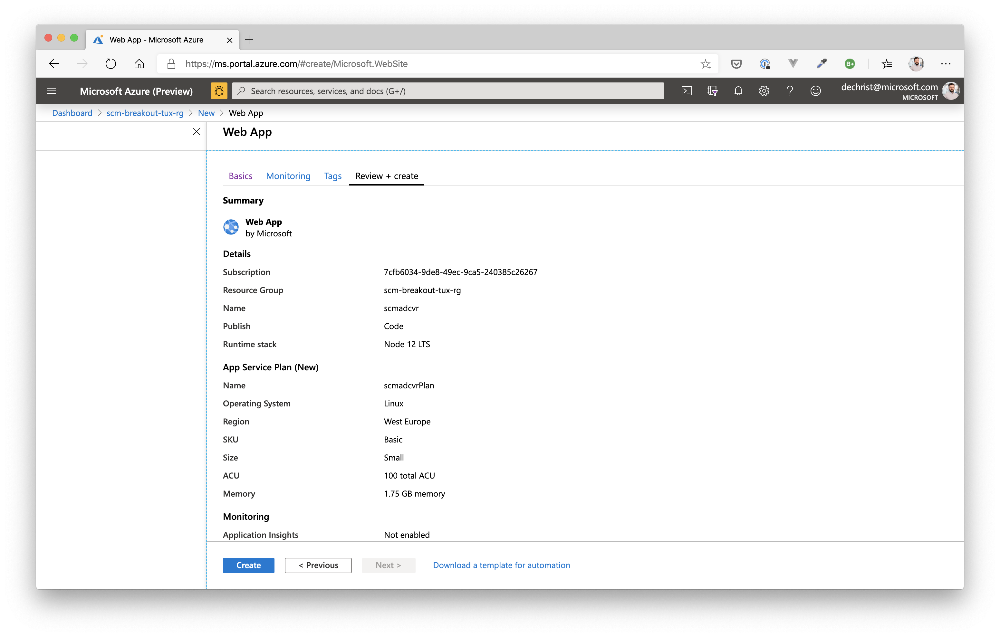

When the Web App has been created, go to the Configuration section and add the following settings (App settings + Connection strings!).

**Azure Web App / Configuration / Application Settings**

| Name | Value |
| --- | --- |
| APPINSIGHTS_KEY | \<empty> |
| COSMOSDB | the endpoint to the Cosmos DB, e.g. <https://adcd3cosmos-dev.documents.azure.com:443/> |

Azure Web App / Configuration / Connection Strings

| Name | Value | Type |
| --- | --- | --- |
| COSMOSKEY | Primary Key of your Cosmos DB | Custom
| SBCONTACTSTOPIC_CONNSTR | Primary Connection String of the Service Bus **Contacts** Topic (**scmtopic** / *scmtopiclisten*) | Custom
| SBVRTOPIC_CONNSTR | Primary Connection String of the Service Bus **Visit Reports** Topic (**scmvrtopic** / *scmvrtopicsend*) | Custom
<hr>
<br>

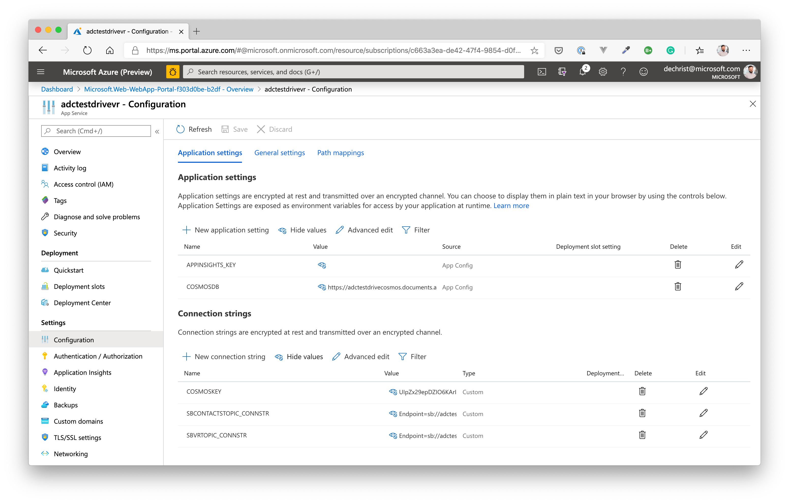

Now, from an infrastructure point of view, we are ready to deploy the NodeJS app. If you haven't run the app on your local machine, open a terminal and got to folder: *day3/apps/nodejs/visitreport*. Execute the following command:

```shell
$ npm install
```

This will install all the neccessary dependencies of the NodeJS Visit Reports service. When that has finished, you can deploy the service to the previously created Linux Web App. 

Therefore, go to the Azure Tools Extension in Visual Studio Code (*App Service* section), find your Linux Web App and *right-click-deploy*, choosing the folder *day3/apps/nodejs/visitreport* as a deployment source.

In the output window, watch how the NodeJS app is copied to the Web App and is being started by Azure.

You can check, if it's running correctly by opening a browser window and point it to the following URL:

https://<YOUR_WEB_APP_NAME>.azurewebsites.net/docs

You will see the Swagger UI of the service (in the **Explore** textbox, replace *json* with *yaml* to view all operations).

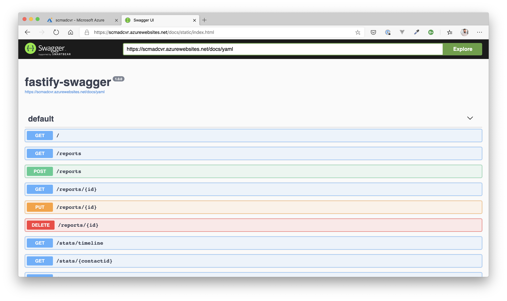

## Deploy new Frontend ##

Now that we have introduced a few new services, we also need to redeploy the VueJS frontend. Of course, we also added a few changes in the UI itself (please see the intro section). So we definetly want that new version running now in Azure.

Open the settings.js file in folder *day3/apps/frontend/scmfe/public/settings* and adjust the settings to fit the URLs of your Web Apps. You will need:

| Name | Value |
| --- | --- |
| endpoint | URL of the contacts API endpoint, e.g. https://adcday3scmapi-dev.azurewebsites.net/ |
| resourcesEndpoint | URL of the resources API endpoint, e.g. https://adcday3scmresourcesapi-dev.azurewebsites.net/ |
| searchEndpoint | URL of the search API endpoint, e.g. https://adcday3scmrsearchapi-dev.azurewebsites.net/ |
| reportsEndpoint | URL of the visit reports API endpoint, e.g. https://adcday3scmvr-dev.azurewebsites.net |
| enableStats | false (we will be adding statistics when we introduced Cognitive Services in the next challenge) |
| aiKey | "" (just leave it empty) |


**Sample:**

```json
var uisettings = {
    "endpoint": "https://adcday3scmapi-dev.azurewebsites.net/",
    "resourcesEndpoint": "https://adcday3scmresourcesapi-dev.azurewebsites.net/",
    "searchEndpoint": "https://adcday3scmrsearchapi-dev.azurewebsites.net/",
    "reportsEndpoint": "https://adcday3scmvr-dev.azurewebsites.net",
    "enableStats": false,
    "aiKey": ""
}
```

After you have adjusted the settings, open a terminal at *day3/apps/frontend/scmfe* and run...

```shell
$ npm install && npm run build
```

The VueJS app is built into folder *dist* of the same directory. Please copy that folder with the **Storage Explorer** to the Storage Account you used for hosting the frontend (container: **$web**. Please delete any contents from Day 2 before copying the new version).

When everything is set up correctly and the services work as expected, you should be able to open the SPA and test the Contacts and Visit Reports services, as well as the Search service. 

Add and edit a few new contacts (search for them via the top navigation bar) and create some visit reports for them.


# Wrap-Up #

So, we know, this was a lot of manual work to do, to add a simple microservice-oriented application to Azure. There are a lot of moving parts in that kind of applications and you will want to avoid deploying such applications manually. That's why we will be introducing Azure DevOps on Day 4, so that you can build and deploy the infrastructure as well as the services automatically.
But hey, we wanted to show you how it's done "the hard way" to bring you relief the day after :) Azure DevOps, FTW!

We now have one more challenge to complete (Cognitive Services), until the application is finished from a services perspective.
