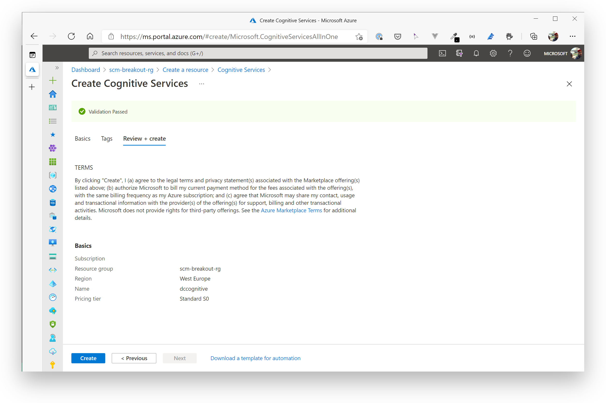
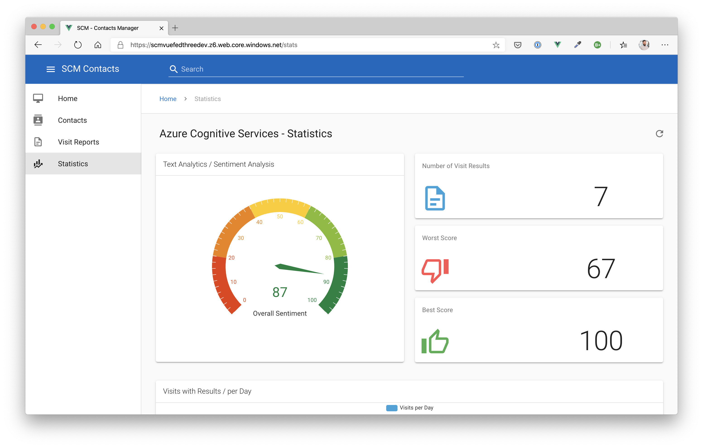
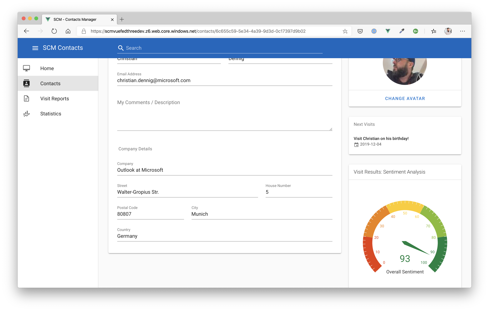

# Break Out #2: Add Congitive Services #

Now it's time to finish our sample application from a services perspective. We'll now add Azure Cognitive Services to enhance our application with Artificial Intelligence.

Whenever a visit report will be saved - and the visit report results field is filled with text - we will be calling the Text Analysis services of Azure Cognitive Services to analyze the sentiment of the text. With that analysis, we can determine, if the visit was a "negative" or "positive" experience on a scala from "0" to "100". When the text has been analyzed, the Cosmos DB is updated to reflect the findings of our analysis.

The text analysis is triggered by a Service Bus topic which will receive a message, whenever a Visit Report will be added or updated. 

This is a very common technique to add functionality to your application without touching the *core* services of it. You can extend without having to worry to break something.

Here is the resulting architecture:


## Create a Cognitive Services Account ##

To be able to use the text analysis services, we need to add an Azure Cognitive Services account.

Go to the Portal and create the new resource (search for Cognitive Services). Choose the **scm-breakout-rg** resource group, location "West Europe" and the lowest pricing tier available (probably **S0**).



## Create an Azure Function to Analyze Visit Report Results ##

As described in the introduction section, we will be using an Azure Function to call the Text Analyisis services - this time the function will be hosted on a Linux OS. It will be triggered by an Azure Service Bus Topic (**scmvrtopic**) we created in the Break Out session earlier this day. 

The code of the function is located in folder *day3/apps/nodejs/textanalytics* (in file *day3/apps/nodejs/textanalytics/TextAnalyticsVRTopicTrigger/index.js*).

### Add Service Bus Topic Subscription ### 

First, we need to add the Topic subscription! So go to your Azure Service Bus and open the topic **scmvrtopic**. Under **Subscriptions**, add a new one called **scmvisitreporttextanalytics**. Leave all other properties as proposed by Azure (make sure sessions are **disabled**).

### Create the Azure Function App ###

Now, create an Azure Function App. Please keep in mind, that we also add the Function to a new resource group, because we can't mix Windows and Linux workloads at the time of writing.

So please open the "Create a Resource" wizard and start creating an Azure Function.

**Azure Function Properties**

Create the Azure Function App in West Europe with the following parameters.

| Name | Value / Hint |
| --- | --- |
| Resource Group | Create a new resource group, e.g. **scm-breakout-tuxfunc-rg** |
| Publish | *Code* |
| Runtime Stack | *Node.js* |
| Region | *West Europe* |
| Storage Account | use the Storage Account you created in the breakout resource group |
| Operating System | *Linux* |
| Plan Type | *Consumption* |

Create it and when the Function App has been deployed, go to the Configuration section and add the following App settings.

| Name | Value / Hint |
| --- | --- |
| ServiceBusConnectionString | Primary Connection String of the Service Bus **Visit Reports** Topic (**scmvrtopic** / *scmvrtopiclisten* Shared Access Key)  <br><br>**Important**: Please remove the entitypath variable (incl. the value) at the end of the connection string!|
| COSMOSDB | the endpoint to the Cosmos DB, e.g. <https://adcd3cosmos-dev.documents.azure.com:443/> |
| COSMOSKEY | Primary Key of your Cosmos DB |
| TA_SUBSCRIPTION_KEY | the Azure Cognitive Services **subscription key**. Obtain it from the *Keys and Endpoint* view under *Resource Management* of your Cognitive Services account |
| TA_SUBSCRIPTIONENDPOINT | the Azure Cognitive Services **endpoint URL**. Obtain it from the *Keys and Endpoint* view under *Resource Management* of your Cognitive Services account |
| FUNCTIONS_EXTENSION_VERSION | ~2 |
<hr>
<br>

Save the settings. We can now start deploying the code that will call the Azure Cognitive services.

### Deploy the Text Analytics Function ###

You've done this a couple of times now. Please open the folder *day3/apps/nodejs/textanalytics* in a new Visual Studio Code window and start deploying the function via the **Azure Tools** extension. If you need a hint, how to do it, please go back to [Breakout Session 1](challenges/challenge-4.md) and see what steps you need to take.

Because we are dealing with a NodeJS application here, there is no "formal" build step before the function app is deployed. So please - before deploying to Azure - run the following command to pull all the NodeJS dependencies of our function (in folder *day3/apps/nodejs/textanalytics*):

```shell
$ npm install
```

Now, deploy via the VS Code Azure Tools extension.

## Adjust the Frontend ##

There is one last step to do, until we can see the new functionality in action. We need to adjust the frontend and enable the feature flag "enableStats". Please set this flag to ***true***. You can either do this on you local machine and redeploy the frontend (again, see [Breakout Session 1](challenges/challenge-4.md)) or you simply open the Azure Storage explorer **in the Portal** and edit the file directly.

The settings file should look similar to that one now:

```json
var uisettings = {
    "endpoint": "https://adcday3scmapi-dev.azurewebsites.net/",
    "resourcesEndpoint": "https://adcday3scmresourcesapi-dev.azurewebsites.net/",
    "searchEndpoint": "https://adcday3scmrsearchapi-dev.azurewebsites.net/",
    "reportsEndpoint": "https://adcday3scmvr-dev.azurewebsites.net",
    "enableStats": true,
    "aiKey": ""
}
```

Now open a browser and reload the frontend. You will see, that a new menu item is available.



Also, the contacts detail view will show results of visit reports, if they are available for the current contact.



# Wrap-Up #

Congratulations! It was a hard and tough way to get to where you are now standing! You have created a basic, microservice oriented application with multiple backend services (contacts, resources, visit reports, search backend), that work independently, have their own storage, communicate via a Service Bus, can be granularly scaled etc. Ready to run globally!

From a services perspective, we have a full working, modern cloud application! Hold on for a while to reflect what we have done so far - and celebrate!!

Tomorrow, we will show you how to deploy the application including the Azure infrastructure within minutes! Trust us and be prepared for some DevOps magic :)
