# Challenge 01: GitHub project boards

⏲️ _Est. time to complete: 20 min._ ⏲️

## Here is what you will learn 🎯

In this challenge you will learn how to:

- Create a GitHub project board
- Assign permissions to a team
- Add project administrators
- Working with items
- Plan milestones (sprints)
- Use GitHub labels to classify issues and pull requests
- See how issues and pull requests flow automatically through the different board's columns

## Table of content

- [Challenge 01: GitHub project boards](#challenge-01-github-project-boards)
  - [Here is what you will learn 🎯](#here-is-what-you-will-learn-)
  - [Table of content](#table-of-content)
  - [Create a GitHub project board](#create-a-github-project-board)
  - [Assign permissions to a team](#assign-permissions-to-a-team)
  - [Add project Administrators](#add-project-administrators)
  - [Working with items](#working-with-items)
  - [Plan milestones (sprints)](#plan-milestones-sprints)
  - [Use GitHub labels to classify issues and pull requests](#use-github-labels-to-classify-issues-and-pull-requests)
  - [See how issues and pull requests flow automatically through the different board's columns](#see-how-issues-and-pull-requests-flow-automatically-through-the-different-boards-columns)
  - [Plan your work for day4](#plan-your-work-for-day4)
  - [Summary and outlook](#summary-and-outlook)

## Create a GitHub project board

Project boards on GitHub help you organize and prioritize your work. You can
create project boards for specific feature work, comprehensive roadmaps or even
release checklists. With project boards, you have the flexibility to create
customized workflows that suit your needs.

To organize and prioritize your work, we are going to create a project
board at the organizational level. Of course it's possible to create a board on
repository level, but as we will create more repositories during the day and we
want to visualize our work across all repositories, we create a board on
organization level. GitHub provides different templates for a project board.
Today, we use the template _Automated Kanban_. With this template, we get a
simple board with three columns:

- **To do**, for items that represent future work
- **In progress**, to display items we are currently working on
- **Done**, items we have completed

Let us create the project board. Navigate to the _Project_ section of your
organization and create a new project. Choose the "Start from Scratch" option and the "Board" view.

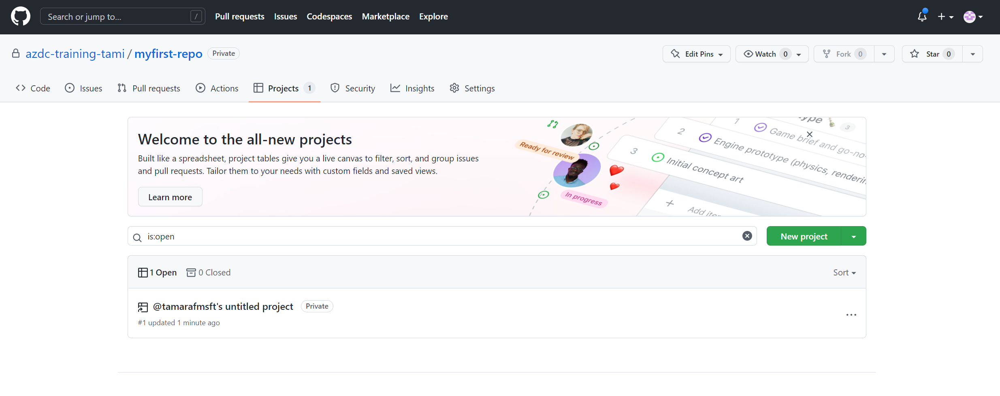

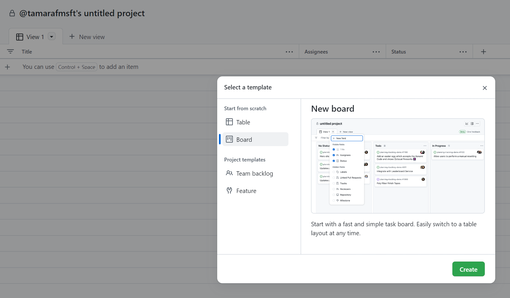

Click on "Create" and then on the top left rename the project to _AzDC-Day4-Project_ 

In the top-right, click the three dots  to open the menu. Check the settings of your project. Make sure to give it a description and check that it is private.

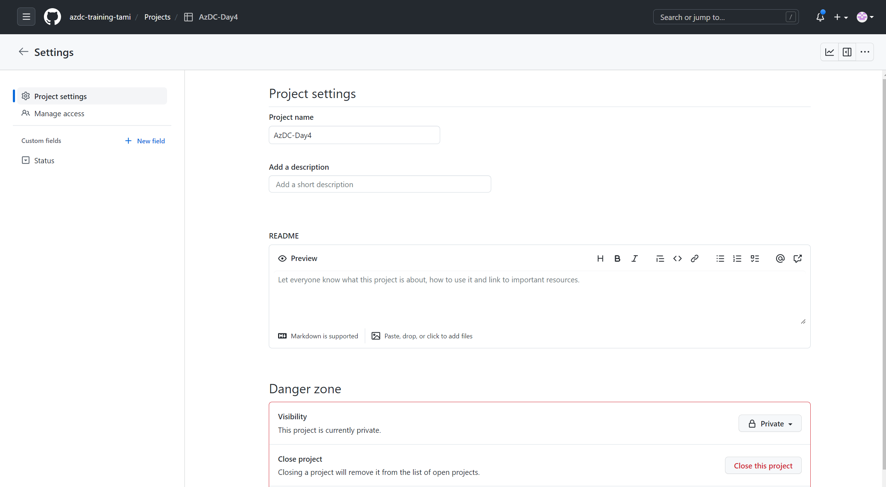

After the project has been created, we can add items to plan and track our work.

A project board is made up of issues, pull requests and notes which are displayed as items. Items are
categorized in columns of your choice. We can move items from one column to
another. The board project template is by default made up of three columns, but you can add more columns to the board to categorize
items the way you want. Under settings, you can add custom fields to your project.

::: tip
📝You can add directly issues and pull request from a repository. To do so, click on the "+" sign on the bottom left, and choose "Add item from repository". You will see the repo you just created. As of now, we do not have anything to add. 
:::

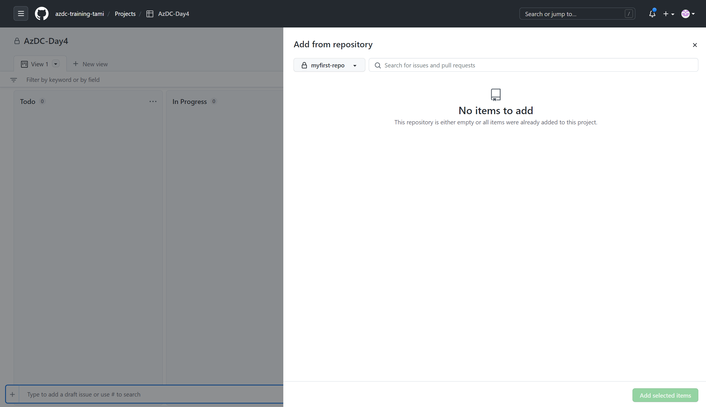


## Assign permissions to a team

Only project creators, organization owners and project members can add and manage items in a project.
We need to assign permissions to a team or member so that they can create items on the board.
Open the board's menu again. Click the ellipsis `...` button and open the
_Settings_.

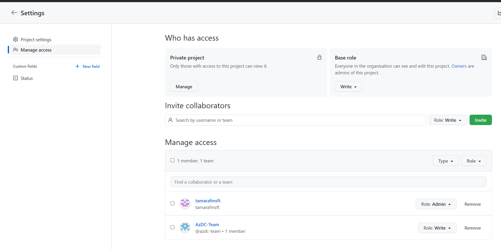

In the _Manage Access_ section you can manage the visibility of the project and
organization member's permissions. _Write_ is the default baseline permission
level for all members of the organization.

:::tip
📝 To restrict access to all organization members, set Read as baseline permission level.
:::

Since we are working with a single team in our organization today and we may
have already added _Outside collaborators_ to this team, we still need to give
_Write_ permissions to this team. Add the team and give it
_Write_ permissions.

## Add project Administrators

As the organization owner and project creator, only you have full administrative
rights in this project. We can make both members of the organization, but also
_Outside collaborators_ project administrators. In the _Collaborators_ section
you can add collaborators and give them _Admin_ permissions.

## Working with items

Your project can track draft issues, issues, and pull requests.

Let's create an item and take a closer look at how to convert the note into an
issue when you start working.

Click the _+_ button in the _To do_ column to add a note and name it "Convert to issue".

Now let us convert the note _Convert note to issue_ to an issue to assign
it to a repository.

Click the ellipsis _..._ button on the _Convert to issue_ card and click
_Convert to issue_.

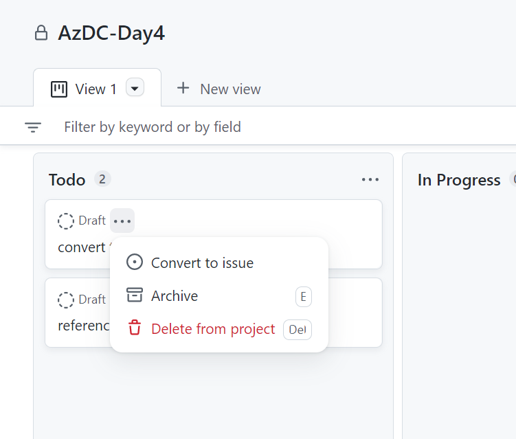

Choose the _myfirst-repo_ repository and convert the note to an issue.

After the converting the note, open the issue detail and have a look at the
additional option we have, to specify more information about the issue. Make
yourself the assignee of the issue and set the label _good first issue_.

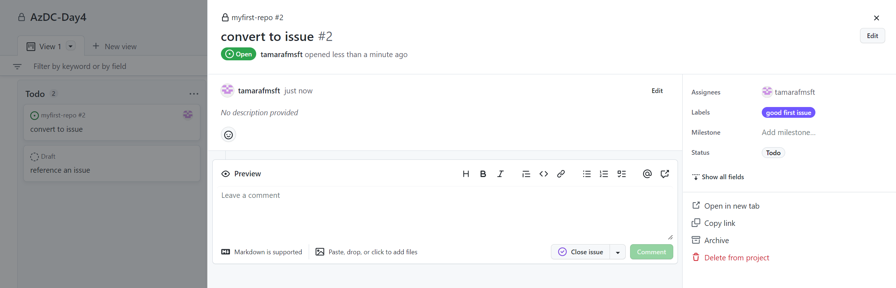

Now you may wonder why you convert a note into an issue. In an issue we can
additionally specify more detailed information. We can specify who is
responsible for the issue, which repository it refers to and we can assign
labels to classify the issue. With this approach, we could map the following
workflow:

We use notes to plan and prioritize the work for our next milestone (sprint).
When we start working on the task, we convert the item into an issue, choose a
repository, assign a responsible person, classify it and push it to the _In
progress_ column.

This is a very simple but agile process flow. But maybe this flow is not
sufficient, especially if items do not always refer to only one repository, but
are spread over several repositories. Items can be used to summarize issues in
different repositories. If we work according to agile methods, we can e.g. store
a _UserStory_ as a note in our board and create tasks in different repositories
as an issue. Or we can go one level higher and use Notes to map _Features_ and
Issues to map _UserStories_ in a repository. Ultimately, there are many ways to
map an agile process with GitHub project boards. There is no one-size-fits-all
solution.

Finally, let's look at how we can reference Issues in a note. Navigate to your
_myfirst-repo_ repository and go to the _Issues_ section. You see that there is
already an issue listed. It's the issue that we created earlier. Now, add a new
Issue name it _Referenced Issue_, set the label _good first issue_, assign
yourself and submit the new issue. Copy the issue's URL from the browser's
address bar and go back to your project board. Add a new item, paste the URL and hit Enter

Your board should now look like this:

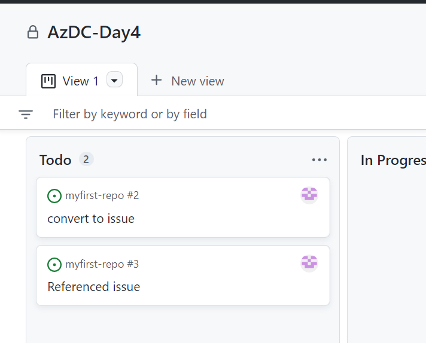

If you want to learn more about GitHub projects, check out their [documentation](https://docs.github.com/en/issues/planning-and-tracking-with-projects/learning-about-projects/about-projects).

## Plan milestones (sprints)

You can use milestones to group and track groups of issues and pull requests
in a repository. Unfortunately, you cannot define milestones at an organizational
level. Therefore it's not possible to set a uniform rhythm for all projects
within an organization. Instead you have to define milestones in each repository
and keep them in sync.

Milestones would be an excellent way to plan a Sprint. But as mentioned,
milestones cannot be created on an organizational level. We need to find another
way to assign tasks to a Sprint. For example, we could work with labels and
create a label for each Sprint. We can then assign these Sprint labels to issues
and pull requests.

Another option would be to create a new project for each sprint and put the
sprint name at the end of the project name.

If you want to take a closer look at Milestones, check out the GitHub
documentation
[here](https://docs.github.com/en/issues/using-labels-and-milestones-to-track-work/about-milestones).

## Use GitHub labels to classify issues and pull requests

GitHub labels are used to classify issues, pull requests and discussions. You
can apply labels in the repository the label was created in. As with Milestones
it is not possible to manage labels at organization level, but you can manage
default labels which are automatically added to a repository when the repository
is created.

Now we want to add two new default labels which will be added to each new
repository. Navigate to your organization's settings, go to _Repository
defaults_ and add the following labels:

| Name            | Description              | Color         |
| --------------- | ------------------------ | ------------- |
| azdc-challenge | An AzDC-Challenge        | _your choice_ |
| azdc-breakout   | An AzDC-Breakout session | _your choice_ |

We have to add these labels to the _myfirst-repo_ manually,
because there is no syncing in the background to add these labels to already
created repositories. Navigate to _myfirst-repo_, go to _Issues_ , click on _Labels_ and
add these labels.

Now go back to your project board and assign the _azdc-challenge_ label to both
issues we created earlier.

Click on _New View_ and add a table view. Here, you will be able to see the labels added.

Your board should look like this:

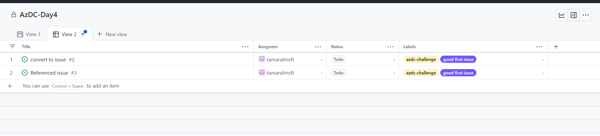

In the last part of this challenge we will describe how to plan the rest of the
work for today. We will add a note now for the _Breakout Session_ where we
will deploy the Azure Developer College's sample application to Azure with
GitHub Actions workflows. Add the note with the following name:

```Text
Deploy the sample application
```
click on it and add a description:

```Text
Use GitHub Actions workflows to deploy the sample application to your Azure
subscription.
```

Labels help us classify our issues. We can filter the board by labels, assignees, etc. to
get a reduced view on our project. Click on the `filters/search` box in the board
to get an overview of how filtering works in GitHub. Try to filter by the label
_azdc-challenge_ in the table view you created


## See how issues and pull requests flow automatically through the different board's columns

In the previous section we have seen how we can use a project board to plan our
work. Now it's time to see how an issue and a pull request automatically flow
through the different board's column to track progress. We add a new
_Note_, convert it to an issue and edit the _README.md_ file within a feature
branch. We commit and push changes to the feature branch and create a pull
request to merge these changes to the _main_ branch.

First, go to your project board and add a _Note_ with the following text:

```text
Issue and Pull Request
```
click on it and add a description:

```Text
Change README.md in a feature branch, commit and push changes and merge these
changes to the _main_ branch with a pull request
```

Next, convert the _Note_ to an issue, link it to the repository _myfirst-repo_,
assign yourself and set the label _azdc-challenge_.

:::tip
📝 Note down the issue's id, because we need it later to reference it in the
pull request. You can find the id after the '#' character.
:::

Now, drag and drop the issue to the _In progress_ column to show project members
that you are working on that topic.

Your board should look like this 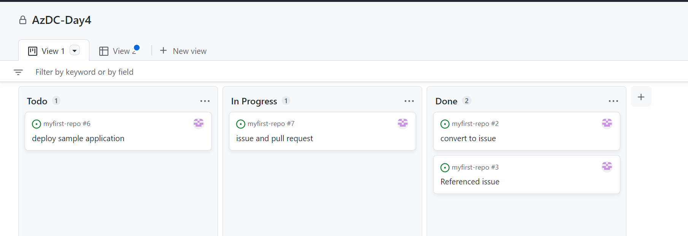

Open a terminal and navigate to the folder where you have cloned the repository.
Use the _git branch_ and _git checkout_ commands to create a new branch and
check it out:

```shell
git branch issueprdemo
git checkout issueprdemo

or

git checkout -b issueprdemo
```

Change the text in the _README.md_ file and commit and push your changes:

```
git add .
git commit -m "Changed text"
git push --set-upstream origin issueprdemo
```

In your browser, navigate to the repository _myfirst-repo_ and go to the section
_Pull requests_. You will see that GitHub informs us that there are recent
pushes to the branch _issueprdemo_ available. Click _Compare & pull request_.

In the _Open a pull request_ view, set the label _azdc-challenge_ and the
project _AzDC-Day4-Project_ to link the pull request to the project. In the pull
request's body we use the keyword _close_ and the character _#_ to link the pull
request to our issue (please use your issue's id) and to inform GitHub that this
issue is closed when the pull request is merged into the _main_ branch.

Navigate back to your project board. You will see that there is a new card with
the pull request symbol displayed. Why is the pull request displayed on the
board?

The project board comes with predefined automation rules. These rules allows us to display issues and pull requests on the board, as long as they are linked to our project. Both are
displayed depending on their status in the columns of the board. You can find
the rules by clicking _Workflows_ on the top right corner of the project. Take your time and check out the rules for each column.

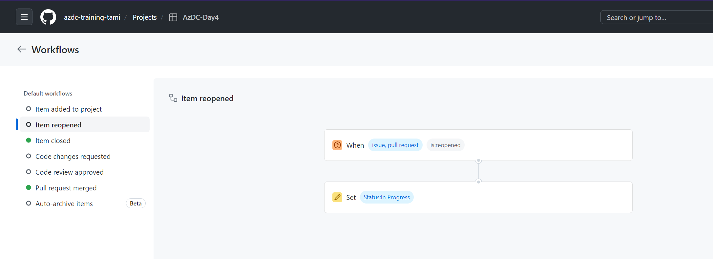

Now let's look at how both items automatically move from the _In progress_
column to the _Done_ column when we complete our pull request. To do this, we
navigate to the open pull request and merge it into the _main_ branch.


After the pull request is merged, we see that both items were moved to the
_Done_ column.

## Plan your work for day4

As the day goes on, we will keep reflecting our work on the board in the
challenges that are still to come. In the respective challenges it's pointed out
to create _Notes_ or _Issues_ and to link them to our project.

## Summary and outlook

We have seen how to plan and track our work with GitHub project boards. There
are many ways to map an agile process, but certainly no one-size-fits-all
solution. Projects can be created and managed at the organizational or
repository level. Labels, milestones and issues are always
assigned to a repository, which makes the handling of a project at the
organizational level somewhat difficult, especially if you want to manage a
project across multiple repositories.

GitHub is working on the next generation of Project planning and it will be
exciting to see how more complex planning scenarios can be managed with it. If
you are interested, why don't you sign up for the beta? [GitHub Issues -
Project planning for developers](https://github.com/features/issues).

If you've already worked with Azure Boards, you can also connect Azure Boards to
GitHub: [Azure Boards &
GitHub](https://docs.microsoft.com/azure/devops/boards/github/?view=azure-devops)

[◀ Previous challenge](./00-challenge-org.md) | [🔼 Day 4](../README.md) | [Next challenge ▶](./02-github-actions-intro.md)
