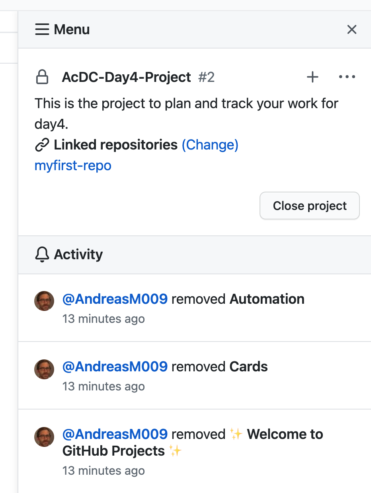
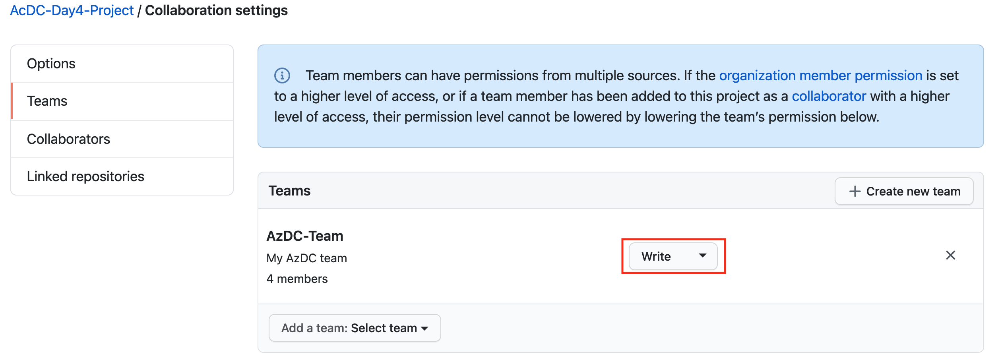
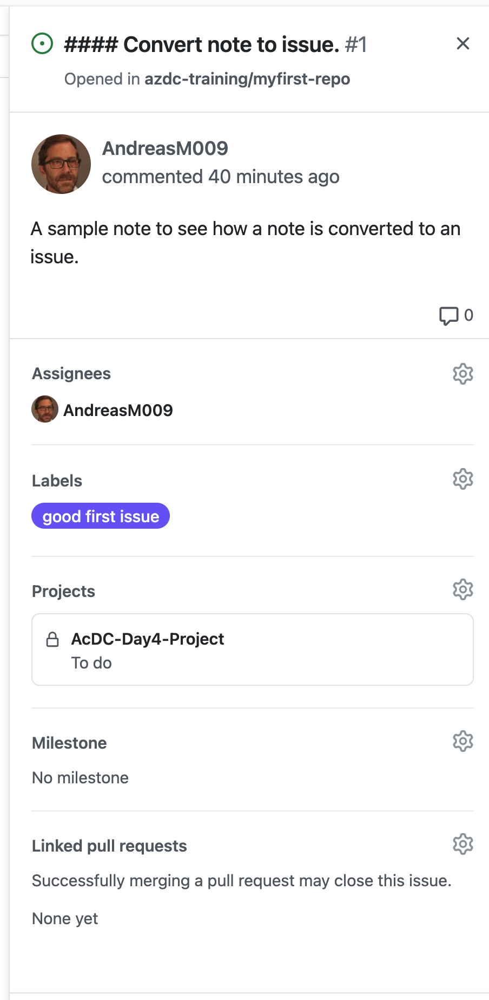
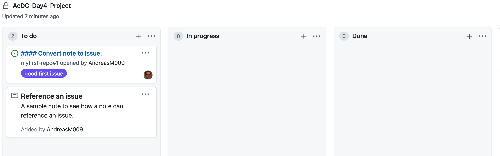
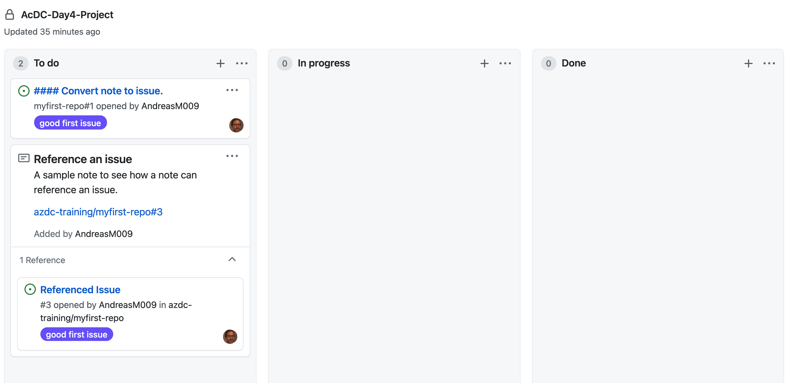

# Challenge 01: GitHub project boards

⏲️ *Est. time to complete: 20 min.* ⏲️

## Here is what you will learn 🎯

In this challenge you will learn how to:
- Create a GitHub project board
- Assign permissions to a team 
- Add project Administrators
- Working with cards
- Plan milestones (sprints)
- Use GitHub labels to categorize issues and pull requests
- See how issues and pull requests flow automatically through the different board's columns

## Table of content

1. [Create a GitHub project board](#create-a-github-project-board)
2. [Assign permissions to a team](#assign-permissions-to-a-team)
3. [Add project Administrators](#add-project-administrators)
4. [Working with cards](#working-with-cards)
5. [See how issues and pull requests flow automatically through the different board's columns](#use-github-labels-to-categorize-issues-and-pull-requests)
6. [Plan your work for day4](#plan-your-work-for-day4)


## Create a GitHub project board

Project boards on GitHub help you organize and prioritize your work. You can create project boards for specific feature work, comprehensive roadmaps or even release checklists. With project boards, you have the flexibility to create customized workflows that suits your needs. To organize and prioritize your work today, we are going to create a project board at the organization level. Of course it is possible to create a board on repository level, but as we will create more repositories during the day and we want to visualize our work across all repositories, we create a board on organization level. GitHub provides different template for a project board. Today, we use the template _Automated kanban_. With this template, we get a simple board with three columns:
- To do, for cards that must be done
- In progress, to display cards we are currently working on
- Done, cards we have completed

Let us create the project board. Navigate to the _Project_ section of your organization and create a new project.
Name the project _AcDC-Day4-Project_ give it a description.


Select the _Automated kanban_ template and choose _Private_ for the visibility of the project. Link the project to your repository as well to be able to show issues on the board later.


After the project is created, we can add notes to plan and track our work. There are already some example notes created in the _To Do_ column of the board. You can delete these notes, as we don't need them. A project board is made up of issues, pull requests and notes which are displayed as cards. Cards are categorized in columns of your choice. We can move cards from one column to another. As we have selected the _Automated kanban_ template, the board is made up of three columns, but you can add more columns to the board to categorize cards the way you want it. 

The project is already linked to the repository _myfirst_repo_. There is a _Menu_ button at the upper right corner of the board. When you click the button, you get an overview of activities and a list of linked repositories. 

:::tip
📝 _Maybe the button is not visible, because there is the flyout dislayed that allows you to add cards. Close it and you will see the Menu button._
:::



## Assign permissions to a team

At the moment organisation owners and members are the only one who can add and manage cards. We need to assign permissions to a team so they can create and manage cards.
Open the board's menu again. Click the ellipsis _..._ button and open the _Settings_. 


In the _Options_ section you can manage the visibility of the project and organization member's permissions. _Write_ is the default baseline permission level for all members of the organization. 

:::tip
📝 _To restrict access to all organisation members, set Read as baseline permission level._
:::

Since we are working with a single team in our organization today and we may have already added _Outside collaborators_ to this team, we still need to give _Write_ permissions to this team. Navigate to the _Teams_ section and assign _Write_ permissions to the _AzDC-Team_ team.




## Add project Administrators

As the organization owner, only you have full administrative rights in this project. We can make both members of the organization, but also _Outside collaborators_ project administrators. In the _Collaborators_ section you can add collaborators and give them _Admin_ permissions.


## Working with cards

If we want to plan and prioritize our work, we can work with notes in the board. You can add notes to serve as task reminders or to add information related to the project you are working on. 

:::tip
📝 _You can format your notes using Markdown syntax._
:::

Let's create a note and take a closer look at how to convert the note into an issue when you start working.
Click the _+_ button in the _To do_ column to add a note and set the following text:

```Text
#### Convert note to issue.

A sample note to see how a note is converted to an issue.
```

Now let's create another note to take a closer look at how we can reference an issue.
Add the node and set the following text:

```Text
#### Reference an issue

A sample note to see how a note can reference an issue.
```

You can drag and drop to reorder notes and move them between columns.

Now let us convert the first note _Convert note to issue_ to an issue to assign it to a repository.
Click the ellipses _..._ on the _Convert to issue_ card and click _Convert to issue_.


Choose the _myfirst-repo_ repository and convert the note to an issue.


After the note is converted, open the issue and have a look at the additional option we have to specify more details about the issue. Assign yourself to the issue and set the label _good first issue_.



Your board should now look like this:



Now you may wonder why you convert a note into an issue. In an issue we can additionally specify more concrete information. We can specify who is responsible for the issue, which repository it refers to and we can assign labels to classify the issue. With this approach, we could map the following workflow: 

_We use notes to plan and prioritize the work for our next milestone (sprint). When we start working on the task, we convert the note into an issue, choose a repository, assign a responsible person, classify it and push it to the _In progress_ column._

This is a very simple but agile process flow. But maybe this flow is not sufficient, especially if notes do not always refer to only one repository, but are spread over several repositories. Notes can be used to summarize issues in different repositories. If we work according to agile methods, we can e.g. store a _UserStory_ as a note in our board and create tasks in different repositories as an issue. Or we can go one level higher and use Notes to map _Features_ and Issues to map _UserStories_ in one repository. Ultimately, there are many ways to map an agile process with GitHub project boards. There is no one-size-fits-all solution. 

Finally, in this part of the Challenge, let's look at how we can reference Issues in a note. Navigate to your _myfirst-repo_ repository and go to the _Issues_ section. You see that there is already an issue listed. It is the issue that we created earlier. Now, add a new Issue name it _Referenced Issue_, set the label _good first issue_, assign yourself and submit the new issue. Copy the issue's URL from the browser's address bar and go back to your project board. Edit the note _Reference an issue_ and paste the issue's URL.

Your board should now look like this:




## Plan milestones (sprints)

## Use GitHub labels to categorize issues and pull requests

## See how issues and pull requests flow automatically through the different board's columns

## Plan your work for day4