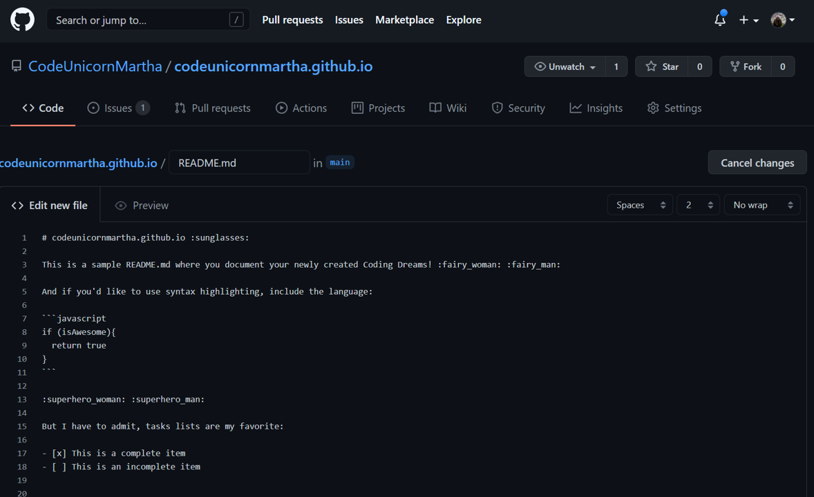
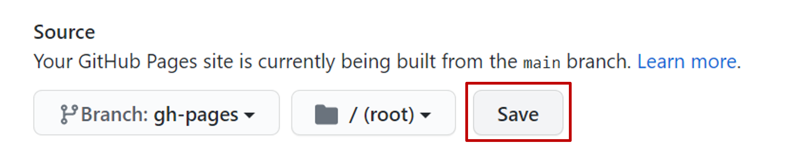

# Github Actions in Action

⏲️ _est. time to complete: 30 min._ ⏲️

## here is what you will learn 🎯

in this challenge you will learn:

- how github pages serves static content from you repositories
- how to create a first github action
- how the github script action can help you do workflow automation
- how to use github actions to run a static site generator

## Getting started

In this challenge we will take a first look at GitHub Actions. GitHub Actions is
GitHubs built in workflow automation and CI/CD tool.

In this challenges we will start playing around with Actions and in doing so
create a GitHub user profile page with automated deployment.

Let's get started! 💪👩

## A clean slate 🧻 - GitHub Pages

For this challenge we will again work on an empty repository so nothing comes in
the way of our automation madness.

We want to also give you a quick tour on GitHub Pages. This feature allows you
to host static websites directly on GitHub, making for a great place to
host your documentation for your project together with it's source code.

GitHub Pages are hosted dependent on the repository name.

After enabling the feature, your page is available under the following link by default:

`https://<username or organization name>.github.io/<repository name`

For each organization and user there is one _special_ repository name `<username or organization name>.github.io` reserved to host the root level GitHub Page
`https://<username or organization name>.github.io/` for you account or
organization.

Let's try this now!

:::tip 📝
As an added bonus you can use this challenge to create a profile,
portfolio or documentation page for your organization or personal github
account.
:::

## Create a new repository

Create a new repository on your private or organizational account, but be careful when naming this repository.

Like before, create a new repository.

See an example for naming your repository here:


This allows you to later access this site using your GitHub username or
organizaions name like this:

`https://<username or organizationname>.github.io`

Make sure you create a public repository and leave it empty for now.

:::tip
📝 If you do _not_ want to create a profile page or have one already just
create a new repository with a different name. You will have to enable GitHub
Pages on your repository manually though.
:::

### Create a Hello World on Github Pages

For anything to show up on your GitHub Page you have to create an `index.html`
file on the `main` branch. So let's do just that!

You can create a new file directly on the GitHub website.


Let's write some fancy HTML "hello world":

```html
<!-- index.html -->
Hello World! 🌍
```


And save the file using the commit changes dialog at the bottom of the
editor window.

**Minutes** later your profile page will be visible on:

`https://<username or organizationname>.github.io`

:::tip
📝 If you created a repository with a different name you have to enable
GitHub Pages under your repositories `Settings > Pages`.
:::

Your page should look something like this:


## Action

We'll this is still kind of boring, what about the ACTION?

First let's setup a workflow:


Let's create one now.

```yaml
name: Hello World!

on:
  push:
  workflow_dispatch:

jobs:
  greet:
    runs-on: ubuntu-latest

    steps:
      - name: Send a hello world
        uses: actions/github-script@v4.0.2
        with:
          script: |
            github.issues.create({
              owner: context.repo.owner,
              repo: context.repo.repo,
              title: "Hello World! 👋",
              body: "Hello 🌍 from GitHub Actions!"
            });
```


Afterwards you will see under the `Issues` section a new `Hello World Issue`:


Then we will add our first README.md:


````md
# azdc-training.github.io

Landing page for azdc-training organization - have fun! 🚀

This is a sample README.md where you document your newly created Coding Dreams! 🧚‍♀️ 🧚‍♂️

And if you'd like to use syntax highlighting, include the language:

```javascript
if (isAwesome) {
  return true
}
```

🦸‍♀️ 🦸‍♂️

But I have to admit, tasks lists are my favorite:

- [x] This is a complete item
- [ ] This is an incomplete item
````



```yml
name: pages

on:
  push:
    branches:
      - main
  pull_request:
    branches:
      - main

jobs:
  build:
    runs-on: ubuntu-latest

    steps:
      - name: Checkout
        uses: actions/checkout@v2

      - uses: actions/setup-node@v2.1.5
        with:
          node-version: '12'

      - run: npx vuepress build
      - name: Upload result of vuepress build
        uses: actions/upload-artifact@v2
        with:
          name: static-website
          path: .vuepress/dist

  deploy:
    runs-on: ubuntu-latest
    needs: build

    if: ${{ github.ref == 'refs/heads/main' }}

    steps:
      - name: Download build of static website
        uses: actions/download-artifact@v2
        with:
          name: static-website
          path: .vuepress/dist
      - name: Deploy to GitHub Pages
        uses: crazy-max/ghaction-github-pages@v2
        with:
          build_dir: .vuepress/dist
        env:
          GITHUB_TOKEN: ${{ secrets.GITHUB_TOKEN }}
```





