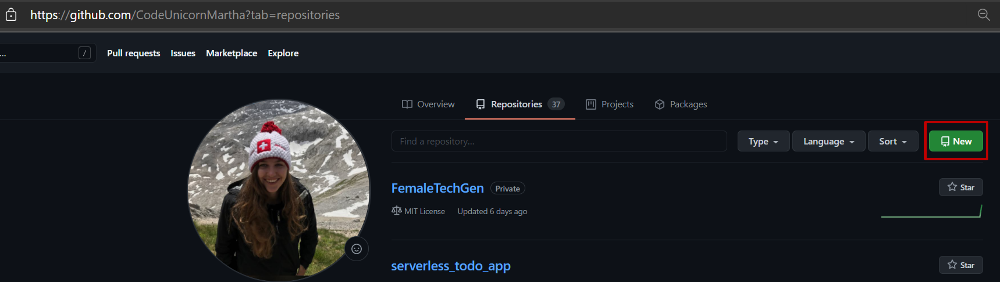

# GitHub Actions in Action

In this challenge we will take a first look at GitHub Actions. GitHub Actions is
GitHubs built in workflow automation and CI/CD tool.

In this challenges we will start playing around with Actions and in doing so
create a GitHub user profile page with automated deployment.

Let's get started! 💪👩

## A clean slate 🧻

For this challenge let's create a new GitHub repository so nothing comes in the
way of our automation madness.

As an added bonus you can use this challenge to create a GitHub profile page for
your organization or personal github account.

### Create a new repository

On your private or organizational create a new repository. If you want to use
the repository as a profile page make sure to name it:

`<username or organizationname>.github.io`



See an example for naming your repository here:


This allows you to later access this site using your GitHub username or
organizaions name like this:

`https://<username or organizationname>.github.io`

Make sure you create a public repository and leave it empty for now.

:::tip
📝 If you do _not_ want to create a profile page or have one already just
create a new repository with a different name. You will have to enable GitHub
Pages on your repository manually though.
:::

### Create a Hello World on Github Pages

For anything to show up on your GitHub Page you have to create an `index.html`
file on the `main` branch. So let's do just that!

You can create a new file directly on the GitHub website.


Let's write some fancy HTML "hello world":

```html
<!-- index.html -->
Hello World! 🌍
```

And save the file using the commit changes dialog at the very bottom of the
editor window.

A few **minutes** later your profile page will be visibile on:

`https://<username or organizationname>.github.io`

:::tip
📝 If you created a repository with a different name you have to enable
GitHub Pages under your repositories `Settings > Pages`.
:::

Your page should look something like this:


## Action

We'll this is still kind of boring, what about the ACTION?

Let's create one now.

```yaml
name: Hello World!

on:
  push:
  workflow_dispatch:

jobs:
  greet:
    runs-on: ubuntu-latest

    steps:
      - name: Send a hello world
        uses: actions/github-script@v4.0.2
        with:
          script: |
            github.issues.create({
              owner: context.repo.owner,
              repo: context.repo.repo,
              title: "Hello World! 👋",
              body: "Hello 🌍 from GitHub Actions!"
            });
```

```md
# <username or organizationname>.github.io

This is a sample README.md where you document your newly created Coding Dreams! :fairy_woman: :fairy_man:

And if you'd like to use syntax highlighting, include the language:

```javascript
if (isAwesome) {
  return true
}
```


:superhero_woman: :superhero_man:

But I have to admit, tasks lists are my favorite:

- [x] This is a complete item
- [ ] This is an incomplete item

```

```yml

name: pages

on:
  push:
    branches:
      - main
  pull_request:
    branches:
      - main

jobs:
  build:
    runs-on: ubuntu-latest

    steps:
      - name: Checkout
        uses: actions/checkout@v2

      - uses: actions/setup-node@v2.1.5
        with:
          node-version: "12"

      - run: npx vuepress build
      - name: Upload result of vuepress build
        uses: actions/upload-artifact@v2
        with:
          name: static-website
          path: .vuepress/dist

  deploy:
    runs-on: ubuntu-latest
    needs: build

    if: ${{ github.ref == 'refs/heads/main' }}

    steps:
      - name: Download build of static website
        uses: actions/download-artifact@v2
        with:
          name: static-website
          path: .vuepress/dist
      - name: Deploy to GitHub Pages
        uses: crazy-max/ghaction-github-pages@v2
        with:
          build_dir: .vuepress/dist
        env:
          GITHUB_TOKEN: ${{ secrets.GITHUB_TOKEN }}


```

