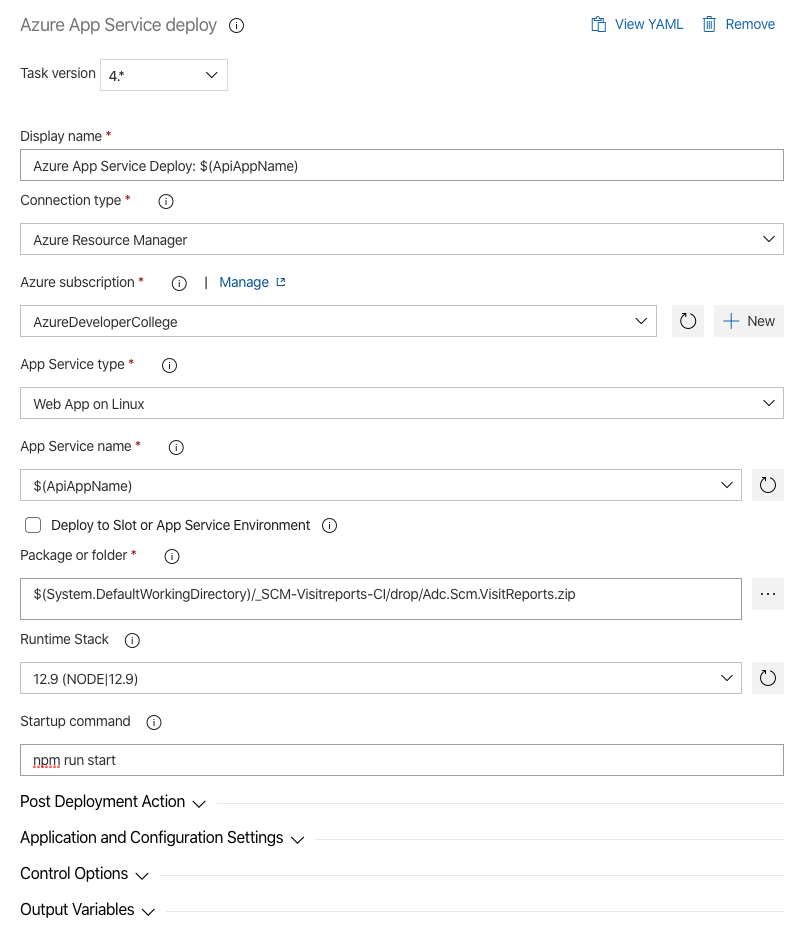

# Break Out: Create CI/CD pipelines to deploy the Azure Dev College sample application to Azure

## Here is what you will learn
Deploy the sample application to Azure.

In [challenge-3](./challenge-3.md), [challenge-4](./challenge-4.md) and [challenge-5](./challenge-5.md) you have learned how to create a CI/CD Pipeline to continuously and consistently deploy services to Azure.
You have learned how to use PullRequests, validation builds and how you track your work with Azure Boards. You may have noticed that there is still some work left to do until the sample application is deployed to your Develeopment and Testing stage.

In this Break Out Session we want you to deploy the remaining Microservices to your stages:
- SCM Resource API
- SCM Search API
- SCM Visitreports API
- SCM Textanalytics

As in [challenge-4](./challenge-4.md) and [challenge-5](./challenge-5.md) we will always perform the following steps for each service:
1. Set the corresponding UserStories to active
2. Create a new feature branch and check it out
3. Create the CI Build definition and validate it
4. Create a the PR validation Build
5. Create the CD Build for the stages *Development* and *Testing*
6. Merge the feature branch into the master branch
7. Update your master branch's policies to trigger the PR Build to validate a PullRequest
8. Test the build flow
9. Update the SCM-Frontend-CD Release Pipeline, set the missing service endpoint in the variable section and run the pipeline
10. Complete the UserStories


## SCM Resource API

Corresponding UserStories: __S6__ and __S7__

Feature branch: __features/scmresourceapicicd__

Projects to build: __apps/dotnetcore/Scm.Resources/Adc.Scm.Resources.Api__ and __Adc.Scm.Resources.ImageResizer__

Project runtime: __dotnetcore__, __ASP.NET Core__ and __AzureFunctions__

ARM Templates: __apps/infrastructure/templates/scm-resources-api-dotnetcore.json__

Build trigger path filters: 
- day4/apps/infrastructure/templates/scm-resources-api-dotnetcore.json
- day4/apps/dotnetcore/Scm.Resources/*

CI Build name: __SCM-Resources-CI__

PR Build name: __SCM-Resource-PR__

CD Build name: __SCM-Resources-CD__

CD Build Tasks:
1. ARM template deployment --> __scm-resources-api-dotnetcore.json__
2. Azure App Service Deploy --> __Adc.Scm.Resources.Api.zip__
   - App Service type --> __API App__
   - App Service name --> __$(ApiAppName)__
3. Azure App Service deploy --> __Adc.Scm.Resources.ImageResizer.zip__
   - App Service type --> __Function App on Windows__
   - App Service name --> __$(ResizerFunctionName)__

CD Build agent runs on: Latest Ubuntu version

CD Build variables stage *Development*:

   | Variable | Value | Scope | ARM Template Parameter |
   |----------|-------|-------|------------------------|
   |ResourceGroupName | ADC-DAY4-SCM-DEV | Development | |
   |Location| westeurope|Development| |
   |ApiAppName|__'prefix'__-day4scmresourceapi-dev|Development| webAppName |
   |AppServicePlanSKU|B1|Development| sku |
   |Use32BitWorker|false|Development| use32bitworker |
   |AlwaysOn|true|Development| alwaysOn|
   |StorageAccountName|__'prefix'__day4resdev|Development| storageAccountName |
   |ResizerFunctionName|__'prefix'__day4resizer-dev|Development| functionAppName |
   |ApplicationInsightsName|your ApplicationInsights instance name of stage Development|Development| applicationInsightsName |
   |ServiceBusNamespaceName|your ServiceBus namespace name of stage Development|Development| serviceBusNamespaceName |


CD Build variables stage *Testing*:

   | Variable | Value | Scope | ARM Template Parameter |
   |----------|-------|-------|------------------------|
   |ResourceGroupName | ADC-DAY4-SCM-TEST | Testing | |
   |Location| westeurope|Testing| |
   |ApiAppName|__'prefix'__-day4scmresourcesapi-test|Testing| webAppName |
   |AppServicePlanSKU|B1|Testing| sku |
   |Use32BitWorker|false|Testing| use32bitworker |
   |AlwaysOn|true|Testing| alwaysOn |
   |StorageAccountName|__'prefix'__day4restest|Testing| storageAccountName |
   |ResizerFunctionName|__'prefix'__day4resizer-test|Testing| functionAppName |
   |ApplicationInsightsName|your ApplicationInsights instance name of stage Testing|Testing| applicationInsightsName |
   |ServiceBusNamespaceName|your ServiceBus namespace name of stage Testing|Testing| serviceBusNamespaceName|

CI Build yaml:

```yaml
pr: none
trigger:
  branches:
    include:
      - master
  paths:
    include:
      - day4/apps/infrastructure/templates/scm-resources-api-dotnetcore.json
      - day4/apps/dotnetcore/Scm.Resources/*
jobs:
  - job: Build
    displayName: Build Scm Contacts
    pool:
      vmImage: ubuntu-latest
    steps:
    - task: UseDotNet@2
      displayName: 'Acquire .NET Core Sdk 3.1.x'
      inputs:
        packageType: Sdk
        version: 3.1.x
    - task: DotNetCoreCLI@2
      displayName: Restore
      inputs:
        command: restore
        projects: "day4/apps/dotnetcore/Scm.Resources/**/*.csproj"
    - task: DotNetCoreCLI@2
      displayName: Build
      inputs:
        projects: "day4/apps/dotnetcore/Scm.Resources/**/*.csproj"
        arguments: --configuration Release
    - task: DotNetCoreCLI@2
      displayName: Publish
      inputs:
        command: publish
        publishWebProjects: false
        projects: "day4/apps/dotnetcore/Scm.Resources/Adc.Scm.Resources.Api/Adc.Scm.Resources.Api.csproj"
        arguments: --configuration Release --output $(build.artifactstagingdirectory)
        zipAfterPublish: True
    - task: DotNetCoreCLI@2
      displayName: Publish
      inputs:
        command: publish
        publishWebProjects: false
        projects: "day4/apps/dotnetcore/Scm.Resources/Adc.Scm.Resources.ImageResizer/Adc.Scm.Resources.ImageResizer.csproj"
        arguments: --configuration Release --output $(build.artifactstagingdirectory)
        zipAfterPublish: True
    - task: CopyFiles@2
      inputs:
        sourceFolder: day4/apps/infrastructure/templates
        contents: |
          scm-resources-api-dotnetcore.json
        targetFolder: $(Build.ArtifactStagingDirectory)
    - task: PublishPipelineArtifact@1
      inputs:
        targetPath: $(Build.ArtifactStagingDirectory)
        artifactName: drop
```

ARM Template override parameters:

``` Shell
-webAppName $(ApiAppName) -sku $(AppServicePlanSKU) -use32bitworker $(Use32BitWorker) -alwaysOn $(AlwaysOn) -storageAccountName $(StorageAccountName) -functionAppName $(ResizerFunctionName) -applicationInsightsName $(ApplicationInsightsName) -serviceBusNamespaceName $(ServiceBusNamespaceName)
```

## SCM Search API

Corresponding UserStories: __S8__ and __S9__

Feature branch: __features/scmsearchapicicd__

Projects to build: __apps/dotnetcore/Scm.Search/Adc.Scm.Search.Api__ and __Adc.Scm.Search.Indexer__

Project runtime: __dotnetcore__, __ASP.NET Core__, __AzureFunctions__

ARM Templates: __apps/infrastructure/templates/scm-search-api-dotnetcore.json__

Build trigger path filters: 
- day4/apps/infrastructure/templates/scm-search-api-dotnetcore.json
- day4/apps/dotnetcore/Scm.Search/*

CI Build name: __SCM-Search-CI__

PR Build name: __SCM-Search-PR__

CD Build name: __SCM-Search-CD__

CD Build Tasks:
1. ARM template deployment --> __scm-search-api-dotnetcore.json__
2. Azure App Service Deploy --> __Adc.Scm.Search.Api.zip__
   - App Service type --> __Web App on Windows__
   - App Service name --> __$(ApiAppName)__
3. Azure App Service Deploy --> __Adc.Scm.Search.Indexer.zip__
   - App Service type --> __Function App on Windows__
   - App Service name --> __$(IndexerFunctionName)__

CD Build agent runs on: Latest Ubuntu version

CD Build variables stage *Development*:

   | Variable | Value | Scope | ARM Template Parameter |
   |----------|-------|-------|------------------------|
   |ResourceGroupName | ADC-DAY4-SCM-DEV | Development | |
   |Location| westeurope|Development| |
   |ApiAppName|__'prefix'__-day4scmsearchapi-dev|Development| webAppName |
   |AppServicePlanSKU|B1|Development| appPlanSKU |
   |Use32BitWorker|false|Development| use32bitworker |
   |AlwaysOn|true|Development| alwaysOn|
   |StorageAccountName|__'prefix'__ day4srdev|Development| storageAccountName |
   |IndexerFunctionName|__'prefix'__-day4indexer-dev|Development| functionAppName |
   |ApplicationInsightsName|your ApplicationInsights instance name of stage Development|Development| applicationInsightsName |
   |ServiceBusNamespaceName|your ServiceBus namespace name of stage Development|Development| serviceBusNamespaceName |
   |AzureSearchServiceName|__'prefix'__-day4search-dev|Development|azureSearchServiceName|
   |AzureSearchSKU|basic|Development|azureSearchSKU|
   |AzureSearchReplicaCount|1|Development|azureSearchReplicaCount|
   |AzureSearchPartitionCount|1|Development|azureSearchPartitionCount|


CD Build variables stage *Testing*:

   | Variable | Value | Scope | ARM Template Parameter |
   |----------|-------|-------|------------------------|
   |ResourceGroupName | ADC-DAY4-SCM-TEST | Testing | |
   |Location| westeurope|Testing| |
   |ApiAppName|__'prefix'__-day4scmsearchapi-dev|Testing| webAppName |
   |AppServicePlanSKU|B1|Testing| appPlanSKU |
   |Use32BitWorker|false|Testing| use32bitworker |
   |AlwaysOn|true|Testing| alwaysOn|
   |StorageAccountName|__'prefix'__-day4srdev|Testing| storageAccountName |
   |IndexerFunctionName|__'prefix'__-day4indexer-dev|Testing| functionAppName |
   |ApplicationInsightsName|your ApplicationInsights instance name of stage Testing|Testing| applicationInsightsName |
   |ServiceBusNamespaceName|your ServiceBus namespace name of stage Testing|Testing| serviceBusNamespaceName |
   |AzureSearchServiceName|__'prefix'__-day4search-dev|Testing|azureSearchServiceName|
   |AzureSearchSKU|basic|Testing|azureSearchSKU|
   |AzureSearchReplicaCount|1|Testing|azureSearchReplicaCount|
   |AzureSearchPartitionCount|1|Testing|azureSearchPartitionCount|

CI Build yaml:
```yaml
pr: none
trigger:
  branches:
    include:
      - master
  paths:
    include:
      - day4/apps/infrastructure/templates/scm-search-api-dotnetcore.json
      - day4/apps/dotnetcore/Scm.Search/*
jobs:
  - job: Build
    displayName: Build Scm Search
    pool:
      vmImage: ubuntu-latest
    steps:
    - task: UseDotNet@2
      displayName: 'Acquire .NET Core Sdk 3.1.x'
      inputs:
        packageType: Sdk
        version: 3.1.x
    - task: DotNetCoreCLI@2
      displayName: Restore
      inputs:
        command: restore
        projects: "day4/apps/dotnetcore/Scm.Search/**/*.csproj"
    - task: DotNetCoreCLI@2
      displayName: Build
      inputs:
        projects: "day4/apps/dotnetcore/Scm.Search/**/*.csproj"
        arguments: --configuration Release
    - task: DotNetCoreCLI@2
      displayName: Publish
      inputs:
        command: publish
        publishWebProjects: false
        projects: "day4/apps/dotnetcore/Scm.Search/Adc.Scm.Search.Api/Adc.Scm.Search.Api.csproj"
        arguments: --configuration Release --output $(build.artifactstagingdirectory)
        zipAfterPublish: True
    - task: DotNetCoreCLI@2
      displayName: Publish
      inputs:
        command: publish
        publishWebProjects: false
        projects: "day4/apps/dotnetcore/Scm.Search/Adc.Scm.Search.Indexer/Adc.Scm.Search.Indexer.csproj"
        arguments: --configuration Release --output $(build.artifactstagingdirectory)
        zipAfterPublish: True
    - task: CopyFiles@2
      inputs:
        sourceFolder: day4/apps/infrastructure/templates
        contents: |
          scm-search-api-dotnetcore.json
        targetFolder: $(Build.ArtifactStagingDirectory)
    - task: PublishPipelineArtifact@1
      inputs:
        targetPath: $(Build.ArtifactStagingDirectory)
        artifactName: drop
```

ARM Template override parameters:
```Shell
-webAppName $(ApiAppName) -appPlanSKU $(AppServicePlanSKU) -use32bitworker $(Use32BitWorker) -alwaysOn $(AlwaysOn) -storageAccountName $(StorageAccountName) -functionAppName $(IndexerFunctionName) -applicationInsightsName $(ApplicationInsightsName) -serviceBusNamespaceName $(ServiceBusNamespaceName) -azureSearchServiceName $(AzureSearchServiceName) -azureSearchSKU $(AzureSearchSKU) -azureSearchReplicaCount $(AzureSearchReplicaCount) -azureSearchPartitionCount $(AzureSearchPartitionCount)
```

## SCM Visitreports API

Corresponding UserStories: __S10__ and __S11__

Feature branch: __features/scmvisitreportscicd__

Projects to build: __apps/nodejs/visitreport__

Project runtime: __NodeJs__

ARM Templates: __apps/infrastructure/templates/scm-visitreport-nodejs-db.json__ and __apps/infrastructure/templates/scm-visitreport-nodejs-infra.json__.
- first deploy __scm-visitreport-nodejs-db.json__
- then deploy __scm-visitreport-nodejs-infra.json__

Build trigger path filters: 
- day4/apps/nodejs/visitreport/*
- day4/apps/infrastructure/templates/scm-visitreport-nodejs-db.json
- day4/apps/infrastructure/templates/scm-visitreport-nodejs-infra.json

CI Build name: __SCM-Visitreports-CI__

PR Build name: __SCM-Visitreports-PR__

CD Build name: __SCM-Visitreports-CD__

CD Build Tasks:
1. ARM template deployment --> __scm-visitreport-nodejs-db.json__
2. ARM template deployment --> __scm-visitreport-nodejs-infra.json__
3. Azure App Service deploy --> __Adc.Scm.VisitReports.zip__
   - App Service type --> __Web App on Linux__
   - App Service name --> __$(ApiAppName)__

CD Build agent runs on: Latest Ubuntu version

CD Build variables stage *Development*:

   | Variable | Value | Scope |
   |----------|-------|-------|
   |ResourceGroupName | ADC-DAY4-SCM-DEV | Development |
   |ResourceGroupNameTux|ADC-DAY4-SCM-TUX-DEV|Development|
   |Location| westeurope|Development|
   |ApiAppName|__'prefix'__-day4vsapi-dev|Development|
   |AppServicePlanSKU|Standard|Development|
   |AppServicePlanSKUCode|S1|Development|
   |ApplicationInsightsName|your ApplicationInsights instance name of stage Development|Development|
   |CosmosDbAccount|your Cosmos Account Name of stage Development|Development|
   |CosmosDatabaseName|scmvisitreports|Development|
   |CosmosDatabaseContainerName|visitreports|Development|
   |ServiceBusNamespaceName|your ServiceBus namespace name of stage Development|Development|

CD Build variables stage *Testing*:

   | Variable | Value | Scope |
   |----------|-------|-------|
   |ResourceGroupName | ADC-DAY4-SCM-TEST | Testing |
   |ResourceGroupNameTux|ADC-DAY4-SCM-TUX-TEST|Testing|
   |Location| westeurope|Testing|
   |ApiAppName|__'prefix'__-day4vsapi-test|Testing|
   |AppServicePlanSKU|Standard|Testing|
   |AppServicePlanSKUCode|S1|Testing|
   |ApplicationInsightsName|your ApplicationInsights instance name of stage Testing|Testing|
   |CosmosDbAccount|your Cosmos Account Name of stage Testing|Testing|
   |CosmosDatabaseName|scmvisitreports|Testing|
   |CosmosDatabaseContainerName|visitreports|Testing|±±±
   |ServiceBusNamespaceName|your ServiceBus namespace name of stage Testing|Testing|

Variable to ARM Template Parameters:

**Note:** Make sure that you apply the ARM Template  __scm-visitreport-nodejs-db.json__ to ResourceGroup __ResourceGroupName__ and
that you apply the ARM Template __scm-visitreport-nodejs-infra.json__ to ResourceGroup __ResourceGroupNameTux__ !!!

   |ARM Template|ARM Template Parameter|Variable to use| Deploy to ResourceGroup|
   |------------|----------------------|---------------|------------------------|
   |scm-visitreport-nodejs-db.json|cosmosDbAccount|CosmosDbAccount| ResourceGroupName |
   |scm-visitreport-nodejs-db.json|cosmosDatabaseName|CosmosDatabaseName| ResourceGroupName |
   |scm-visitreport-nodejs-db.json|cosmosDatabaseContainerName|CosmosDatabaseContainerName| ResourceGroupName|
   |scm-visitreport-nodejs-infra.json|sku|AppServicePlanSKU|ResourceGroupNameTux|
   |scm-visitreport-nodejs-infra.json|skuCode|AppServicePlanSKUCode|ResourceGroupNameTux|
   |scm-visitreport-nodejs-infra.json|webAppName|ApiAppName|ResourceGroupNameTux|
   |scm-visitreport-nodejs-infra.json|applicationInsightsName|ApplicationInsightsName|ResourceGroupNameTux|
   |scm-visitreport-nodejs-infra.json|cosmosDbAccount|CosmosDbAccount|ResourceGroupNameTux|
   |scm-visitreport-nodejs-infra.json|serviceBusNamespaceName|ServiceBusNamespaceName|ResourceGroupNameTux|
   |scm-visitreport-nodejs-infra.json|commonResGroup|ResourceGroupName|ResourceGroupNameTux|


**Hint:** to build a NodeJs application you have to install NodeJs on your build agent first. After the installation you can run a bash script that executes *npm install* in your project folder. Next, you can create a zip file and copy it to the artifacts staging directory to publish it in the next step.

CI Build yaml:

```yaml
pr: none
trigger:
  branches:
    include:
      - master
  paths:
    include:
      - day4/apps/nodejs/visitreport/*
      - day4/apps/infrastructure/templates/scm-visitreport-nodejs-db.json
      - day4/apps/infrastructure/templates/scm-visitreport-nodejs-infra.json
steps:
  - task: NodeTool@0
    inputs:
      versionSpec: "12.x"
    displayName: "Install Node.js"
  - task: Bash@3
    inputs:
      workingDirectory: "$(Build.SourcesDirectory)/day4/apps/nodejs/visitreport"
      targetType: "inline"
      displayName: "npm install"
      script: npm install
  - task: ArchiveFiles@2
    displayName: "Archive build files"
    inputs:
      rootFolderOrFile: "$(Build.SourcesDirectory)/day4/apps/nodejs/visitreport"
      includeRootFolder: false
      archiveType: zip
      archiveFile: $(Build.ArtifactStagingDirectory)/Adc.Scm.VisitReports.zip
      replaceExistingArchive: true
  - task: CopyFiles@2
    inputs:
      sourceFolder: day4/apps/infrastructure/templates
      contents: |
        scm-visitreport-nodejs-db.json
        scm-visitreport-nodejs-infra.json
      targetFolder: $(Build.ArtifactStagingDirectory)
  - task: PublishPipelineArtifact@1
    inputs:
      targetPath: $(Build.ArtifactStagingDirectory)
      artifactName: drop

```

ARM Template override parameters:
- scm-visitreport-nodejs-db.json
  ```Shell
  -cosmosDbAccount $(CosmosDbAccount) -cosmosDatabaseName $(CosmosDatabaseName) -cosmosDatabaseContainerName $(CosmosDatabaseContainerName)
  ```
- scm-visitreport-nodejs-infra.json:
  ```Shell
  -sku $(AppServicePlanSKU) -skuCode $(AppServicePlanSKUCode) -webAppName $(ApiAppName) -applicationInsightsName $(ApplicationInsightsName) -cosmosDbAccount $(CosmosDbAccount) -serviceBusNamespaceName $(ServiceBusNamespaceName) -commonResGroup $(ResourceGroupName)
  ```

Make sure that your AppService deployment task is configured as follows:



## SCM Textanalytics

Corresponding UserStories: __S12__ and __S13__

Feature branch: __features/scmtextanalyticscicd__

Projects to build: __apps/nodejs/textanalytics__

Project runtime: __NodeJs__

ARM Templates: __apps/infrastructure/templates/scm-textanalytics-nodejs-common.json__ and __apps/infrastructure/templates/scm-textanalytics-nodejs-infra.json__.
- first deploy __scm-textanalytics-nodejs-common.json__
- then deploy __scm-textanalytics-nodejs-infra.json__

Build trigger path filters: 
- day4/apps/nodejs/textanalytics/*
- day4/apps/infrastructure/templates/scm-textanalytics-nodejs-common.json
- day4/apps/infrastructure/templates/scm-textanalytics-nodejs-infra.json

CI Build name: __SCM-Textanalytics-CI__

PR Build name: __SCM-Textanalytics-PR__

CD Build name: __SCM-Textanalytics-CD__

CD Build Tasks:
1. ARM template deployment --> __scm-textanalytics-nodejs-common.json__
2. ARM template deployment --> __scm-textanalytics-nodejs-infra.json__
3. Azure App Service deploy --> __Adc.Scm.Textanalytics.zip__
   - App Service type --> __Function App on Linux__
   - App Service name: --> __$(FunctionAppName)__
 
CD Build agent runs on: Latest Ubuntu version

CD Build variables stage *Development*:

   | Variable | Value | Scope |
   |----------|-------|-------|
   |ResourceGroupName | ADC-DAY4-SCM-DEV | Development |
   |ResourceGroupNameFunc|ADC-DAY4-SCM-FUNC-DEV|Development|
   |Location| westeurope|Development|
   |TextAnalyticsName|__'prefix'__-day4cognitive-dev|Development|
   |TextAnalyticsTier|S0|Development|
   |StorageAccountName|__'prefix'__ day4tadev|Development|
   |FunctionAppName|__'prefix'__-day4tafunc-dev|Development|
   |ApplicationInsightsName|your ApplicationInsights instance name of stage Development|Development|
   |CosmosDbAccount|your Cosmos Account Name of stage Development|Development|
   |ServiceBusNamespaceName|your ServiceBus namespace name of stage Development|Development|

CD Build variables stage *Testing*:

   | Variable | Value | Scope |
   |----------|-------|-------|
   |ResourceGroupName | ADC-DAY4-SCM-TEST | Testing |
   |ResourceGroupNameFunc|ADC-DAY4-SCM-FUNC-TEST|Testing|
   |Location| westeurope|Testing|
   |TextAnalyticsName|__'prefix'__-day4cognitive-test|Testing|
   |TextAnalyticsTier|S0|Testing|
   |StorageAccountName|__'prefix'__ day4tatest|Testing|
   |FunctionAppName|__'prefix'__-day4tafunc-test|Testing|
   |ApplicationInsightsName|your ApplicationInsights instance name of stage Testing|Testing|
   |CosmosDbAccount|your Cosmos Account Name of stage Testing|Testing|
   |ServiceBusNamespaceName|your ServiceBus namespace name of stage Testing|Testing|

Variable to ARM Template Parameters:

**Note:** Make sure that you apply the ARM Template  __scm-textanalytics-nodejs-common.json__ to ResourceGroup __ResourceGroupName__ and
that you apply the ARM Template __scm-textanalytics-nodejs-infra.json__ to ResourceGroup __ResourceGroupNameFunc__ !!!

   |ARM Template|ARM Template Parameter|Variable to use| Deploy to ResourceGroup|
   |------------|----------------------|---------------|------------------------|
   |scm-textanalytics-nodejs-common.json|taname|TextAnalyticsName| ResourceGroupName |
   |scm-textanalytics-nodejs-common.json|tatier|TextAnalyticsTier| ResourceGroupName |
   |scm-textanalytics-nodejs-common.json|storageAccountName|StorageAccountName| ResourceGroupName|
   |scm-textanalytics-nodejs-infra.json|functionAppName|FunctionAppName|ResourceGroupNameFunc|
   |scm-textanalytics-nodejs-infra.json|storageAccountName|StorageAccountName|ResourceGroupNameFunc|
   |scm-textanalytics-nodejs-infra.json|taname|TextAnalyticsName|ResourceGroupNameFunc|
   |scm-textanalytics-nodejs-infra.json|applicationInsightsName|ApplicationInsightsName|ResourceGroupNameFunc|
   |scm-textanalytics-nodejs-infra.json|cosmosDbAccount|CosmosDbAccount|ResourceGroupNameFunc|
   |scm-textanalytics-nodejs-infra.json|serviceBusNamespaceName|ServiceBusNamespaceName|ResourceGroupNameFunc|
   |scm-textanalytics-nodejs-infra.json|commonResGroup|ResourceGroupName|ResourceGroupNameFunc|

**Hints:** To build SCM Textanalytics we need to use NodeJs version 10.x.

CI Build yaml:
```yaml
pr: none
trigger:
  branches:
    include:
      - master
  paths:
    include:
      - day4/apps/nodejs/textanalytics/*
      - day4/apps/infrastructure/templates/scm-textanalytics-nodejs-common.json
      - day4/apps/infrastructure/templates/scm-textanalytics-nodejs-infra.json
steps:
  - task: NodeTool@0
    inputs:
      versionSpec: "10.x"
    displayName: "Install Node.js"
  - task: Bash@3
    inputs:
      workingDirectory: "$(Build.SourcesDirectory)/day4/apps/nodejs/textanalytics"
      targetType: "inline"
      displayName: "npm install"
      script: npm install
  - task: ArchiveFiles@2
    displayName: "Archive build files"
    inputs:
      rootFolderOrFile: "$(Build.SourcesDirectory)/day4/apps/nodejs/textanalytics"
      includeRootFolder: false
      archiveType: zip
      archiveFile: $(Build.ArtifactStagingDirectory)/Adc.Scm.Textanalytics.zip
      replaceExistingArchive: true
  - task: CopyFiles@2
    inputs:
      sourceFolder: day4/apps/infrastructure/templates
      contents: |
        scm-textanalytics-nodejs-common.json
        scm-textanalytics-nodejs-infra.json
      targetFolder: $(Build.ArtifactStagingDirectory)
  - task: PublishPipelineArtifact@1
    inputs:
      targetPath: $(Build.ArtifactStagingDirectory)
      artifactName: drop
```

ARM Template override parameters:
- scm-textanalytics-nodejs-common.json
  ```Shell
  -taname $(TextAnalyticsName) -tatier $(TextAnalyticsTier) -storageAccountName $(StorageAccountName)
  ```
- scm-textanalytics-nodejs-infra.json
  ```Shell
  -functionAppName $(FunctionAppName) -storageAccountName $(StorageAccountName) -taname $(TextAnalyticsName) -applicationInsightsName $(ApplicationInsightsName) -cosmosDbAccount $(CosmosDbAccount) -serviceBusNamespaceName $(ServiceBusNamespaceName) -commonResGroup $(ResourceGroupName)
  ```

Make sure that your AppService deployment task is configured as follows:


## Test the application

Now that you have deployed all services to Azure it's time to test it!
Go to the Azure Portal and navigate to the ResourceGroup ADC-DAY4-SCM-DEV. Open the StorageAccount *__'prefix'__ day4scmfedev* and go to *Static website*.
Copy the url of the __Primary endpoint__, open a new browser window and paste the url. If everything is configured correctly, the Azure Developer College's Sample Application should work. Try to add some Contacts, add Avatars and create VisitReports. 
If you want you can check the Testing stage, too.

## ApplicationInsights

Now that we have created some test data, go to the ApplicationInsights instance of your Development stage and open the ApplicationMap.
If nothing is displayed, wait some minutes, it takes ts time until all data is pushed to ApplicationInsights. 

With ApplicationInsights, Azure Monitor offers a distributed tracing solution that makes a developer’s live easier. ApplicationInsights offers an application map view which aggregates many transactions to show a topological view of how the systems interact, and what the average performance and error rates are.

Take some time and look at the map to see what information an Operator can get from it.


Now Navigate to the *Performance* view. Here you find all details about operations and dependencies of your services.
In the upper panel you can apply filters to investigate your telemetry:


Check out some details about the SCM API operations:


Drill into a sample and see the "End to end transaction":


## Congratulation !!
You've done it!
