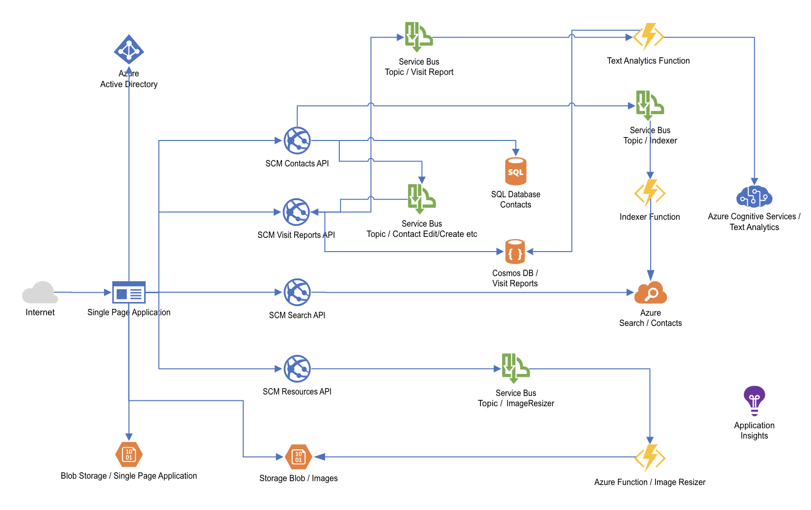

# Day 5 Identity and Architecture

- [Challenge 0 - Request an ID Token from Azure AD](./challenges/challenge-0.md)
- [Challenge 1 - Receive an ID Token in a Fragment URL](./challenges/challenge-1.md)
- [Challenge 2 - OAuth2 Implicit Flow](./challenges/challenge-2.md)
- [Challenge 3 - Integrate Azure AD into the SCM Contacts API](./challenges/challenge-3.md)
- :small_orange_diamond: *[Breakout! - Integrate the sample application into Azure AD](./challenges/challenge-bo-1.md)* :small_orange_diamond:

# Day5 - Goal

You already have deployed the Azure Developer College's sample application to your Azure subscription. Although the application is up and running we can not use different user accounts to create Contacts and VisitReports per user. The current deployed application does not support any user authentication.

Today we we want to integrate Azure Active Directory as an Identity Provider in your application to authenticate and to authorize an Azure AD user to access the sample application. 

Azure Active Directory (Azure AD) is Microsoft’s cloud-based identity and access management service, which helps your employees sign in and access resources in:
- External resources, such as Microsoft Office 365, the Azure portal, and thousands of other SaaS applications.
- Internal resources, such as apps on your corporate network and intranet, along with any cloud apps developed by your own organization.

To get started with Azure AD the documentation [here](https://docs.microsoft.com/azure/active-directory) is a good starting point.

## Authentication

Authentication is the act of challenging a party for legitimate credentials, providing the basis for creation of a security principal to be used for identity and access control. In simpler terms, it's the process of proving you are who you say you are. Authentication is sometimes shortened to AuthN.

## Authorization

Authorization is the act of granting an authenticated security principal permission to do something. It specifies what data you're allowed to access and what you can do with it. Authorization is sometimes shortened to AuthZ.

## OpenID Connect and OAuth 2.0

[OpenID Connect](https://openid.net/specs/openid-connect-core-1_0.html) is a simple identity layer built on top of the OAuth 2.0 protocol. OAuth 2.0 defines mechanisms to obtain and use [access tokens](https://docs.microsoft.com/en-us/azure/active-directory/develop/access-tokens) to access protected resources, but they do not define standard methods to provide identity information. OpenID Connect implements authentication as an extension to the OAuth 2.0 authorization process. It provides information about the end user in the form of an [id_token](https://docs.microsoft.com/en-us/azure/active-directory/develop/id-tokens) that verifies the identity of the user and provides basic profile information about the user.

## Protect APIs with Azure AD

On Day5 you will learn how you can protect your APIs (microservices) with Azure AD. In addition you will learn how OAuth2 permissions are used to grant access to API's client applications and how a signed-in user can grant access. The sample application defines the following OAuth2 permissions

  |OAuth2 permission|Description|
  |-----------------|-----------|
  |Contacts.Create|Allows the client app to create contacts for the signed-in user|
  |Contacts.Read|Allows the client app to read contacts of the signed-in user|
  |Contacts.Update|Allows the client app to update contacts of the signed-in user|
  |Contacts.Delete|Allows the client app to delete contacts of the signed-in user|
  |VisitReports.Create|Allows the client app to create VisitReports for the signed-in user|
  |VisitReports.Read|Allows the client app to read VisitReports of the signed-in user|
  |VisitReports.Update|Allows the client app to update VisitReports of the signed-in user|
  |VisitReports.Delete|Allows the client app to delete VisitReports of the signed-in user|

## Sign in users

You will see how the sample application's Single Page Application (SPA) uses MSAL to sign in users and how to acquire an access token to access the APIs in the name of the signed-in user. Once an access token is acquired it is forwarded with each request to the APIs and the APIs can use the token to get needed information about the signed-in user.

## Microsoft Authentication Library

[Microsoft Authentication Library (MSAL)](https://docs.microsoft.com/azure/active-directory/develop/msal-overview) enables developers to acquire tokens from the Microsoft identity platform endpoint in order to access secured Web APIs. These Web APIs can be the Microsoft Graph, other Microsoft APIS, third-party Web APIs, or your own Web API. MSAL is available for .NET, JavaScript, Android, and iOS, which support many different application architectures and platforms. 

## Architecure

At the end of the day we will have integrated the sample application into Azure AD:

   