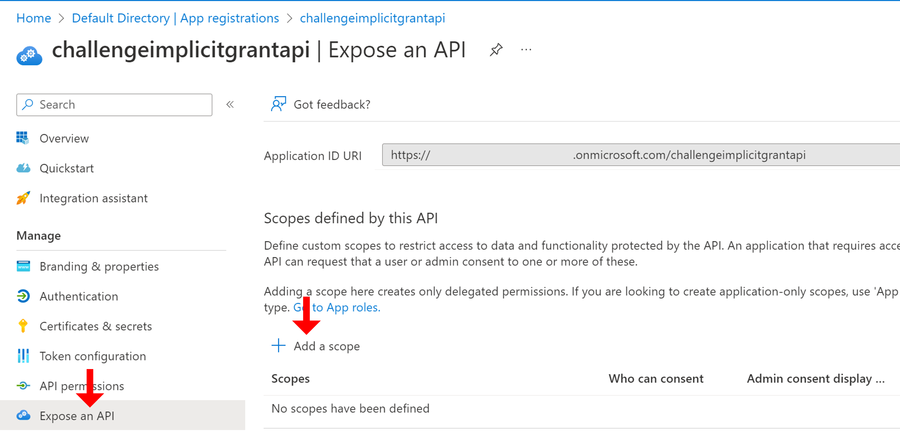

# Challenge 2: OAuth 2 Implicit Flow

## Here is what you'll learn 🎯

- How to register an Azure AD application and allow the OAuth2 Implicit Grant Flow
- How to register an Azure AD application and expose an API with OAuth2 permissions
- How to authenticate an user and start an OAuth2 implicit flow to acquire an access token for the API

:::warning
The Implicit Grant Flow is less secure than the Code Grant Flow. This is because the generation of the `access_token` for accessing the user's data on a resource server (e.g., the Graph API), is completely happening on the front channel. However, as the flow completely happens in the browser, it is suited for applications that do not have a server backend (e.g., 100% JS-based SPA).
:::

## Table Of Contents

1. [Create an Azure AD Application and enable Implicit Grant Flow](#create-an-azure-ad-application-and-enable-implicit-grant-flow)
2. [Create an Azure AD Application and expose an API with OAuth2 Permissions](#create-an-azure-ad-application-and-expose-an-api-with-oauth2-permissions)
3. [Run the Token Echo Server](#run-the-token-echo-server)
4. [Create the Request to directly acquire an `access_token` for the Microsoft Graph API](#create-the-request-to-directly-acquire-an-access-token-for-the-microsoft-graph-api)
5. [Wrap-Up](#wrap-up)
6. [Cleanup](#cleanup)

## Create an Azure AD Application and enable Implicit Grant Flow

Before you can authenticate an user and acquire an access token for the API you
must register an application in your Azure AD tenant. By default the _Implicit
Grant Flow_ for issuing access tokens is disabled.

### Azure CLI

First, create a new Azure AD Application, this time with
`oauth2-allow-implicit-flow` enabled:

```shell
az ad app create --display-name challengeimplicitgrant --web-redirect-uris http://localhost:5001/api/tokenechofragment --identifier-uris https://TENANT_DOMAIN_NAME.com/challengeimplicitgrantflow --enable-id-token-issuance true --enable-access-token-issuance true
```
Replace `TENANT_DOMAIN_NAME` with the domain name of your Azure AD instance again.
As before, note down the `appId`. Next, retrieve and note the ID of your current
Azure AD tenant via:

```shell
az account show
```

## Create an Azure AD Application and expose an API with OAuth2 Permissions

In this sample we create an API that exposes four OAuth2 permissions:

- Contacts.Read
- Contacts.Create
- Contacts.Update
- Contacts.Delete

### Azure CLI

First, create a new Azure AD application and write the output to a variable:

```shell
az ad app create --display-name challengeimplicitgrantapi --identifier-uris https://TENANT_DOMAIN_NAME/challengeimplicitgrantapi
```
Replace `TENANT_DOMAIN_NAME` with the domain name of your Azure AD instance again.

Now you need to add your own OAuth2 permissions. This we will do manually in the Azure portal. Navigate there. Under `Azure Active Directory --> App registrations` find the **challengeimplicitgrantapi**.

There navigate to `Expose an API` and add four scopes.

Select `+ Add a Scope`.



Enter the following information for the new Scope:

| Name               | Value                                                                  |
| ------------------ | ---------------------------------------------------------------------- |
| _Scope name_ | Contacts.Update |
| _Who can consent?_ | Admins and users |
| _Admin consent display name_ | Update contacts |
| _Admin consent description_ | Allows the app to update contacts for the signed-in user |
| _User consent display name_ | Update contacts |
| _User consent description_ | Allows the app to update your contacts |
| _State_ | Enabled |

Select `Add scope`.


Do the same for 3 more scopes.

| Name | Value |
| ------------------ | ---------------------------------------------------------------------- |
| _Scope name_ | Contacts.Delete |
| _Who can consent?_ | Admins and users |
| _Admin consent display name_ | Delete contacts |
| _Admin consent description_ | Allows the app to delete contacts for the signed-in user |
| _User consent display name_ | Delete contacts |
| _User consent description_ | Allows the app to delete your contacts |
| _State_ | Enabled |

| Name | Value |
| ------------------ | ---------------------------------------------------------------------- |
| _Scope name_ | Contacts.Create |
| _Who can consent?_ | Admins and users |
| _Admin consent display name_ | Create contacts |
| _Admin consent description_ | Allows the app to create contacts for the signed-in user |
| _User consent display name_ | Create contacts |
| _User consent description_ | Allows the app to create your contacts |
| _State_ | Enabled |

| Name | Value |
| ------------------ | ---------------------------------------------------------------------- |
| _Scope name_ | Contacts.Read |
| _Who can consent?_ | Admins and users |
| _Admin consent display name_ | Read contacts |
| _Admin consent description_ | Allows the app to read contacts for the signed-in user |
| _User consent display name_ | Read contacts |
| _User consent description_ | Allows the app to read your contacts |
| _State_ | Enabled |

The permissions
should look like this: 

In Azure AD an _Application_ is something like a template with all necessary
settings like ReplyUrl, required permissions, OAuth2 Permissions etc. When a
user logs in for the first time and grants consent, an instance of the
application is created. The instance is called a **Service Principal**. All
created Service principals can be found in your Azure AD under **Enterprise
Applications**. As no user ever logs on to an API we must create the **Service
Principal** for the API.

```shell
az ad sp create --id <API_APP_ID>
```


## Run the Token Echo Server

Open another shell and run the `Token Echo Server` from
[`day5/apps/token-echo-server`](https://github.com/azuredevcollege/trainingdays/tree/master/day5/apps/token-echo-server) in this repository.
This helper ASP.NET Core tool is used to echo the token issued by your AAD. The
tool is listening on port 5001 on your local machine. Tokens are accepted on the
route `http://localhost:5001/api/tokenechofragment`. That's the reason why we
initially registered an AAD application with a reply url pointing to
`http://localhost:5001/api/tokenechofragment`.

Run the application via:

```shell
dotnet run
```

## Create the Request to directly acquire an `access_token` for the Microsoft Graph API

We can directly request an `access_token` by specifying `token` in the
`response_type` field. Adding `token` will allow our app to receive an
`access_token` immediately from the authorize endpoint without having to make a
second request to the token endpoint. If you use the token in `response_type`,
the scope parameter must contain a scope indicating which resource to issue the
token for.

Replace `TENANT_ID` with your AAD Tenant Id and `APPLICATION_ID` with your
Application Id (this is the id that you received when you created the first
application). Replace `TENANT_DOMAIN` with the name of your Azure AD instance and make sure not to temper with the masking. Open a browser and paste the request:

```http
https://login.microsoftonline.com/TENANT_ID/oauth2/v2.0/authorize?
client_id=APPLICATION_ID
&response_type=id_token+token
&redirect_uri=http%3A%2F%2Flocalhost%3A5001%2Fapi%2Ftokenechofragment
&response_mode=fragment
&scope=openid%20profile%20https%3A%2F%2FTENANT_DOMAIN.onmicrosoft.com%2Fchallengeimplicitgrantapi%2FContacts.Read%20https%3A%2F%2FTENANT_DOMAIN.onmicrosoft.com%2Fchallengeimplicitgrantapi%2FContacts.Create%20https%3A%2F%2FTENANT_DOMAIN.onmicrosoft.com%2Fchallengeimplicitgrantapi%2FContacts.Update%20https%3A%2F%2FTENANT_DOMAIN.onmicrosoft.com%2Fchallengeimplicitgrantapi%2FContacts.Delete
&nonce=1234
```
After executing the request and you have signed in, Azure AD shows you a consent
page and you have to grant access for the requested API permissions. After
giving consent, have a look at your browser's address bar. The `access_token` is
in the fragment of the url and should look something like this:

```http
http://localhost:5001/api/tokenechofragment#access_token=eyJ0eX...&token_type=Bearer&expires_in=3599&scope=openid+profile+User.Read+email&id_token=eyJ0eXAiOi...&session_state=0f76c823-eac5-4ec0-9d4a-edf40b783583
```

Make sure to only copy the `access_token`, not the full remainder of the string!

Go to [https://jwt.ms](http://jwt.ms), paste the token and have a look at the
decoded token. You will see that there is issued an additional claim `scp`. This
claim contains all OAuth2Permissions the user gave consent to.

More details on how the OAuth2 Implicit Grant Flow request can be used is
documented
[here](https://docs.microsoft.com/azure/active-directory/develop/v2-oauth2-implicit-grant-flow#send-the-sign-in-request).

## Wrap-Up

This challenge showed how to create a new application in AAD and use the OAuth
2.0 Implicit Grant Flow to request an access token for accessing the Graph API.
The full process is described
[here](https://docs.microsoft.com/azure/active-directory/develop/v2-oauth2-implicit-grant-flow).

## Cleanup

Remove the created resources via the Azure CLI:

```shell
az ad app delete --id <APP_ID>
az ad app delete --id <API_APP_ID>
```

[◀ Previous challenge](./01-challenge.md) | [🔼 Day 5](../README.md) | [Next challenge ▶](./03-challenge.md)
