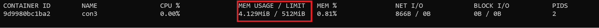

# Challenge 2: Container 101

⏲️ *Est. time to complete: 30 min.* ⏲️

## Here is what you'll learn 🎯

In this challenge, we go a little bit deeper and learn how to use native Docker commands to play with containers without connecting them.

In this challenge you will:

- Check container logs
- List running processes inside container
- Check container's resource usage
- Limit container's CPU and memory usage
- Set environment variables

## Table Of Contents

1. [Starting Point - Create Containers](#starting-point-create-containers)
2. [Docker Logs](#docker-logs)
3. [Docker top and stats](#docker-top-and-stats)
4. [CPU and Memory Consumption Limits](#cpu-and-memory-consumption-limits)
5. [Environment Variables](#environment-variables)
6. [Wrap-Up](#wrap-up)

## Starting Point - Create Containers

First let's create a couple of containers. Open your terminal and type:

```shell
docker container run -d --name con1 -p 80:80 nginx 
```

The output will be something like:

```shell
501ff8e64847a6ac9510761f42a3c1ebe2aee20f0e3e78752d04056eb941a8c1
 ```

We have created a container called ```con1``` with ```-d``` option from the image ```nginx:latest```. As you remember, ```-d``` means run it in background.

_Nginx_ is an open source reverse proxy-webserver daemon. When you create a container from that image, the nginx webserver daemon runs and starts to listen on tcp port 80. Nginx is a service, not a one time application, so when it starts, it continues to run. Hence, container is up and running too.

With ```-p 80:80``` option, we instructed to Docker that we want to forward host's TCP 80 port to container's TCP 80 port.

Any request that reaches to the host's 80 port will be forwarded to the container. If you open a web browser on the host and type ```http://127.0.0.1```, you'll access the website running inside the container. We'll come to network details later.


 Now let's keep this container as is and create another one. This time we create a _task container_. A one time application will start when container will start, which means that it will do its thing and close after it has finished. Consequently the container will close too. We run this container detached.

Type:

```shell
docker run -d --name con2 chuanwen/cowsay
```

The output will be something like:

```shell
Unable to find image 'chuanwen/cowsay:latest' locally
latest: Pulling from chuanwen/cowsay
99ad4e3ced4d: Pull complete
ec5a723f4e2a: Pull complete
2a175e11567c: Pull complete
8d26426e95e0: Pull complete
46e451596b7c: Pull complete
c337767f8c73: Pull complete
Digest: sha256:1f7a652a47fe7311c7e201644d44682e11e7ae4d3d7b03c1ce5c0df164de205c
Status: Downloaded newer image for chuanwen/cowsay:latest
385b768034d531ca050b0334f359cc29cfa3077d479a143634fe23b1acf4c55e
 ```

We've created two containers named ```con1``` and ```con2```. ```con1``` is still running but ```con2``` exited because the running process inside container has done its job and exited. Let's check them.

Type:

```shell
docker ps -a
```

The output will be something like:

```shell
CONTAINER ID        IMAGE               COMMAND                  CREATED             STATUS                    PORTS                NAMES
385b768034d5        chuanwen/cowsay     "/bin/sh -c '/usr/ga…"   11 hours ago        Exited (0) 1 hour ago                        con2
501ff8e64847        nginx               "/docker-entrypoint.…"   11 hours ago        Up 1 hour               0.0.0.0:80->80/tcp   con1
 ```

Don't delete the containers, we need them in the next exercise.

## Docker Logs

We've created two containers a few minutes ago with the ```-d``` option which allowed us to run them in the background. Therefore, we couldn't see any messages or logs generated by these containers.

Now it's time to see what's going on. Let start with ```con2```. The command that we will use is ```docker logs```

Type:

```shell
docker logs con2
```

The output will be something like:

```shell
 ________________________________________
/ No one so thoroughly appreciates the   \
| value of constructive criticism as the |
| one who's giving it.                   |
|                                        |
\ -- Hal Chadwick                        /
 ----------------------------------------
        \   ^__^
         \  (oo)\_______
            (__)\       )\/\
                ||----w |
                ||     ||
 ```

 The cow said some wise things :)

 But, when did it say these? To learn that, we use the ```-t``` option, which adds timestamps to each generated log line.

 Type:

```shell
docker logs -t con2
```

The output will be something like:

```shell
2020-06-03T00:46:16.592712600Z  ________________________________________
2020-06-03T00:46:16.592752800Z / No one so thoroughly appreciates the   \
2020-06-03T00:46:16.592755800Z | value of constructive criticism as the |
2020-06-03T00:46:16.592757700Z | one who's giving it.                   |
2020-06-03T00:46:16.592759500Z |                                        |
2020-06-03T00:46:16.592761300Z \ -- Hal Chadwick                        /
2020-06-03T00:46:16.592763200Z  ----------------------------------------
2020-06-03T00:46:16.592765200Z         \   ^__^
2020-06-03T00:46:16.592767200Z          \  (oo)\_______
2020-06-03T00:46:16.592769100Z             (__)\       )\/\
2020-06-03T00:46:16.592771100Z                 ||----w |
2020-06-03T00:46:16.592773000Z                 ||     ||
 ```

What if this was a long log and we just wanted to see last couple of lines instead of whole log output? We can use ```--tail``` option for that.

Type:

```shell
docker logs --tail 5 con2
```

The output will be something like:

```shell
        \   ^__^
         \  (oo)\_______
            (__)\       )\/\
                ||----w |
                ||     ||
```

Let's start playing with ```con1```. ```con1``` is a nginx web daemon and it's running.

Sometimes you want to check the logs live, while things are happening. To do that, we use the ```-f``` option. It allows us to attach to the log and follow it in real time.

Type:

```shell
docker logs -f con1
```

The output will be something like:

```shell
/docker-entrypoint.sh: /docker-entrypoint.d/ is not empty, will attempt to perform configuration
/docker-entrypoint.sh: Looking for shell scripts in /docker-entrypoint.d/
/docker-entrypoint.sh: Launching /docker-entrypoint.d/10-listen-on-ipv6-by-default.sh
10-listen-on-ipv6-by-default.sh: Getting the checksum of /etc/nginx/conf.d/default.conf
10-listen-on-ipv6-by-default.sh: Enabled listen on IPv6 in /etc/nginx/conf.d/default.conf
/docker-entrypoint.sh: Launching /docker-entrypoint.d/20-envsubst-on-templates.sh
/docker-entrypoint.sh: Configuration complete; ready for start up
172.17.0.1 - - [03/Aug/2020:00:54:51 +0000] "GET / HTTP/1.1" 200 612 "-" "Mozilla/5.0 (Windows NT 10.0; Win64; x64) AppleWebKit/537.36 (KHTML, like Gecko) Chrome/84.0.4147.105 Safari/537.36 Edg/84.0.522.50" "-"
2020/06/03 00:54:51 [error] 28#28: *1 open() "/usr/share/nginx/html/favicon.ico" failed (2: No such file or directory), client: 172.17.0.1, server: localhost, request: "GET /favicon.ico HTTP/1.1", host: "127.0.0.1", referrer: "http://127.0.0.1/"
172.17.0.1 - - [03/Jun/2020:00:54:51 +0000] "GET /favicon.ico HTTP/1.1" 404 555 "http://127.0.0.1/" "Mozilla/5.0 (Windows NT 10.0; Win64; x64) AppleWebKit/537.36 (KHTML, like Gecko) Chrome/84.0.4147.105 Safari/537.36 Edg/84.0.522.50" "-"
172.17.0.1 - - [03/Jun/2020:10:45:47 +0000] "GET / HTTP/1.1" 304 0 "-" "Mozilla/5.0 (Windows NT 10.0; Win64; x64) AppleWebKit/537.36 (KHTML, like Gecko) Chrome/84.0.4147.105 Safari/537.36 Edg/84.0.522.50" "-"
```

Now we're attached to the log. Open a browser and visit ```http://127.0.0.1``` and refresh the page a couple of times. Turn back to terminal and you'll see new logs generated. You can follow them in real time.

You can cut the connection to the log by typing ```CTRL + C``` when you're done.

## Docker top and stats

In this exercise, we'll take a look at ```docker stats``` and ```docker top``` commands.

First let's get started with ```docker top```. This command allows us to check which processes are running in a container. It's the equivalent to the ```ps``` Linux command.

However, you don't need to connect to the container to execute it. Instead you can get the same result with ```docker top```. Let's try it on ```con1```, which is still running.

Type:

```shell
docker top con1
```

The output will be something like:

```shell
PID                 USER                TIME                COMMAND
2345                root                0:00                nginx: master process nginx -g daemon off;
2404                101                 0:00                nginx: worker process
```

If you execute the same command for ```con2``` you get an error because ```con2``` is not up and running at the moment.

Type:

```shell
docker top con2
```

The output will be something like:

```shell
Error response from daemon: Container 385b768034d531ca050b0334f359cc29cfa3077d479a143634fe23b1acf4c55e is not running
```

This way we can see running processes in the container. Now it's time to check container's resource usage.

For that, we use the ```docker stats``` command. If you type ```docker stats``` without any option, it'll start showing all the running containers' resource usage statistics. You can also just check single container's resource usage by adding the container name or ID to the command, like ```docker stats con1```.

Type:

```shell
docker stats con1
```

The output will be something like:

```shell
CONTAINER ID        NAME                CPU %               MEM USAGE / LIMIT     MEM %               NET I/O             BLOCK I/O           PIDS
501ff8e64847        con1                0.00%               3.918MiB / 7.574GiB   0.05%               8.9kB / 5.27kB      0B / 0B             2
```

```CTRL + C```  will allow you to turn back to terminal from this view.

## CPU and Memory Consumption Limits

It will certainly lead to problems if you run any container on any production system without limiting its CPU and memory usage. Due to a faulty process or load, the container may start to use all the system resources of the host. This means that the other containers and processes on that host would crash.

Docker allows us to limit any container's memory and CPU usage. You can specify maximum amount of memory that a container can access via the ```--memory``` option. ```--memory=512M``` dedicates 512 Megabyte of RAM to the container. The option takes a positive integer, followed by a suffix of b, k, m, g, to indicate bytes, kilobytes, megabytes, or gigabytes.

You can also use ```--memory-swap``` option to set the amount of memory this container is allowed to swap to disk. Let's try to create a new container with restricted memory.

Type:

```shell
docker container run -d --memory=512M --name con3 nginx
```

The output will be something like:

```shell
9d9980bc1ba2dcbc72d30a1b62b4c69c9f0ba1c745a6ba7a098a1a9811068742
```

Use ```docker stats con3``` command to see that container started with limited memory.


CPU limits are not the same as memory limits. You can't specify an "amount" of the CPU power. Instead of that, you can specify which CPU core the container can access or not. If you don't specify that, by default, any container can access all CPU cores of the host.

The ```–cpus``` option allows us to limit the maximum number of cores that container can access. For example, ```–cpus=“3”``` defines that the container can only access three CPU cores of the host.

There is another option which is ```--cpuset-cpus=```. This option allows us to restrict the container to specific CPU cores. For example, ```--cpuset-cpus=“1,3”```  means that container can only use core number 1 and core number 3 on the host.

Let's try these and create 2 new containers with limited CPU access.

Type:

```shell
docker container run -d --cpus="3" --name con4 nginx
```

The output will be something like:

```shell
fba14e8a88ffa8f85ed904dd72901fd30da80bb9fe47bcac0ff4a4d44f385cfe
```

Type:

```shell
docker container run -d --cpuset-cpus="1,3" --name con5 nginx
```

The output will be something like:

```shell
2f1e7477a628c8ae3084166759987ead5456641451a03450cd7fcbcb1004afb9
```

## Environment Variables

> **Definition**: An _environment variable_ is a dynamic-named value that can affect the way running processes will behave on a computer. They are part of the environment in which a process runs. For example, a running process can query the value of the TEMP environment variable to discover a suitable location to store temporary files, or the HOME or USERPROFILE variable to find the directory structure owned by the user running the process. *Wikipedia*

Docker allows us to set _environment variables_ in containers while creating them. There are two ways to do so:

- The ```--env``` option: Type ```--env``` and after that set the ```key=value```. This creates the key as an environment variable and sets the value as its value. You can use multiple ```--env``` options to set multiple environment variables.
- The ```--env-file``` option: Create a file and put all the key=value pairs in it and use ```--env-file``` to set all of these environment variables as bulk.

It's now time to try that. First, we're gonna create a new container from ubuntu image. While doing that, we'll set couple of environment variables. And instead of the default application, we instruct to run the ```printenv``` command. This will list all the environment variables of the container.

Type:

```shell
docker container run --name env_test1  --env KEY1=value --env name=test --env database_server=test.contoso.com ubuntu printenv
```

The output will be something like:

```shell
PATH=/usr/local/sbin:/usr/local/bin:/usr/sbin:/usr/bin:/sbin:/bin
HOSTNAME=7d4d2c92c617
KEY1=value
name=test
database_server=test.contoso.com
HOME=/root
```

We've created a new container named ```env_test``` and set three new environment variables. Instead of setting them one by one, we could create a file and put all the key=value pairs in it and use the ```--env-file``` option to set them as bulk.

Let's try that. First create a file named ```env.list```, put these environment variables in it line by line and save the file.  

```shell
KEY1=value
name=test
database_server=test.contoso.com
```

Open the terminal and cd to folder where you saved this file.

Type:

```shell
docker container run --name env_test2  --env-file env.list ubuntu printenv
```

The output will be something like:

```shell
PATH=/usr/local/sbin:/usr/local/bin:/usr/sbin:/usr/bin:/sbin:/bin
HOSTNAME=070f264ef277
KEY1=value
name=test
database_server=test.contoso.com
HOME=/root
```

Let's delete the containers that have been created so far.

Type:

```shell
docker container rm -f con1 con2 con3 con4 con5 env_test1 env_test2
```

The output will be something like:

```shell
con1
con2
con3
con4
con5
env_test1
env_test2
```

## Wrap-up

🎉 **_Congratulations_** 🎉

You have completed the Container 101 challenge and learned a couple of very essential Docker commands.

:::details
🔍 Reference: <https://docs.docker.com>
:::

[◀ Previous challenge](./challenge1.md) | [🔼 Day 6](../README.md) | [Next challenge ▶](./challenge3.md)
