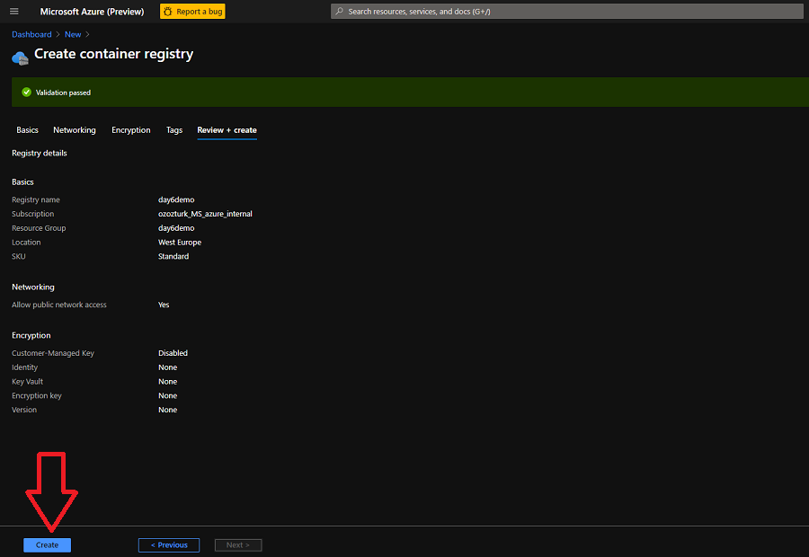
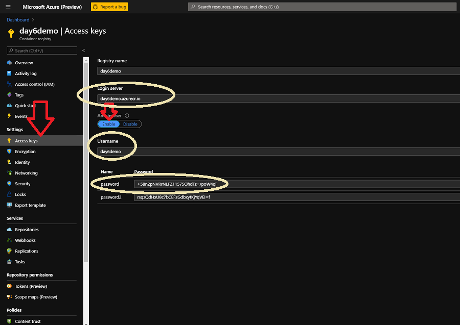
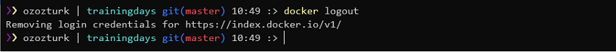
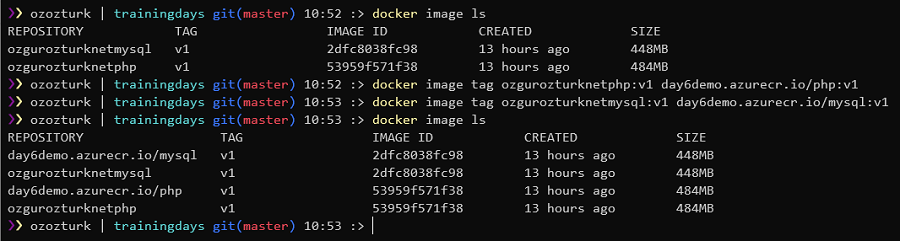
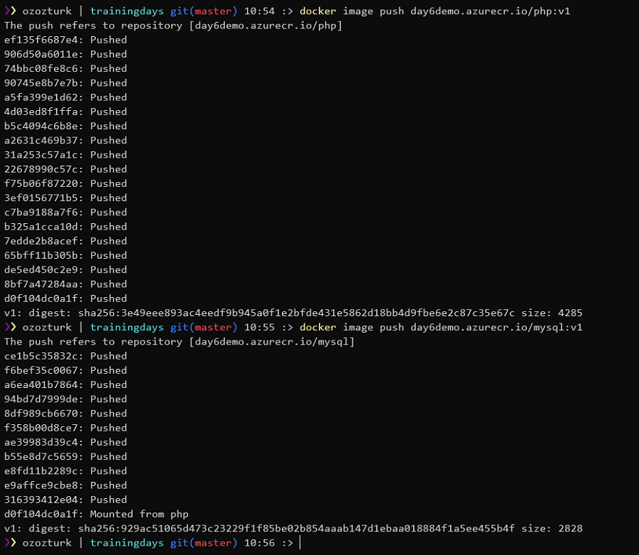
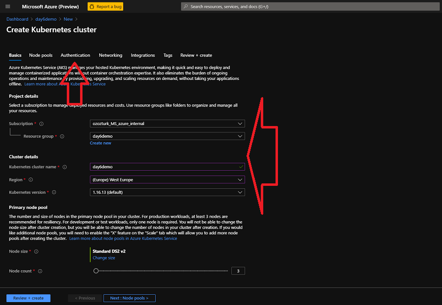
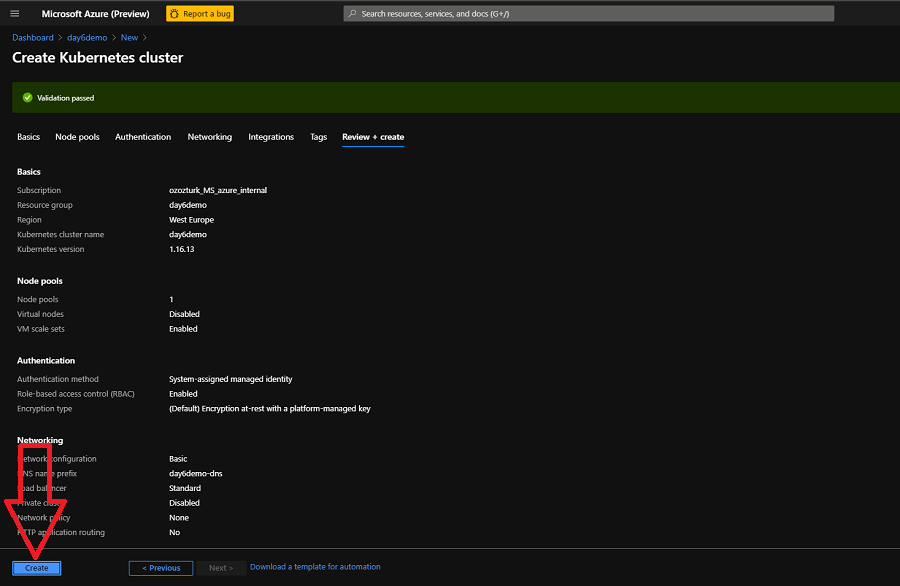
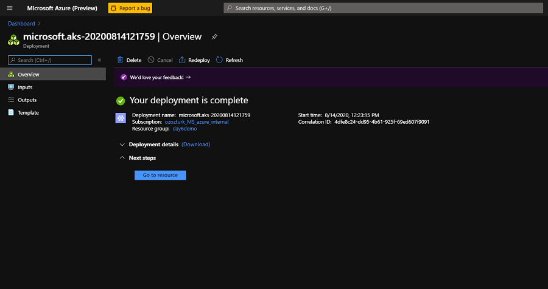
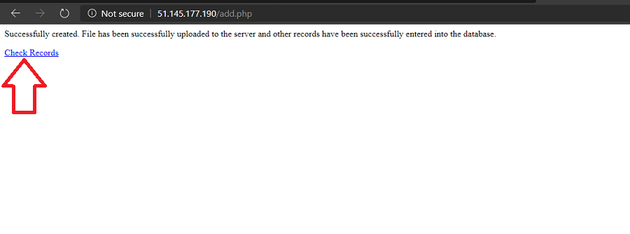

# Challenge 5: Azure Container Services

## Here is what you'll learn 🎯

In this challenge, we're gonna create our ACR and AKS instances and deploy a php based webapp that we have containerized at the end of [challenge 4](./challenge4.md).

In detail we will:

- Create an Azure Container Registry (ACR) Instance
- Push images that we have built to ACR
- Create our first Azure Kubernetes Service (AKS) cluster and deploy a PHP application

## Table Of Contents

1. [Azure Container Registry](#azure-container-registry)
2. [Azure Kubernetes Service](#azure-kubernetes-service)
3. [Deploy the PHP App to AKS](#deploy-the-php-app-to-aks)
4. [Cleanup](#cleanup)
5. [Wrap-Up](#wrap-up)

## Azure Container Registry

In this first task, we'll create a new _Azure Container Registry_ (ACR) instance. The Azure Container Registry allows us to _build_, _store_, and _manage_ container images and artifacts in a private registry for all types of container deployments. We will store two images that we've created at the end of the [challenge 4](./challenge4.md).

We'll do this via portal, so let's jump to [https://portal.azure.com](https://portal.azure.com)

- Click the hamburger icon on the top left of the screen.
- Click the **Create a resource** link.

   

- Click **Container** on the left menu.
- Continue with the **Container Registry** option

   

- Now we're on the **Create container registry** screen.
- Select a subscription. Click **Create New** button once for the Resource Group and create a new resource group.
- Fill the other values.
  - Registry Name: Type a unique name.
  - Location: Select **West Europe**.
  - SKU: Keep as is. **Standard**
- Click **Review + create**.

   

- Click **Create** and finalize the ACR creation steps.

   

- When done, click the **Go to resource** button and access the newly created ACR instance.

   

- Now it's time to get the connection details of our ACR instance.
- Click **Access keys** on the left.
- Click **Enable** under the **Adminuser** section and enable the _Adminuser_.
- Copy the values of **Login Server**, **Username** and **Password** into a text editor. We'll need these later.  

   

- We have created an ACR instance and it's ready to store our images. Let's turn back to the terminal and push the images that we have created before.
- First, let's get logged out from our current registry.

   Type:

   ```shell
   docker logout
   ```

   The output will be something like:

   ```shell
   Removing login credentials for https://index.docker.io/v1/
   ```

   

- It's time log into our newly created ACR instance.

   Type:

   ```shell
   docker login acr_login_url -u Username -p Password
   ```

   The output will be something like:

   ```shell
   WARNING! Using --password via the CLI is insecure. Use --password-stdin.
   Login Succeeded
   ```

   

- We could successfully log in. This means that from now on we can push images to th ACR registry. But to be able to do that, we have to re-tag the images that we have created at the end of the [challenge 4](./challenge4.md). So we have to add new tags to them, in the format  ```registry_url/repository_name:tag```.
- First, let's list all the images on the system.

   Type:

   ```shell
   docker image ls
   ```

   The output will be something like:

   ```shell
   REPOSITORY            TAG                 IMAGE ID            CREATED             SIZE
   your_dockerhub_id/mysql   v1                  2dfc8038fc98        13 hours ago        448MB
   your_dockerhub_id/php     v1                  53959f571f38        13 hours ago        484MB
   ```

- There should be two images that we have created at the end of the [challenge 4](./challenge4.md). They were tagged as ```your_dockerhub_id/mysql:v1``` and ```your_dockerhub_id/php:v1```. We add new tags to these images.

   Type:

   ```shell
   docker image tag your_dockerhub_id/php:v1 acr_login_url/php:v1
   docker image tag your_dockerhub_id/mysql:v1 acr_login_url/mysql:v1
   ```

- Let's list all the images on the system and check the newly added tags.

   Type:

   ```shell
   docker image ls
   ```

   The output will be something like:

   ```shell
   REPOSITORY            TAG                 IMAGE ID            CREATED             SIZE
   your_dockerhub_id/mysql   v1                  2dfc8038fc98        13 hours ago        448MB
   your_dockerhub_id/php     v1                  53959f571f38        13 hours ago        484MB
   acr_login_url/mysql:v1   v1                  2dfc8038fc98        13 hours ago        448MB
   acr_login_url/php:v1    v1                  53959f571f38        13 hours ago        484MB
   ```

   

- Now we can push these images to the ACR.

   Type:

   ```shell
   docker image push acr_login_url/php:v1
   ```

   The output will be something like:

   ```shell
   The push refers to repository [acr_login_url/php]
   ef135f6687e4: Pushed
   906d50a6011e: Pushed
   74bbc08fe8c6: Pushed
   90745e8b7e7b: Pushed
   a5fa399e1d62: Pushed
   4d03ed8f1ffa: Pushed
   b5c4094c6b8e: Pushed
   a2631c469b37: Pushed
   31a253c57a1c: Pushed
   22678990c57c: Pushed
   f75b06f87220: Pushed
   3ef0156771b5: Pushed
   c7ba9188a7f6: Pushed
   b325a1cca10d: Pushed
   7edde2b8acef: Pushed
   65bff11b305b: Pushed
   de5ed450c2e9: Pushed
   8bf7a47284aa: Pushed
   d0f104dc0a1f: Pushed
   v1: digest: sha256:3e49eee893ac4eedf9b945a0f1e2bfde431e5862d18bb4d9fbe6e2c87c35e67c size: 4285
   ```

   Type:

   ```shell
   docker image push acr_login_url/mysql:v1
   ```

   The output will be something like:

   ```shell
   The push refers to repository [acr_login_url/mysql]
   ce1b5c35832c: Pushed
   f6bef35c0067: Pushed
   a6ea401b7864: Pushed
   94bd7d7999de: Pushed
   8df989cb6670: Pushed
   f358b00d8ce7: Pushed
   ae39983d39c4: Pushed
   b55e8d7c5659: Pushed
   e8fd11b2289c: Pushed
   e9affce9cbe8: Pushed
   316393412e04: Pushed
   d0f104dc0a1f: Mounted from php
   v1: digest: sha256:929ac51065d473c23229f1f85be02b854aaab147d1ebaa018884f1a5ee455b4f size: 2828
   ```

   

- Turn back to the Azure Portal and confirm that the images were pushed and stored in the ACR.
- We successfully re-tagged our images and pushed them to newly created ACR.

   

## Azure Kubernetes Service

It's time to create our first _Azure Kubernetes Service_ (AKS) cluster.  

- On the portal, find your Resource Group and click **Add** on the overview screen.

   

- Under the the **Containers** section click **Kubernetes Service**.

   

- Select your subscription.
- Fill the other values:
  - Kubernetes cluster name: Type a unique name.
  - Region: Select **West Europe**.
  - Kubernetes version: Leave as is.
- Click **Authentication**.

   

- Select **System-assigned managed identity**
- Click on the **Integrations** section.

   

- Select the ACR instance that we created a few minutes ago.
- Click **Review + create**.

   

- Click **Create** and wait until it has been successfully created.
  
   

   

Congrats. You have successfully built your first AKS cluster.

## Deploy the PHP App to AKS

Now it's time to deploy our PHP app to the AKS cluster.

We will use the ```kubectl``` CLI tool to manage the Kubernetes cluster. THe Kubernetes command-line tool, ```kubectl```, allows us to run commands against the Kubernetes clusters.

We can use ```kubectl``` to deploy applications, inspect and manage cluster resources, and view logs. You can either install ```kubectl``` in your terminal or you can use _Azure Cloud Shell_ where ```kubectl``` is already installed.

- Click on the **Cloud Shell** icon on the top left right side of the portal screen and open it.
- If asked, select **Bash** and open the shell.
- When you interact with an AKS cluster using ```kubectl```, a _configuration file_ is used that defines cluster connection information. This configuration file is typically stored in ```~/.kube/config```. Multiple clusters can be defined in the kubeconfig file.

  The ```"az aks get-credentials"``` command lets you get access to the credentials for an AKS cluster and merges them into the kubeconfig file. Now we use that command and merge the credential into our kubeconfig file. Thus we can manage our Kubernetes cluster.

   Type:

   ```shell
   az aks get-credentials --resource-group resource_group_name --name aks_cluster_name
   ```

   The output will be something like:

   ```shell
   The behavior of this command has been altered by the following extension: aks-preview
   Merged "aks_cluster_name" as current context in /home/username/.kube/config
   ```

- We have merged the config. It's time to check if kubectl works properly. Let's list all the nodes in the cluster.

   Type:

   ```shell
   kubectl get nodes
   ```

   The output will be something like:

   ```shell
   NAME                                STATUS   ROLES   AGE   VERSION
   aks-agentpool-10704589-vmss000000   Ready    agent   26m   v1.16.13
   aks-agentpool-10704589-vmss000001   Ready    agent   26m   v1.16.13
   aks-agentpool-10704589-vmss000002   Ready    agent   26m   v1.16.13
   ```

- It seems that our cluster is ready. Let's deploy our app.

   

- There are two ways to spin up Kubernetes resources:
  - The  _imperative_ method, which is basically using the command line.
  - The _declarative method_. This method is easier and more useful leveraging configuration files using _YAML_.
  
    Most of the things you can deploy to a Cluster in Kubernetes can be described as a YAML file. YAML is a human-readable text-based format that let’s us easily specify configuration-type information by using a combination of maps of name-value pairs and lists of items.
- We have created a YAML file to create two deployment and two service objects. All the config that is needed to create these objects are defined in this YAML file.

  But what is a _deployment_ and what is a _service_? These are the object types that you can create on Kubernetes. Simply, deployment object is our application and service object is an end-point that exposes this application to other services or external users. But all of these are Kubernetes related topics and we won't cover them today. We have a full Kubernetes day, [Day 7](../../day7/README.md), there you will get all the information related to Kubernetes. Today, we're gonna only deploy this application and that's all.
- So first let's open the yaml file. Go to the ```day6/apps/kube``` folder and open the ```app.yaml``` file in a text editor.
- There are two lines that you have to update. Go to line 19 and 66 and update the ACR URL with your own URL.

   ```shell
   19-->image: day6demo.azurecr.io/mysql:v1
   66-->image: day6demo.azurecr.io/php:v1
   ```

- After that, copy the whole text and turn back to the **Cloud Shell**.
- Now type ```code app.deploy``` or ```code app.yaml``` to create a file and open the built-in text editor.
- In the text editor type CTRL-V to paste the text that you copied a few minutes ago.
- Click the **...** icon on the top right of the Cloud Shell, save and close the file. Now our YAML file is ready.  

   

- It's finally time to deploy our application.

   Type:

   ```shell
   kubectl apply -f app.yaml # or app.deploy based on your filename. 
   ```

   The output will be something like:

   ```shell
   deployment.apps/mysqldb created
   service/mysqldb created
   deployment.apps/phpapp created
   service/phpapp created
   ```

- Two deployments and two services have been created. Let's check if the pods are running.

   Type:

   ```shell
   kubectl get pods 
   ```

   The output will be something like:

   ```shell
   NAME                                                       READY   STATUS    RESTARTS   AGE
   mysqldb-df67cc945-ctfqg                            1/1     Running   0                  1m
   phpapp-df67cc945-s5z6n                             1/1     Running   0                  1m
   ```

- Type a couple of times ```kubectl get pods``` until the statuses turn to ```Running```.

   

- Congratulations! We successfully deployed our application to the AKS cluster. Let's access it and see if it works as expected. To be able to do that we must get the external IP address of the ```phpapp``` service.

   Type:

   ```shell
   kubectl get svc
   ```

   The output will be something like:

   ```shell
   NAME                                       TYPE           CLUSTER-IP     EXTERNAL-IP      PORT(S)    AGE
   mysqldb                                    ClusterIP      10.0.250.27    <none>           80/TCP     48d
   phpapp                                     LoadBalancer   10.0.243.220   51.145.177.190   80/TCP     47d
   kubernetes                                 ClusterIP      10.0.0.1       <none>           443/TCP    59d
   ```

- Copy the external IP address of the ```phpapp``` service.

   

- Open a web browser and visit the site of the ```phpapp```via the copied IP address.
- Fill the form and add a new record. If you get a **Successfully created**  message when you click add, then everything works perfectly.

   

   

   

## Cleanup

When you have completed the challenge, don't forget to delete the resources that you have created. Find the resource group  that you have created at the beginning of this challenge in the Azure Portal and delete it. All the resources that you have created in this resource group will be automatically deleted too.


## Wrap-up

🎉 **_Congratulations_** 🎉

You have completed the Azure Container Services challenge. You have created your first ACR instance and AKS cluster and deploy an application.

:::details
🔍 References:

- <https://docs.microsoft.com/en-us/azure/aks/>
- <https://docs.microsoft.com/en-us/azure/container-registry/>
:::

[◀ Previous challenge](./challenge4.md) | [🔼 Day 6](../README.md) | [Next challenge ▶](./challenge6.md)
