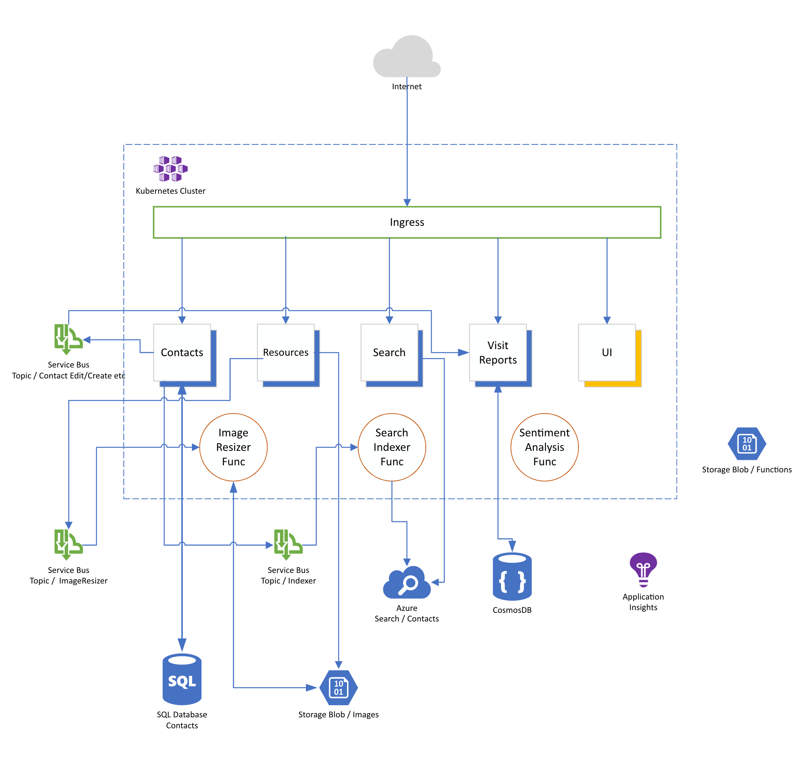

# Day 7 Kubernetes

- [Challenge 0: Setup your System](./challenges/challenge-0.md)
- [Challenge 1: Create your first Kubernetes Cluster](./challenges/challenge-1.md)
- [Challenge 2: Basic Kubernetes Concepts](./challenges/challenge-2.md)
- [Challenge 3: Configuration](./challenges/challenge-3.md)
- [Challenge 4: Deploy a microservice-oriented sample application](./challenges/challenge-4.md)
- [Bonus: Secure Endpoints with SSL Certificates (optional)](./challenges/bonus-1.md)

## Goal

The goal of this day is to make you familiar with Kubernetes and give you hands-on experience in deploying real-world applications/services. First, we will setup your local environment that you are ready to use Kubernetes, then setup a first Kubernetes cluster with the Azure Kubernetes Service (AKS). After a few easy tasks like deploying some containers/pods, this workshop will guide you how to setup deployments and different service types, how to route traffic from the internet to/within your cluster and in the end show you how to operate a real-world application consisting of multiple microservices backed by Azure platform services like Azure SQL DB and/or CosmosDB.

If you have completed Day 1-5 of the Azure Developer College, you are already familiar with the application. For all others: the application is called "Simple Contacts Management" and gives a user the ability to manage contacts and visit reports, a very tiny CRM, so to say.

At the end of the day, you will have a working application that looks like that:

The architecture you will be setting up (in Kubernetes, as well as in Azure) looks like that:

