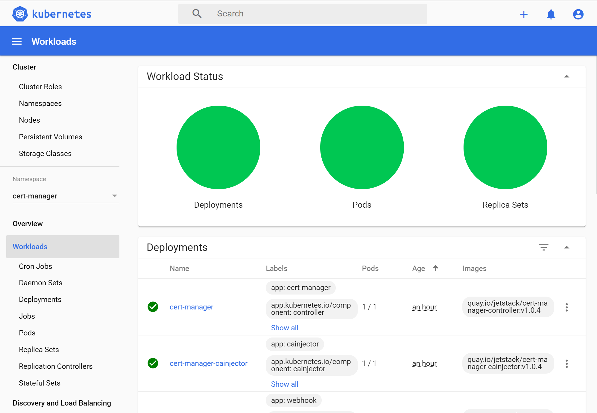

# Secure endpoints with SSL certificates (optional)

In this optional challenge you will learn to secure your ingress traffic
using TLS (HTTPS). To facilitate the issuance and management of certificates we will introduce a tool called cert-manager.

cert-manager is a Kubernetes add-on to automate the management and issuance of TLS certificates from various issuing sources.

It will ensure certificates are valid and up to date periodically, and attempt to renew certificates at an appropriate time before expiry.

Let's get started!

## Create a new separate namespace for the cert-manager

To separate the cert manager from the rest of our resource let's create a new namespace:

```shell
$ kubectl create namespace cert-manager
```

## Add the Jetstack Helm repository

cert-manager comes with a set of different pods and custom resources so we will use helm to install all of it's components in one go.

First we have to add the official repository from jetstack which contains the cert-manager helm chart.

```shell
$ helm repo add jetstack https://charts.jetstack.io
$ helm repo update
```

We will prepare a small configuration for the helm chart. Basically we want the Kubernetes Custom Resource Definitions to be installed together with the chart and set some default values in terms of how TLS certificates are issued for our Ingress resources.

```yaml
# cert-manager-values.yaml
installCRDs: true # install custom resource definitions
ingressShim:
  defaultIssuerKind: ClusterIssuer
  defaultIssuerName: letsencrypt-prod
```

## Install the cert-manager helm chart

Now that we have prepared the configuration we can install (or upgrade)
cert-manager using a single command:

```shell
$ helm upgrade -i -f cert-manager-values.yaml --namespace cert-manager cert-manager jetstack/cert-manager
```

If take a look at the kubernetes dashboard under the cert-manager namespace you should see a few nice green deployments showing up after a few seconds.



## Add letsencrypt cluster issuer

To make cert-manager fully functional we'll need to create a so called
Issuer. Issuers, as their name suggests, issue TLS certificates for us. For
our small sample we'll rely on the free service of [letsencrypt.org](https://letsencrypt.org).

Let’s Encrypt is a free, automated, and open certificate authority (CA), run for the public’s benefit. It is a service provided by the Internet Security Research Group (ISRG).

To configure Issuers (and manage the state of certificates) cert-manager
comes with a set of Custom Resource Definitions (CRDs). CRDs are used to
extend the set of existing resources in kubernetes with custom ones. They are
one of the main extension mechanisms of kubernetes.

cert-manager knows two kinds of Issuers: `Issuer` and `ClusterIssuer`.

`Issuer` is a namespaced resource that is only available for the namespace it is stored in.
`ClusterIssuer` is a cluster wide resource that is available for all namespaces.

In for our example we will create a `ClusterIssuer` since we trust all resources in our cluster.

To define pur `ClusterIssuer` we again use a yaml file that we will apply to
our cluster. Let's take a look:

```yaml
# letsencrypt-prod-cluster-issuer.yaml
apiVersion: cert-manager.io/v1alpha2
kind: ClusterIssuer
metadata:
  name: letsencrypt-prod
spec:
  acme:
    server: https://acme-v02.api.letsencrypt.org/directory
    email: update.your@email.com
    privateKeySecretRef:
      name: letsencrypt-prod
    solvers:
      - http01:
          ingress:
            class: nginx
```

Don't forget to update your email-address!

The email address you provide will be used by Let's Encrypt to notify you of
expiring certificates. Hopefully you will never receive such notification
because cert-manager should take care of the certificate renewal process for
you.

Let's apply our configuration:

```shell
$ kubectl apply -f letsencrypt-prod-cluster-issuer.yaml
```

## Update your frontend ingress configuration

Only two things are missing to complete our super secure TLS setup. We need to
upgrade our ingress configurations for the frontend and the API.

We'll want to add two things each. A `kubernetes.io/tls-acme: true`
annotation to enable the management of the TLS certificate through cert
manager and a `tls` section in our Ingress `spec` to define the hostname for
the certificate and the name of the kubernetes secret to store the
certificate safely.

The following shows how you Ingress section for the frontend deployment
should look like. Make ure you don't forget to update your domain names.
Usually you'll want your TLS host to match the hostname for the ingress rule
you have configured.

```yaml
apiVersion: networking.k8s.io/v1beta1
kind: Ingress
metadata:
  name: ing-frontend
  annotations:
    kubernetes.io/tls-acme: 'true'
    kubernetes.io/ingress.class: 'nginx'
    nginx.ingress.kubernetes.io/enable-cors: 'true'
    nginx.ingress.kubernetes.io/cors-allow-headers: 'Keep-Alive,User-Agent,X-Requested-With,If-Modified-Since,Cache-Control,Content-Type,Authorization,Accept-Language'
    nginx.ingress.kubernetes.io/cors-max-age: '600'
    nginx.ingress.kubernetes.io/proxy-body-size: '12m'
spec:
  tls:
    - hosts:
        - 51-116-98-151.nip.io # this should be replaced with YOUR OWN DOMAIN
      secretName: tls-secret
  rules:
    - host: 51-116-98-151.nip.io # this should be replaced with YOUR OWN DOMAIN
      http:
        paths:
          - path: /
            backend:
              serviceName: frontend
              servicePort: 8080
```

If you access you website again you'll notice that after a few moments it's
already being served through https and that your browser is redirected to the
safe endpoint automatically.

## Update your api ingress configuration

It's important not to forget to update our Ingress for the contacts API as
well. We would not want to deliver the static website client on a secure
channel while leaving sensitive information about our contacts in the open.

Just like we did for the frontend we also add the `kubernetes.io/tls-acme:
'true'` annotation and the `tls` configuration to the `spec` section of our
ingress configuration.

```yaml
apiVersion: networking.k8s.io/v1beta1
kind: Ingress
metadata:
  name: ing-contacts
  annotations:
    kubernetes.io/tls-acme: 'true'
    kubernetes.io/ingress.class: 'nginx'
    nginx.ingress.kubernetes.io/enable-cors: 'true'
    nginx.ingress.kubernetes.io/cors-allow-headers: 'Keep-Alive,User-Agent,X-Requested-With,If-Modified-Since,Cache-Control,Content-Type,Authorization,Accept-Language'
    nginx.ingress.kubernetes.io/cors-max-age: '600'
    nginx.ingress.kubernetes.io/proxy-body-size: '12m'
    nginx.ingress.kubernetes.io/rewrite-target: '/contacts/$2'
    nginx.ingress.kubernetes.io/use-regex: 'true'
spec:
  tls:
    - hosts:
        - 51-116-98-151.nip.io # this should be replaced with YOUR OWN DOMAIN
      secretName: tls-secret
  rules:
    - host: 51-116-98-151.nip.io # this should be replaced with YOUR OWN DOMAIN
      http:
        paths:
          - path: /api/contacts(\/|$)(.*)
            backend:
              serviceName: contactsapi
              servicePort: 8080
```

Know let's check if everything connects as expected.

Navigate to you contacts website and use your browsers developer tools to make sure
both the initial request to the website, as well as any subsequent request to
the contacts API use secure HTTPS endpoints.


If both requests are being served over https were good to got!

## Note about settings/settings.js

It might be necessary to update the `settings/settings.js` file for the frontend deployment. One elegant way to make sure the corresponding protocol is being used is just to set the path to the API as absolute on the same host.


```js
var uisettings = {
  endpoint: "/api/contacts/",
  enableStats: false,
  aiKey: '',
}
```

