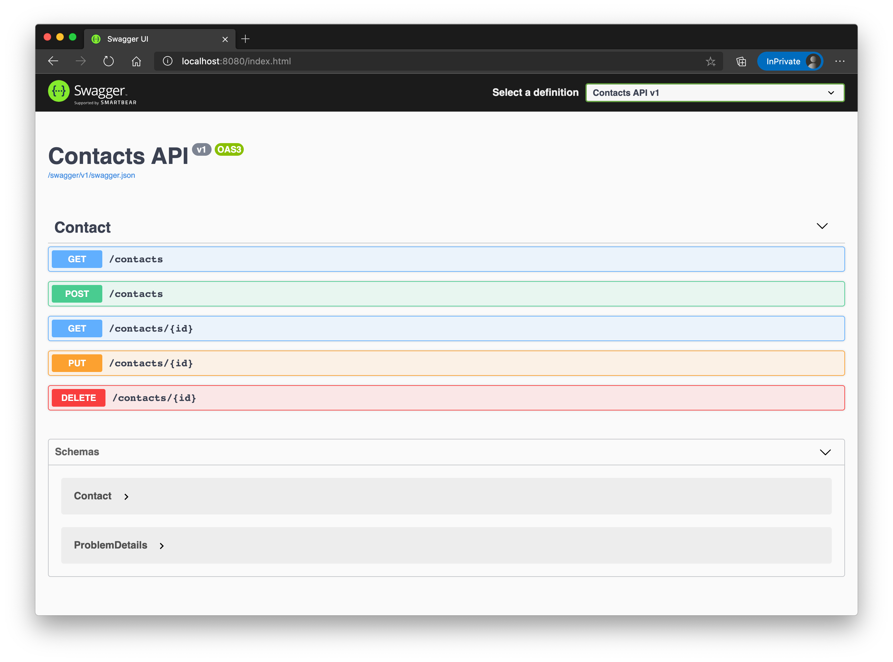

# Basic Kubernetes Concepts

## Prerequisites

In order to be able to store the custom Docker images you will be creating throughout this workshop, we need a container registry. Azure provides its own service for that, the Azure Container Registry. Let's create one via the Azure CLI:

```zsh
$ az group create --name adc-acr-rg --location germanywestcentral
$ az acr create --name adccontainerreg --resource-group adc-acr-rg --sku basic --admin-enabled

# now let's attach the container registry to the cluster

$ az aks update --resource-group adc-aks-rg --name adc-cluster --attach-acr adccontainerreg
```

## Build a custom image

First, let's build a custom Docker image. Go to the folder `day7/challenges/samples/challenge-2/singlecontainer`. Take a look at the - very simple - Dockerfile and run the following commands.

```zsh
$ docker build -t test:1.0 .
$ docker run -p 8080:80 test:1.0
```

Open your browser and navigate to `http://localhost:8080`. You should see a page with a welcome message.

Now let's push the image to our registry. To be able to interact with our registry, we first need to login.

```zsh
$ ACRPWD=$(az acr credential show -n adccontainerreg --query "passwords[0].value" -o tsv)
$ docker login adccontainerreg.azurecr.io -u adccontainerreg -p $ACRPWD
```

> In this sample, we used the `admin` account of our registry to login - basically with username/password. In secure/production environments, you should not enable the `admin` account on the registry and login via Azure Active Directory: `az acr login -n adccontainerreg`. The token that is issued will be valid for 3 hours.

We are now ready to push the image to our container registry.

```zsh
$ docker tag test:1.0 adccontainerreg.azurecr.io/test:1.0
$ docker push adccontainerreg.azurecr.io/test:1.0
```

You can also build directly within the Azure Container Registry service, in case you don't have Docker on your machine. Let's have try...

```zsh
$ az acr build -r adccontainerreg -t adccontainerreg.azurecr.io/test:2.0 .
```

The command will send the current build context to Azure, kick-off a docker build and add the image to your registry.

## Run your custom image

Now that we have an image in our container registry, let's create a pod. This time, we will be using a YAML manifest.

```yaml
# Content of file myfirstpod.yaml
apiVersion: v1
kind: Pod
metadata:
  name: myfirstpod
spec:
  containers:
    - image: adccontainerreg.azurecr.io/test:2.0
      name: myfirstpod
      resources: {}
      ports:
        - containerPort: 80
  restartPolicy: Never
```

Create a file called `myfirstpod.yaml` with the content above and apply it to your cluster.

```zsh
$ kubectl apply -f myfirstpod.yaml
```

Check that everything works as expected.

```zsh
$ kubectl get pods -w
NAME         READY   STATUS              RESTARTS   AGE
myfirstpod   0/1     ContainerCreating   0          6s
...
...
[after a few seconds]
myfirstpod   1/1     Running             0          17s
```

Also, "describe" the pod to see some more details like status, the node it's running on, events etc.

```zsh
$ kubectl describe pod myfirstpod
Name:         myfirstpod
Namespace:    default
Priority:     0
Node:         aks-nodepool1-11985439-vmss000001/10.240.0.5
Start Time:   Thu, 08 Oct 2020 14:03:55 +0200
Labels:       <none>
Annotations:  Status:  Running
IP:           10.244.2.5
IPs:
  IP:  10.244.2.5
Containers:
  myfirstpod:
    Container ID:   docker://2dc2e9ef913a6985fe355bd871666bd6eec859eba544c051eb3b5db5d7eeb1ab
    Image:          adccontainerreg.azurecr.io/test:2.0
    Image ID:       docker-pullable://adccontainerreg.azurecr.io/test@sha256:0e6b51d93fd3769bda02b5865491092a595194ea04f5b8bd8f6209f101bde724
    Port:           80/TCP
    Host Port:      0/TCP
    State:          Running
      Started:      Thu, 08 Oct 2020 14:03:56 +0200
    Ready:          True
    Restart Count:  0
    Environment:    <none>
    Mounts:
      /var/run/secrets/kubernetes.io/serviceaccount from default-token-9lb48 (ro)
Conditions:
  Type              Status
  Initialized       True
  Ready             True
  ContainersReady   True
  PodScheduled      True
Volumes:
  default-token-9lb48:
    Type:        Secret (a volume populated by a Secret)
    SecretName:  default-token-9lb48
    Optional:    false
QoS Class:       BestEffort
Node-Selectors:  <none>
Tolerations:     node.kubernetes.io/not-ready:NoExecute for 300s
                 node.kubernetes.io/unreachable:NoExecute for 300s
Events:
  Type    Reason     Age   From                                        Message
  ----    ------     ----  ----                                        -------
  Normal  Scheduled  13s   default-scheduler                           Successfully assigned default/myfirstpod to aks-nodepool1-11985439-vmss000001
  Normal  Pulled     12s   kubelet, aks-nodepool1-11985439-vmss000001  Container image "adccontainerreg.azurecr.io/test:2.0" already present on machine
  Normal  Created    12s   kubelet, aks-nodepool1-11985439-vmss000001  Created container myfirstpod
  Normal  Started    12s   kubelet, aks-nodepool1-11985439-vmss000001  Started container myfirstpod
```

## Port-Forwarding

So, the pod is running, but how do we access it?! Let's have a look at one option, that you typically would use in _test/debug_ scenarios.

With `kubectl` you can "port-forward" a local port to a port on a pod. This is how it works in our case:

```zsh
$ kubectl port-forward myfirstpod 8080:80
```

Our pod is listening on port `80` and we forward our local port `8080` to that one. You can check the result by navigating - once again - to `http://localhost:8080`.

To proof that the requests arrive at the pod, check the logs:

```zsh
$ kubectl logs myfirstpod -f=true
/docker-entrypoint.sh: /docker-entrypoint.d/ is not empty, will attempt to perform configuration
/docker-entrypoint.sh: Looking for shell scripts in /docker-entrypoint.d/
/docker-entrypoint.sh: Launching /docker-entrypoint.d/10-listen-on-ipv6-by-default.sh
10-listen-on-ipv6-by-default.sh: Getting the checksum of /etc/nginx/conf.d/default.conf
10-listen-on-ipv6-by-default.sh: Enabled listen on IPv6 in /etc/nginx/conf.d/default.conf
/docker-entrypoint.sh: Launching /docker-entrypoint.d/20-envsubst-on-templates.sh
/docker-entrypoint.sh: Configuration complete; ready for start up
127.0.0.1 - - [08/Oct/2020:12:09:04 +0000] "GET / HTTP/1.1" 200 171 "-" "Mozilla/5.0 (Macintosh; Intel Mac OS X 10_15_7) AppleWebKit/537.36 (KHTML, like Gecko) Chrome/85.0.4183.121 Safari/537.36 Edg/85.0.564.70" "-"
127.0.0.1 - - [08/Oct/2020:12:09:04 +0000] "GET / HTTP/1.1" 304 0 "-" "Mozilla/5.0 (Macintosh; Intel Mac OS X 10_15_7) AppleWebKit/537.36 (KHTML, like Gecko) Chrome/85.0.4183.121 Safari/537.36 Edg/85.0.564.70" "-"
127.0.0.1 - - [08/Oct/2020:12:09:04 +0000] "GET / HTTP/1.1" 304 0 "-" "Mozilla/5.0 (Macintosh; Intel Mac OS X 10_15_7) AppleWebKit/537.36 (KHTML, like Gecko) Chrome/85.0.4183.121 Safari/537.36 Edg/85.0.564.70" "-"
127.0.0.1 - - [08/Oct/2020:12:09:04 +0000] "GET / HTTP/1.1" 304 0 "-" "Mozilla/5.0 (Macintosh; Intel Mac OS X 10_15_7) AppleWebKit/537.36 (KHTML, like Gecko) Chrome/85.0.4183.121 Safari/537.36 Edg/85.0.564.70" "-"
```

## Running multiple instances of our workload

Now we only showed, how Kubernetes is dealing with single container/pod environments. If such a pod fails (something serious happens and the process crashes e.g.), Kubernetes doesn't take care of restarting our workload. On top of that, we only run a single instance - ideally, we can tell Kubernetes to run multiple instances of our container in the cluster. To give Kubernetes more control over the application/service we want to run, we need to use another object to deploy our container(s): `Deployments`.

In a `Deployment`, you can tell Kubernetes a few more things, that you definetely need in production environments:

- number of instances of our container/pod
- how to do the upgrade, in case we deploy the next version of our service (e.g. always keep two instances up and running)

So let's do this...the service that we are going to deploy needs a SQL server instance to connect to. Therefor, we deploy a Microsoft SQL Server 2019 instance into our cluster that we then can use from our service.

```yaml
# Content of file sqlserver.yaml
apiVersion: apps/v1
kind: Deployment
metadata:
  name: mssql-deployment
spec:
  replicas: 1
  selector:
    matchLabels:
      app: mssql
  template:
    metadata:
      labels:
        app: mssql
    spec:
      terminationGracePeriodSeconds: 30
      securityContext:
        fsGroup: 10001
      containers:
        - name: mssql
          image: mcr.microsoft.com/mssql/server:2019-latest
          ports:
            - containerPort: 1433
          env:
            - name: MSSQL_PID
              value: 'Developer'
            - name: ACCEPT_EULA
              value: 'Y'
            - name: SA_PASSWORD
              value: 'Ch@ngeMe!23'
```

Create a file called `sqlserver.yaml` and apply the configuration.

```zsh
$ kubectl apply -f sqlserver.yaml

deployment.apps/mssql-deployment created

$ kubectl get pods -w

NAME                                READY   STATUS              RESTARTS   AGE
mssql-deployment-5559884974-q2j4w   0/1     ContainerCreating   0          5s
mssql-deployment-5559884974-q2j4w   1/1     Running             0          39s
```

After about 30-40 sec, you should see that the pod with SQL Server 2019 is up and running. Also, let's have a look at the deployment.

```zsh
$ kubectl get deployments

NAME               READY   UP-TO-DATE   AVAILABLE   AGE
mssql-deployment   1/1     1            1           100s

$ kubectl describe deployment mssql-deployment

Name:                   mssql-deployment
Namespace:              default
CreationTimestamp:      Tue, 27 Oct 2020 09:34:28 +0100
Labels:                 <none>
Annotations:            deployment.kubernetes.io/revision: 1
Selector:               app=mssql
Replicas:               1 desired | 1 updated | 1 total | 1 available | 0 unavailable
StrategyType:           RollingUpdate
MinReadySeconds:        0
RollingUpdateStrategy:  25% max unavailable, 25% max surge
Pod Template:
  Labels:  app=mssql
  Containers:
   mssql:
    Image:      mcr.microsoft.com/mssql/server:2019-latest
    Port:       1433/TCP
    Host Port:  0/TCP
    Environment:
      MSSQL_PID:    Developer
      ACCEPT_EULA:  Y
      SA_PASSWORD:  Ch@ngeMe!23
    Mounts:         <none>
  Volumes:          <none>
Conditions:
  Type           Status  Reason
  ----           ------  ------
  Available      True    MinimumReplicasAvailable
  Progressing    True    NewReplicaSetAvailable
OldReplicaSets:  <none>
NewReplicaSet:   mssql-deployment-5559884974 (1/1 replicas created)
Events:
  Type    Reason             Age    From                   Message
  ----    ------             ----   ----                   -------
  Normal  ScalingReplicaSet  2m25s  deployment-controller  Scaled up replica set mssql-deployment-5559884974 to 1
```

As we need to connect to this pod over the network, let's find out what IP adress has been assigned to it.

```zsh
$ kubectl get pods -o wide

NAME                                READY   STATUS    RESTARTS   AGE     IP           NODE                                NOMINATED NODE   READINESS GATES
mssql-deployment-5559884974-q2j4w   1/1     Running   0          4m44s   10.244.0.5   aks-nodepool1-11985439-vmss000000   <none>           <none>
```

The adress may vary in your environment, for the sample here, it's `10.244.0.5`. Please note the adress down, as you will need it in the next step.

Now, we can deploy a simple API that is able to manage `Contacts` object, that means Create/Read/Update/Delete contacts of a very simple CRM app. The image is already present in a public container registry, so we don't need to build an image for it.

```yaml
# Content of file api.yaml
apiVersion: apps/v1
kind: Deployment
metadata:
  name: myapi
spec:
  replicas: 4
  selector:
    matchLabels:
      app: myapi
  template:
    metadata:
      labels:
        app: myapi
    spec:
      containers:
        - name: myapi
          env:
            - name: ConnectionStrings__DefaultConnectionString
              value: Server=tcp:<IP_OF_THE_SQL_POD>,1433;Initial Catalog=scmcontactsdb;Persist Security Info=False;User ID=sa;Password=Ch@ngeMe!23;MultipleActiveResultSets=False;Encrypt=False;TrustServerCertificate=True;Connection Timeout=30;
          image: csaocpger/adc-api-sql:2.1
          resources:
            limits:
              memory: '128Mi'
              cpu: '500m'
          ports:
            - containerPort: 5000
```

A few notes on the deployment above. Firt and foremost, we tell Kubernetes to run 4 replicas of our service `replicas: 4`. We also configure the pod to set an environment variable called `ConnectionStrings__DefaultConnectionString` which contains the connection string to the database. Please replace \<IP_OF_THE_SQL_POD\> with the correct IP adress. We also set resource limits and expose port 5000, so that the API can be reached from outside of the pod.

So, again create a file (`api.yaml`) with the contents above - don't forget to replace the IP adress - and apply the configuration to your cluster.

```zsh
$ kubectl apply -f api.yaml

deployment.apps/myapi created
```

Let's have a look at the pods, we should now have 4 replicas running in the cluster.

```zsh
$ kubectl get pods

NAME                                READY   STATUS    RESTARTS   AGE
mssql-deployment-5559884974-q2j4w   1/1     Running   0          23m
myapi-7c74475b88-7hmcj              1/1     Running   0          74s
myapi-7c74475b88-7jhtq              1/1     Running   0          74s
myapi-7c74475b88-jzmcx              1/1     Running   0          74s
myapi-7c74475b88-s5gmj              1/1     Running   0          74s
```

So, we are all set to test the API and the connection to the SQL server. As done before, let's port-forward a local port to a pod in the Kubernetes cluster. You can pick any of the four running API pods. In the sample here, we take pod `myapi-7c74475b88-7hmcj`.

```zsh
$ kubectl port-forward myapi-7c74475b88-7hmcj 8080:5000

Forwarding from 127.0.0.1:8080 -> 5000
Forwarding from [::1]:8080 -> 5000
Handling connection for 8080
Handling connection for 8080
Handling connection for 8080
```

You can now open a browser and navigate to `http://localhost:8080`. If everything is fine, you will see the Swagger UI of the API:



Try out the API, e.g. create a contact via `POST` method, read (all) contacts via the `GET` operations etc.

### Failover / Health

As discussed before, Kubernetes takes care of your deployments by constantly checking the state of it and if anything is not the way it is supposed to be, Kubernetes tries to "heal" the correspondig deployment. E.g. if a pod of a deployment gets deleted (for any reason) and the deployment - as in our case - defines to have 4 replicas of the service, your cluster will notice the difference and restarts the 4th pod again to reestablish the desired state.

Let's try this...first, let's query the pods in our cluster. An this time, we are "watching" (`-w`) them so that we get notified of any changes of their states:

```zsh
$ kubectl get pods -w

NAME                                READY   STATUS    RESTARTS   AGE
mssql-deployment-5559884974-q2j4w   1/1     Running   0          58m
myapi-7c74475b88-7hmcj              1/1     Running   0          36m
myapi-7c74475b88-7jhtq              1/1     Running   0          36m
myapi-7c74475b88-jzmcx              1/1     Running   0          36m
myapi-7c74475b88-s5gmj              1/1     Running   0          36m
```

Now please open another tab/command line window and kill one of the pods. Here, we pick `myapi-7c74475b88-7jhtq`.

```zsh
$ kubectl delete pod myapi-7c74475b88-7jhtq

pod "myapi-7c74475b88-7jhtq" deleted
```

In the first tab/window where we are watching for "pod changes", you should now see a similar output...

```zsh
myapi-7c74475b88-7jhtq              1/1     Terminating   0          45m
myapi-7c74475b88-rpv8x              0/1     Pending       0          0s
myapi-7c74475b88-rpv8x              0/1     Pending       0          0s
myapi-7c74475b88-rpv8x              0/1     ContainerCreating   0          0s
myapi-7c74475b88-7jhtq              0/1     Terminating         0          45m
myapi-7c74475b88-rpv8x              1/1     Running             0          2s
myapi-7c74475b88-7jhtq              0/1     Terminating         0          45m
myapi-7c74475b88-7jhtq              0/1     Terminating         0          45m
```

As you can see, Kubernetes immediately starts a new pod (`myapi-7c74475b88-rpv8x`), because for a certain amount of time, there are only 3 pods running/available in the cluster. And in the deployment, we told Kubernetes to always have 4 pods of the API present.

### Scale on purpose

Of course, you can scale such a deployment on purpose to e.g. 3 or 6 replicas. Therefor, you should use the `scale` command. Kubernetes will then kill or create the corresponding amount of pods to fulfill the request. Try it out:

```zsh
# Scale up to 6 replicas
$ kubectl scale deployment --replicas 6 myapi

deployment.apps/myapi scaled

# kubectl get pods should now show 6 "myapi"-pods
```

So, now we learned how to scale containers/pods and how Kubernetes behaves when the desired state is different from the actual state. But still there is no way to access our pods, except via IP adresses within the cluster. It even got worse, because we now have mutliple pods running. We would need to find out all IP adresses of our pods to being able to send requests to them. This is not ideal. So, let's introduce another object called `Service` to have a common, load-balanced endpoint for all of our pods.

## Services

Kubernetes comes with its own service discovery component, called `Service`. A service is a way to expose a set of pods as a network endpoint with a unique name. This is very useful, because as you saw in the previous chapters, Kubernetes automatically creates and destroys pods to match the state of your cluster, IP adresses therefor change or aren't valid the next time you would call such a pod. So, the `Service` is the one component that keeps track of what pods make up a certain service (and what IP adresses are valid to call) - and is also able to load-balance traffic across those pods.

To be able to determine which pods form a service, Kubernetes uses `Labels` and `LabelSelectors`: you assign labels to a (set of) pod(s) e.g. `app = myapi` and the corresponding service uses the same key/value combination as selector.

There are different types of services you can create in Kubernetes, let's dive into some of them...

## ClusterIP

The default service type in Kubernetes is called `ClusterIP`. If you choose that type, the service will be exposed via a cluster-internal IP adress and is therefor only reachable from within the cluster.

Let's see it in action...

For this sample, we will be re-using the deployment and pods we created in the previous chapter (Contacts REST API and a SQL server running in the cluster).
Let's scale the API deployment back down to 4 replicas.

```zsh
$ kubectl scale deployment --replicas 4 myapi

deployment.apps/myapi scaled
```

After executing that command, the current state should look similar to that one:

```zsh
$ kubectl get pods,deployments,services

NAME                                    READY   STATUS    RESTARTS   AGE
pod/mssql-deployment-5559884974-q2j4w   1/1     Running   0          6h9m
pod/myapi-7c74475b88-67s7w              1/1     Running   0          49s
pod/myapi-7c74475b88-jzmcx              1/1     Running   0          5h47m
pod/myapi-7c74475b88-s5gmj              1/1     Running   0          5h47m
pod/myapi-7c74475b88-vhw6n              1/1     Running   0          49s

NAME                               READY   UP-TO-DATE   AVAILABLE   AGE
deployment.apps/mssql-deployment   1/1     1            1           6h9m
deployment.apps/myapi              4/4     4            4           5h47m

NAME                 TYPE        CLUSTER-IP   EXTERNAL-IP   PORT(S)   AGE
service/kubernetes   ClusterIP   10.0.0.1     <none>        443/TCP   5d1h
```

In the previous deployment, we already added `Labels` without really knowing what they are good for :)). Here's the excerpt of one the YAML manifest:

```yaml
spec:
  [...]
  template:
    metadata:
      labels:
        app: myapi
```

So, let's see, if we have these labels attached to the API pods.

```zsh
kubectl get pods --show-labels -o wide

NAME                                READY   STATUS    RESTARTS   AGE     IP            NODE                                NOMINATED NODE   READINESS GATES   LABELS
mssql-deployment-5559884974-q2j4w   1/1     Running   0          6h42m   10.244.0.5    aks-nodepool1-11985439-vmss000000   <none>           <none>            app=mssql,pod-template-hash=5559884974
myapi-7c74475b88-67s7w              1/1     Running   0          34m     10.244.0.15   aks-nodepool1-11985439-vmss000000   <none>           <none>            app=myapi,pod-template-hash=7c74475b88
myapi-7c74475b88-jzmcx              1/1     Running   0          6h20m   10.244.2.4    aks-nodepool1-11985439-vmss000002   <none>           <none>            app=myapi,pod-template-hash=7c74475b88
myapi-7c74475b88-s5gmj              1/1     Running   0          6h20m   10.244.1.8    aks-nodepool1-11985439-vmss000001   <none>           <none>            app=myapi,pod-template-hash=7c74475b88
myapi-7c74475b88-vhw6n              1/1     Running   0          34m     10.244.0.16   aks-nodepool1-11985439-vmss000000   <none>           <none>            app=myapi,pod-template-hash=7c74475b88
```

Looks good! As you can see, the SQL server pod also already has some labels (`app=mssql`). Now, let's add two services: one for the SQL server (remember, we used the IP adress in the connection string, which is really bad as we now know) and one for the API pods.

```yaml
# Content of file sqlserver-service.yaml
apiVersion: v1
kind: Service
metadata:
  name: mssqlsvr
spec:
  selector:
    app: mssql
  ports:
    - protocol: TCP
      port: 1433
      targetPort: 1433 # could be omitted, because 'port' and 'targetPort' are the same
  type: ClusterIP # could be omitted, because ClusterIP is the default type
```

```yaml
# Content of file api-service.yaml
apiVersion: v1
kind: Service
metadata:
  name: contactsapi
spec:
  selector:
    app: myapi
  ports:
    - protocol: TCP
      port: 8080 # 'external' port...
      targetPort: 5000 # 'internal' port...
```

Let's apply both definitions.

```zsh
$ kubectl apply -f sqlserver-service.yaml
service/mssqlsvr created

$ kubectl apply -f api-service.yaml
service/contactsapi created
```

So, how do we check, that the service(s) really find pods to route traffic to? Therefor, another Kubernetes object comes into play: `Endpoints`. An endpoint tracks the IP adresses of individual pods and is created for each service you define. The service then references an endpoint to know to which pods traffic can be routed. Any time a pod gets created or deleted (and is part of a certain service), the corresponding `Endpoint` gets updated.

Let's see how that looks like in our case.

```zsh
$ kubectl get services,endpoints

NAME                  TYPE        CLUSTER-IP    EXTERNAL-IP   PORT(S)    AGE
service/contactsapi   ClusterIP   10.0.49.134   <none>        8080/TCP   8m21s
service/kubernetes    ClusterIP   10.0.0.1      <none>        443/TCP    5d1h
service/mssqlsvr      ClusterIP   10.0.96.4     <none>        1433/TCP   8m21s

NAME                    ENDPOINTS                                                       AGE
endpoints/contactsapi   10.244.0.15:5000,10.244.0.16:5000,10.244.1.8:5000 + 1 more...   8m22s
endpoints/kubernetes    20.50.162.80:443                                                5d1h
endpoints/mssqlsvr      10.244.0.5:1433                                                 8m22s
```

This looks pretty good! The services we added have been created and also their corresponding endpoints point to the correct pod IP adresses. In case of the `contactsapi` service/endpoint, it finds multiple pods/IP adresses to route traffic to.

Now, there is one more step to do, before we can test the setup: adjust the connection string of the "myapi" deployment.

```yaml
[...]
    - name: ConnectionStrings__DefaultConnectionString
      value: Server=tcp:mssqlsvr,1433;Initial Catalog=scmcontactsdb;Persist Security Info=False;User ID=sa;Password=Ch@ngeMe!23;MultipleActiveResultSets=False;Encrypt=False;TrustServerCertificate=True;Connection Timeout=30;
[...]
```

Please replace the IP adress, with the DNS name of the service `mssqlsvr` and reapply the manifest. This will result in 4 new API pods.

```zsh
$ kubectl apply -f api.yaml
deployment.apps/myapi configured
```

Let's test the setup...we now spin up another pod in the cluster, connect to the commandline of that pod and run several calls against our API service.

```zsh
$ kubectl run -it --rm --image csaocpger/httpie:1.0 http --restart Never -- /bin/sh
If you don't see a command prompt, try pressing enter.
```

You are now connected to the pod and should see a command prompt. We can now issue some requests.

```zsh

# CREATE a contact
$ echo '{ "firstname": "Satya", "lastname": "Nadella", "email": "satya@microsoft.com", "company": "Microsoft", "avatarLocation": "", "phone": "+1 32 6546 6545", "mobile": "+1 32 6546 6542", "description": "CEO of Microsoft", "street": "Street", "houseNumber": "1", "city": "Redmond", "postalCode": "123456", "country": "USA" }' | http POST http://contactsapi:8080/contacts

HTTP/1.1 201 Created
Content-Type: application/json; charset=utf-8
Date: Wed, 28 Oct 2020 08:44:43 GMT
Location: http://contactsapi:8080/contacts/011a9848-2889-4164-a29e-d5ffca5d58cc
Server: Kestrel
Transfer-Encoding: chunked

{
    "avatarLocation": "",
    "city": "Redmond",
    "company": "Microsoft",
    "country": "USA",
    "description": "CEO of Microsoft",
    "email": "satya@microsoft.com",
    "firstname": "Satya",
    "houseNumber": "1",
    "id": "011a9848-2889-4164-a29e-d5ffca5d58cc",
    "lastname": "Nadella",
    "mobile": "+1 32 6546 6542",
    "phone": "+1 32 6546 6545",
    "postalCode": "123456",
    "street": "Street"
}

# READ all contacts
http GET http://contactsapi:8080/contacts

HTTP/1.1 200 OK
Content-Type: application/json; charset=utf-8
Date: Wed, 28 Oct 2020 08:45:49 GMT
Server: Kestrel
Transfer-Encoding: chunked

[
    {
        "avatarLocation": "",
        "city": "Redmond",
        "company": "Microsoft",
        "country": "USA",
        "description": "CEO of Microsoft",
        "email": "satya@microsoft.com",
        "firstname": "Satya",
        "houseNumber": "1",
        "id": "011a9848-2889-4164-a29e-d5ffca5d58cc",
        "lastname": "Nadella",
        "mobile": "+1 32 6546 6542",
        "phone": "+1 32 6546 6545",
        "postalCode": "123456",
        "street": "Street"
    }
]
```

As you can see, the API is working perfectly...and, traffic is load-balanced over the 4 running pods of the contacts API. Also, the connection from an API pod to the database via the `Service` is working as expected.

## NodePort

## LoadBalancer

## Ingress

Add an ingress controller in front of service
